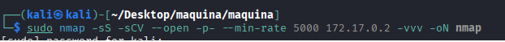
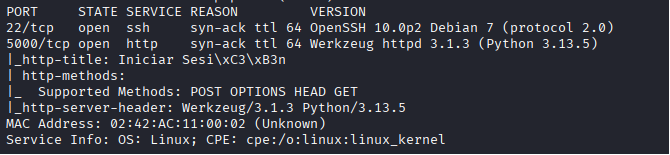
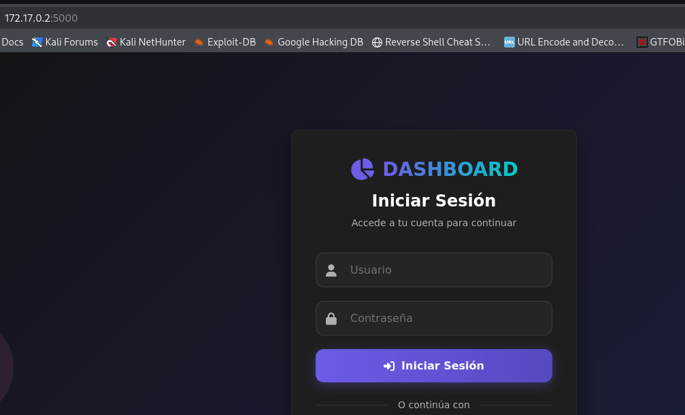
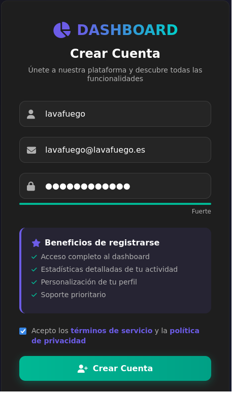
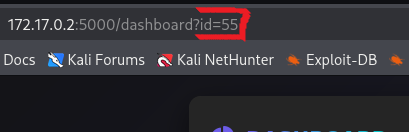

## DESCARGAR MÁQUINA VULNERABLE

Descargamos la máquina vulnerable "Aidor" de la página
```bash
https://dockerlabs.es/
```


## MONTAJE DE LA MÁQUINA VULNERABLE EN NUESTRO SISTEMA

La máquina vulnerable se va a montar en uin docker, nos hemos descargado un zip y hay que descomprimirlo:

```bash
unzip aidor.zip
```
esto nos va a descomprimir dos archivos:

-auto_deploy.sh que tiene las instrucciones para montar el docker

-aidor.tar que tiene el docker que vamos a correr

usando este comando montamos la máquina:

```bash
sudo bash auto_deploy.sh aidor.tar
```


## FASE DE ENUMERACIÓN

Vamos a escanear los puertos de la máquina que tiene la IP--->172.17.0.2 para ver que puerto tiene abiertos y que servicios corren por ellos:

```bash
sudo nmap -sS -sCV --open -p- --min-rate 5000 172.17.0.2 -vvv -oN nmap
```







Hay dos puertos abiertos:

-22 con SSH 10.0p2 en una version no vulnerable

-5000 http

como no tenemos nada mas que el servicio HTTP vamos a centrarnos en el,
lanzo un wharweb por si reporta algo interesante:

```bash
whatweb http://172.17.0.2:5000 | tee whatweb
```


a parte de que corre python y Werkzeug nada interesante, visitamos la página




Intenté inyecciones básicas sql y nosql en las peticiones y viendo que no funcionaba nada me creé un usurio desde 'Regístrate aquí':





Me doy cuenta en la URL de una cosa:





Si modificamos el id accedemos al panel de otros usuarios

```bash
http://172.17.0.2:5000/dashboard?id=55
http://172.17.0.2:5000/dashboard?id=54
```
Me hago un script para descargar los usuarios con su id y su password


