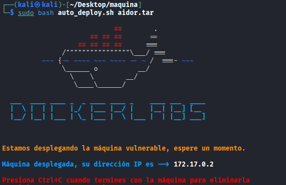

## DESCARGAR MÁQUINA VULNERABLE

Descargamos la máquina vulnerable "Aidor" de la página
```bash
https://dockerlabs.es/
```


## MONTAJE DE LA MÁQUINA VULNERABLE EN NUESTRO SISTEMA

La máquina vulnerable se va a montar en uin docker, nos hemos descargado un zip y hay que descomprimirlo:

```bash
unzip aidor.zip
```
esto nos va a descomprimir dos archivos:

-auto_deploy.sh que tiene las instrucciones para montar el docker

-aidor.tar que tiene el docker que vamos a correr

usando este comando montamos la máquina:

```bash
sudo bash auto_deploy.sh aidor.tar
```



