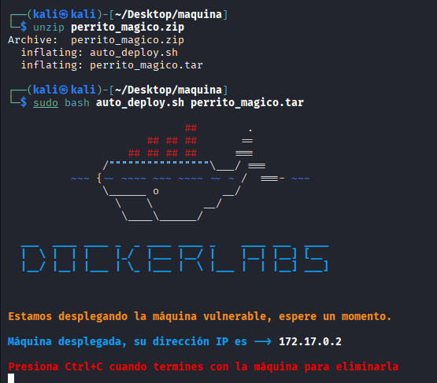

## DESCARGA Y MONTAJE DE LA MÁQUNA

1-Nos vamos a la página ´https://dockerlabs.es/´ y buscamos la máquina vulnerable ´Perrito Mágico´

2-La descargamos en nuestra máquina kali 

3- descomprimimos con:

```bash
unzip perrito_magico.zip
```

4- usamos este comando para levantar el docker:

```bash
sudo bash auto_deploy.sh perrito_magico.tar
```



