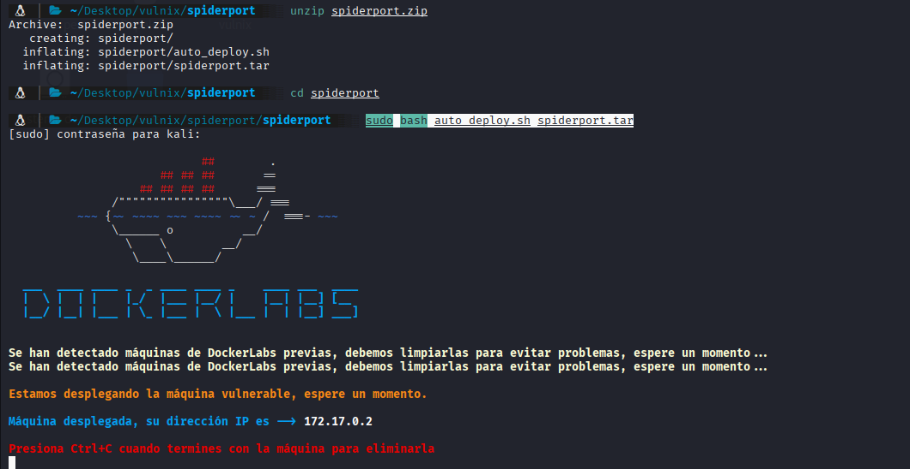
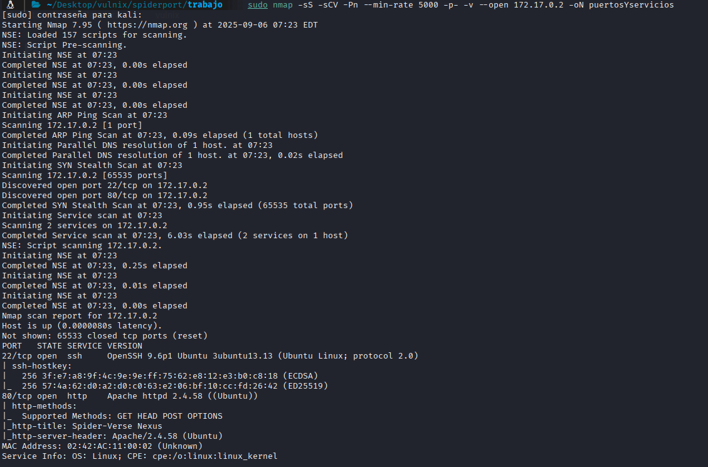
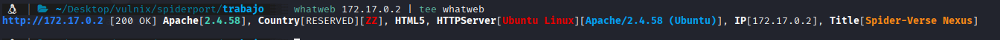
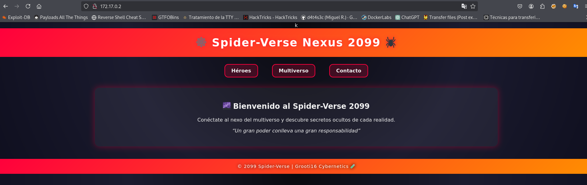
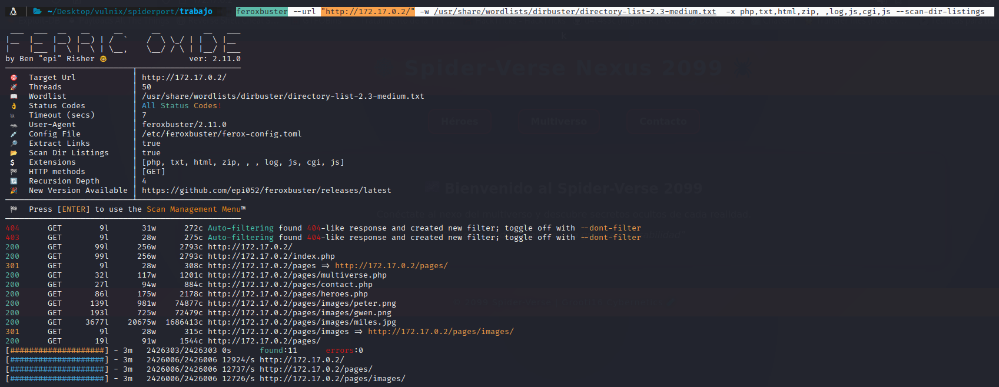
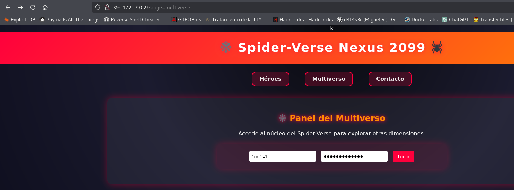
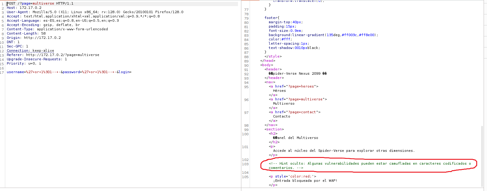

## DESCARGAR LA MÁQUINA Y MONTARLA

Nos dirigimos a la página `https://dockerlabs.es/` y allí buscamos la máquina `SpiderRoot` y vamos al enlace para descargarla:

```bash
https://dockerlabs.es/
https://mega.nz/file/6N0EyKqZ#7GKnF_GxBkij0pPofVhA6p-lRrdfscuJBoJxR4qLO6o
```

1- hacemos un unzip del archibo descargado:
  ```bash
  unzip spiderport.zip
  ```
2- entramos en la carpeta que nos ha creado
  ```bash
   cd spiderport
  ```

3- montamos la máquina

  ```bash
  sudo bash auto_deploy.sh spiderport.tar
  ```




## FASE DE ENUMERACIÓN

Vamos a escanear los puertos para ver cuales tienes abiertos, que servicios corren por ellos y si tinen alguna vulnerabilidad:

```bash
 sudo nmap -sS -sCV -Pn --min-rate 5000 -p- -v --open 172.17.0.2 -oN puertosYservicios
```



Vemos dos puertos abiertos:

-22 ssh con versión no vulnerable
-80 http

Antes de ir a la web vamos a lanzar un whatweb :

```bash
whatweb 172.17.0.2 | tee whatweb
```




Salvo que corre un apache poco más, visitamos la página web



Revisando el codigo fuente no vemos nada extraño así que vamos a hacer un fuzz:
```bash
feroxbuster --url "http://172.17.0.2/" -w /usr/share/wordlists/dirbuster/directory-list-2.3-medium.txt  -x php,txt,html,zip, ,log,js,cgi,js --scan-dir-listings
```

nos muestra algunas páginas:
```bash
200      GET       99l      256w     2793c http://172.17.0.2/
200      GET       99l      256w     2793c http://172.17.0.2/index.php
301      GET        9l       28w      308c http://172.17.0.2/pages => http://172.17.0.2/pages/
200      GET       32l      117w     1201c http://172.17.0.2/pages/multiverse.php
200      GET       27l       94w      884c http://172.17.0.2/pages/contact.php
200      GET       86l      175w     2178c http://172.17.0.2/pages/heroes.php
200      GET      139l      981w    74877c http://172.17.0.2/pages/images/peter.png
200      GET      193l      725w    72479c http://172.17.0.2/pages/images/gwen.png
200      GET     3677l    20675w  1686413c http://172.17.0.2/pages/images/miles.jpg
301      GET        9l       28w      315c http://172.17.0.2/pages/images => http://172.17.0.2/pages/images/
200      GET       19l       91w     1544c http://172.17.0.2/pages/
```





nos vamos a `http://172.17.0.2/pages/multiverse.php` que resuelve igual que `http://172.17.0.2/?page=multiverse` y tenemos un panel, intentamos una inyección basica
de sqli `' or  1=1-- -`




y nos aparece esto:


Así pues vamos a pasar la petición por burpsuite a ver que hay, vemos un comentario interesante:




