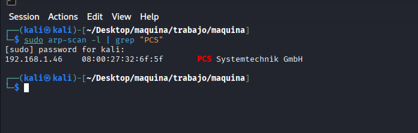
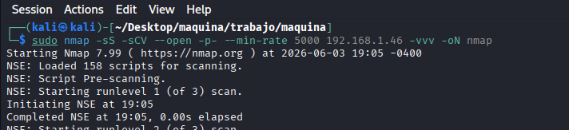
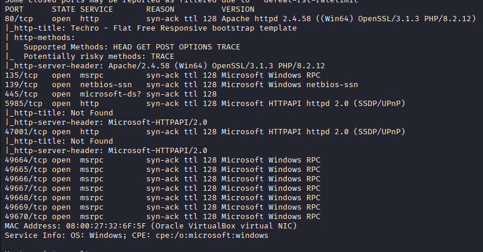
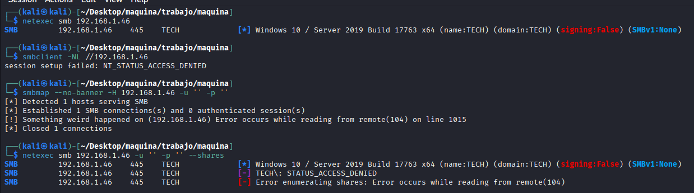
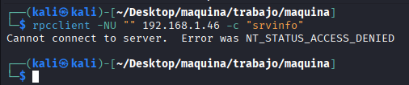

## COMPROBAMOS IP DE LA MAQUINA VICTIMA

ejecutamos:
```bash
sudo arp-scan -l | grep "PCS"
```
y la IP victima es `192.168.1.46`



## SCAN DE PUERTOS Y SERVICIOS

Ejecutamos un scan de puertos abiertos y vemos los servicios y versiones que corren por ellos:

```bash
sudo nmap -sS -sCV --open -p- --min-rate 5000 192.168.1.46 -vvv -oN nmap
```







## ENUMERACION SMB 445

Enumeración básica:
```bash
netexec smb 192.168.1.46
```
```
SMB         192.168.1.46    445    TECH             [*] Windows 10 / Server 2019 Build 17763 x64 (name:TECH) (domain:TECH) (signing:False) (SMBv1:None)
```

vemos un windows arquitectura x64 y un dominio `TECH`


Enumeracion de SHERES con null session:
```bash
smbclient -NL //192.168.1.46
smbmap --no-banner -H 192.168.1.46 -u '' -p ''
netexec smb 192.168.1.46 -u '' -p '' --shares
```




RCP:
```bash
rpcclient -NU "" 192.168.1.46 -c "srvinfo"
```



