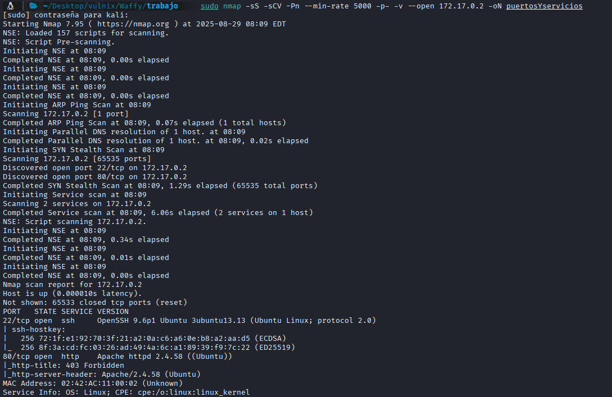
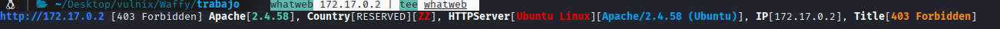
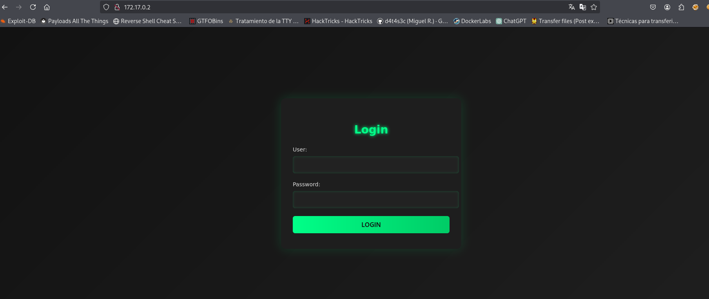

## FASE ENUMERACION

Sabiendo la IP de la máquina víctima vamos a hacer un reconocimiento de los puertos abiertos y los servicios
que corren por ellos, así como sus versiones para ver si tienen alguna vulnerabilidad:

IP-->`172.17.0.2`

```bash
 sudo nmap -sS -sCV -Pn --min-rate 5000 -p- -v --open 172.17.0.2 -oN puertosYservicios
```




```
PORT   STATE SERVICE VERSION
22/tcp open  ssh     OpenSSH 9.6p1 Ubuntu 3ubuntu13.13 (Ubuntu Linux; protocol 2.0)
| ssh-hostkey: 
|   256 72:1f:e1:92:70:3f:21:a2:0a:c6:a6:0e:b8:a2:aa:d5 (ECDSA)
|_  256 8f:3a:cd:fc:03:26:ad:49:4a:6c:a1:89:39:f9:7c:22 (ED25519)
80/tcp open  http    Apache httpd 2.4.58 ((Ubuntu))
|_http-title: 403 Forbidden
|_http-server-header: Apache/2.4.58 (Ubuntu)
MAC Address: 02:42:AC:11:00:02 (Unknown)

```

-Puerto 22 con SSH en versión no vulnerable 

-Puerto 80 HTTP

Sin credenciales ni usuarios nos vamos a centrar en el puerto 80, vamos a lanzar un whatweb para ver si reporta algo interesante:

```bash
whatweb 172.17.0.2 | tee whatweb
```





Lo más relevante es ese 403, vamos a visitar la página




Un panel, miramos el código fuente y no vemos nada, vamos a fuzzear


