## LEVANTAMOS LA MÁQUINA

Vamos a la página de 'Dockerlabs' y buscamos la máquina grooti, vamos al enlace y la descargamos:
```bash
https://dockerlabs.es/
https://mega.nz/file/OEUQEJjC#Ckg_Wxq7MqLHTfpjXgXBAJuIxla3qFqWv42Xw_qTQYA
```


Descarhamos el zip en nuestra máquina Linux, descomprimimos con:
```bash
unzip grooti.zip
```
y ejecutamos:

```bash
sudo bash auto_deploy.sh grooti.tar
```
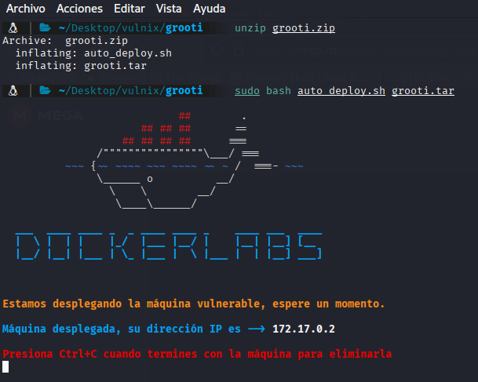

## FASE ENUMERACIÓN

Comenzamos con un scaneo de los puertos que tiene abiertos y los servicios que corren por ellos, así como sus versiones por si hay alguna vulnerabilidad asociada:

```bash
sudo nmap -sS -sCV -Pn --min-rate 5000 -p- -vvv --open 172.17.0.2
```
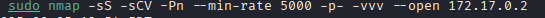
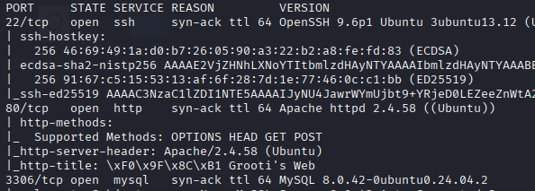

Vemos:

  -Puerto 22 con SSH versión 9.6p1 no vulnerable
  
  -Puerto 80 HTTP
  
  -Puerto 3306 mysql

Dado que no tenemos credenciales vamos a centrarno en el puerto 80 http, vamos a lanzar un 'whatweb' para saber que está utilizando la página:

```bash
 whatweb 172.17.0.2
```

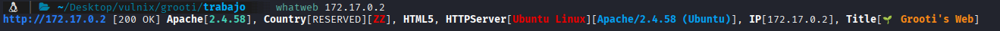


Nada interesante, salvo que utiliza apache, llegados a este punto toca mirar el código fuente por si hay algo interesante:

Abrimos la página web:


con Ctrl+u abrimos el código fuente y vemos dos cosas interesantes:


1- que un usuario rocket ha entrado en la base de datos, recordad que el puerto 3306 corre con mysql


2- tres rutas:"imagenes","documentos","archives"


No obstante vamos a hacer un fuzzing para ver que más rutas podemos encontrar:

```bash
gobuster dir -w /usr/share/wordlists/dirbuster/directory-list-2.3-medium.txt -u 'http://172.17.0.2/' -x html,php,txt,bak,env,cgi,
```
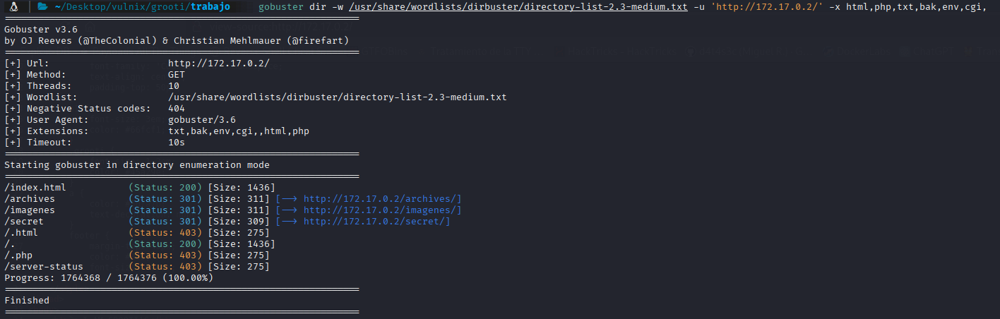

Vemos varias rutas con cosas interesante:
```
http://172.17.0.2/imagenes/ ----->http://172.17.0.2/imagenes/README.txt
```

Con un README.txt muy interesante:

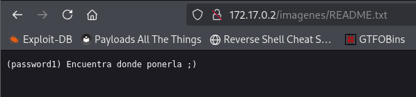

Ya tenemos un password: password1

```
http://172.17.0.2/archives/
```

Sin nada interesante


```
http://172.17.0.2/secret/
```
Con un listado de posibles usuarios:

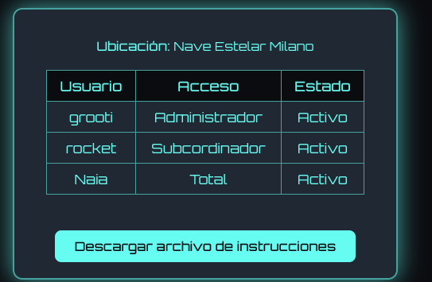

## INTRUSION EN BASE DE DATOS

Con todas las pistas vamos a intentar conectarnos a la base de datos con el usuario rocket y el password password1

```bash
mysql -h 172.17.0.2 -u rocket -ppassword1
```
Nos va a da un error y para corregirlo añadiremos --skip-ssl  quedando:
```bash
mysql -h 172.17.0.2 -u rocket -ppassword1 --skip-ssl
```
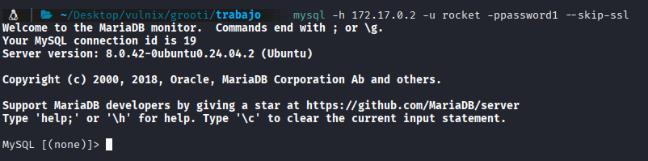

Ahora que estamos conectados vamos a veer que bases de datos hay:
```
show databases;
```
encontramos `files_secret` vamos a utilizar esta base de datos

```bash
use files_secret;
```
listamos las tablas
```bash
show tables;
```
y mostramos todo lo que contiene la tabla `rutas`
```
select * from rutas;
```
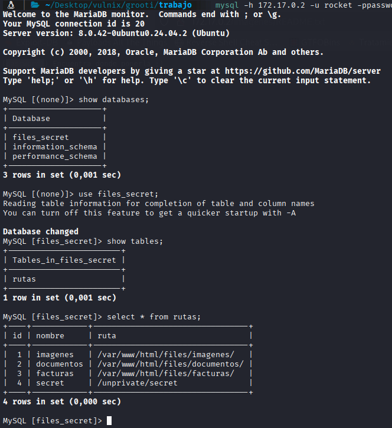

## FASE INTRUSIÓN
Encontrada una nueva ruta en la base de datos nos dirigimos a ella:

```
http://172.17.0.2/unprivate/secret/
```

vemos un panel donde podemos poner una frease y un numero del 1 al 100:

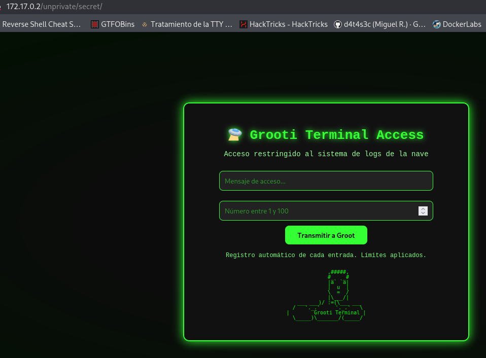

Despues de mirar el código fuente, intentar inyectar cosas en el panel y no viendo nada raro, vamos a pasar la petición por burpsuite, dado que lo único que hace es descargar un archivo con el nombre password1.txt
el 1 varía y es el número que ponemos del 1 al 100. 

Capturamos la petición y vamos a lanzar un ataque de fuerza bruta a los numeros que introducimos


1- mandamos la petición al intruder:

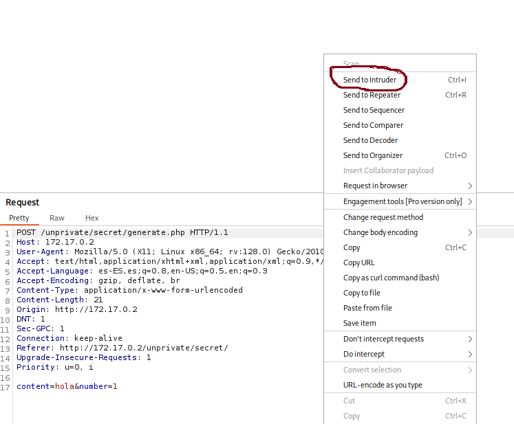

2-Seleccionamos dónde poner nuestro payload, concretamente en el número que metemos en el panael y le damos a "add"

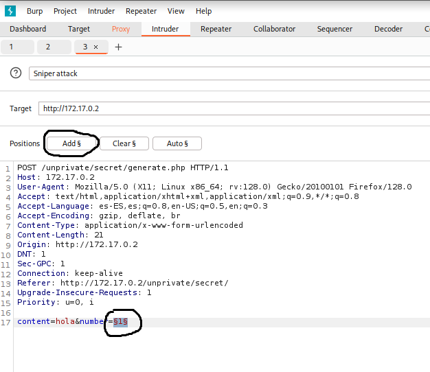

3-Cambiamos el payload type a Numers y from 1 to 100 para indicar que queremos solo numeros del 1 al 100

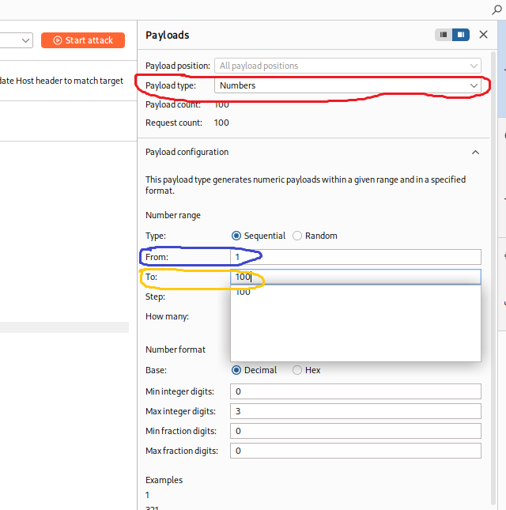

y lanzamos el ataque con start attack

Cuando termina el ataque vamos a ordenar por el tamaño:

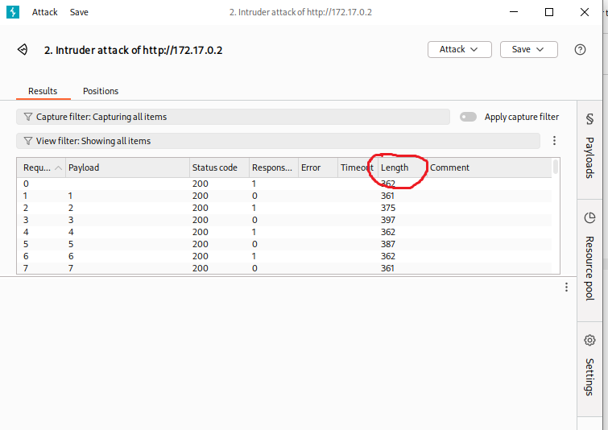

Vemos que al poner el número 16 se dispara el tamaño de la respuesta y si miramos en ese número la respuesta vemos:

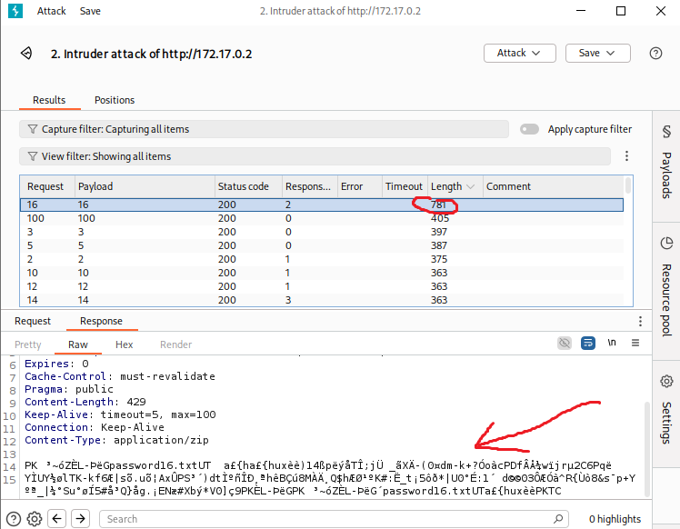


Pues vamos a lanzar una petición con el número 16 y vemos que pasa, y nos descarga un zip protegido por cntraseña, vamos a romperla con 
john, lo primero usamos:

```bash
zip2john password16.zip > hash.txt
```
para generar el hash a romper del zip

y ahora intentamos romperlo con john:
```bash
 john --wordlist=/usr/share/wordlists/rockyou.txt  hash.txt
```
y rompe el hash:

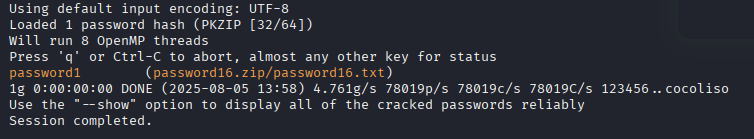

hacemos un unzip, metemos el password y nos descarga un txt:

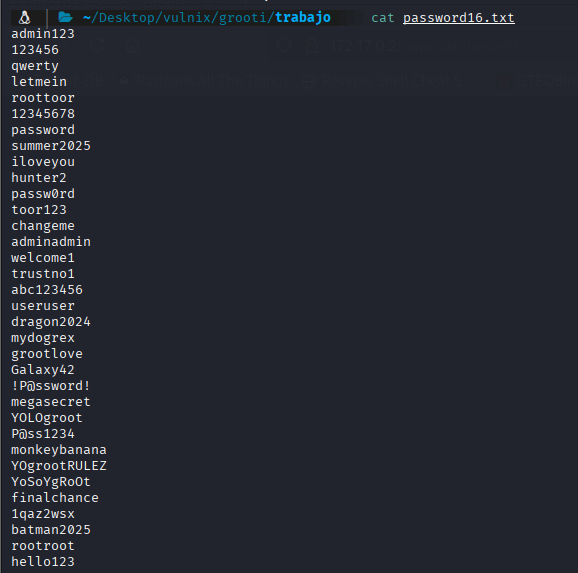

pues parece una lista de passwords, con esto vamos a probar fuerzabruta por ssh, antes hacemos una lista de users, os acordais de la página "http://172.17.0.2/secret/"
ahí teniamos tres usuarios: 
```
grooti
rocket
naia
```

vamos a meterlo en un archivo con el nombre users.txt y lanzamos un ataque con hidra, con esos usuarios y el archivo con los passwords que sacamos del zip:

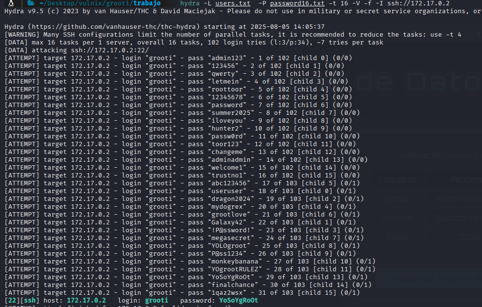

Nos conectamos por SSH como el usuario grooti a la IP victima:
```bash
ssh grooti@172.17.02
```
y cuando nos pide el password metemos
```
YoSoYgRoOt
```

Ya estamos dentro

##ESCALADA DE PRIVILEGIOS

Miro si estoy en algún grupo privilegiado con "id" y nada, si tengo algun privilegio sudo con "sudo -l" y nada, busco SUID y tampoco nada, listo usuarios y estamos root y yo xD

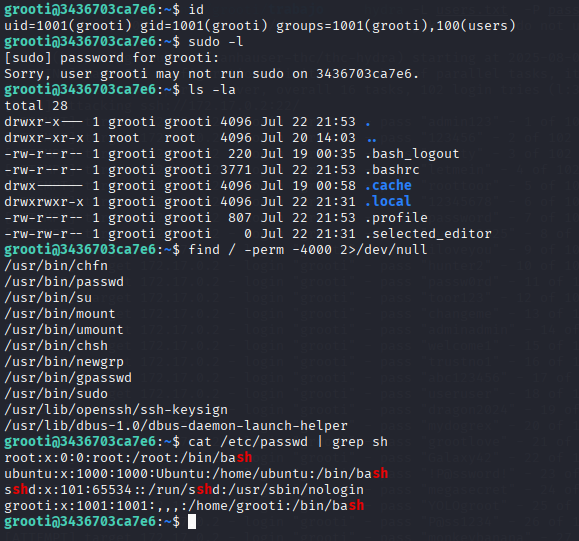

Voy a detectar si hay algún proceso, copio en la victima en un archivo con nano este script:
```bash
https://github.com/lavafuego/herramientas/blob/main/detectar%20procesos%20en%20bash/procesos.sh
```
doy permisos de ejecución con chmod +x <nombre del archivo>
lo ejecuto:

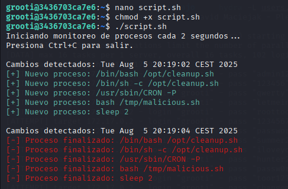

Veo que se ejecuta este proceso:
```
 /tmp/malicious.sh
```
miro los permisos que tengo sobre él, propietario root y puedo modificarlo
le añado una linea para modificar los permisos de la /bin/bash:
```bash
echo "chmod u+s /bin/bash" >>/tmp/malicious.sh
```
y espero a que vuelva a ejecutarse el proceso, cuando se ha ejecutado cambia los permisos de la /bin/bash y si lo ejecuto con la flag -p me convierto en root:
```bash
/bin/bash -p
```

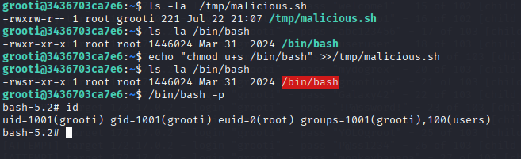


