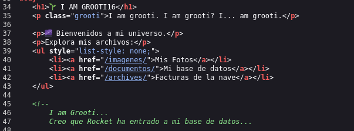

## LEVANTAMOS LA MÁQUINA

Vamos a la página de 'Dockerlabs' y buscamos la máquina grooti, vamos al enlace y la descargamos:
```bash
https://dockerlabs.es/
https://mega.nz/file/OEUQEJjC#Ckg_Wxq7MqLHTfpjXgXBAJuIxla3qFqWv42Xw_qTQYA
```


Descarhamos el zip en nuestra máquina Linux, descomprimimos con:
```bash
unzip grooti.zip
```
y ejecutamos:

```bash
sudo bash auto_deploy.sh grooti.tar
```


## FASE ENUMERACIÓN

Comenzamos con un scaneo de los puertos que tiene abiertos y los servicios que corren por ellos, así como sus versiones por si hay alguna vulnerabilidad asociada:

```bash
sudo nmap -sS -sCV -Pn --min-rate 5000 -p- -vvv --open 172.17.0.2
```


Vemos:

  -Puerto 22 con SSH versión 9.6p1 no vulnerable
  -Puerto 80 HTTP
  -Puerto 3306 mysql

Dado que no tenemos credenciales vamos a centrarno en el puerto 80 http, vamos a lanzar un 'whatweb' para saber que está utilizando la página:

```bash
 whatweb 172.17.0.2
```


Nada interesante, salvo que utiliza apache, llegados a este punto toca mirar el código fuente por si hay algo interesante:

Abrimos la página web:


con Ctrl+u abrimos el código fuente y vemos dos cosas interesantes:



1-que un usuario rocket ha entrado en la base de datos, recordad que el puerto 3306 corre con mysql
2-tres rutas:"imagenes","documentos","archives"

No obstante vamos a hacer un fuzzing para ver que más rutas podemos encontrar:

```bash
gobuster dir -w /usr/share/wordlists/dirbuster/directory-list-2.3-medium.txt -u 'http://172.17.0.2/' -x html,php,txt,bak,env,cgi,
```


Vemos varias rutas con cosas interesante:
```
http://172.17.0.2/imagenes/ ----->http://172.17.0.2/imagenes/README.txt
```

Con un README.txt muy interesante:


Ya tenemos un password: password1

```
http://172.17.0.2/archives/
```
Sin nada interesante


```
http://172.17.0.2/secret/
```
Con un listado de posibles usuarios:


## INTRUSION EN BASE DE DATOS

Con todas las pistas vamos a intentar conectarnos a la base de datos con el usuario rocket y el password password1

```bash
mysql -h 172.17.0.2 -u rocket -ppassword1
```
Nos va a da un error y para corregirlo añadiremos --skip-ssl  quedando:
```bash
mysql -h 172.17.0.2 -u rocket -ppassword1 --skip-ssl
```


Ahora que estamos conectados vamos a veer que bases de datos hay:
```
show databases;
```
encontramos `files_secret` vamos a utilizar esta base de datos

```bash
use files_secret;
```
listamos las tablas
```bash
show tables;
```
y mostramos todo lo que contiene la tabla `rutas`
```
select * from rutas;
```


  
