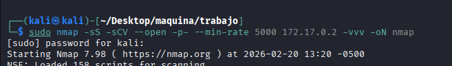
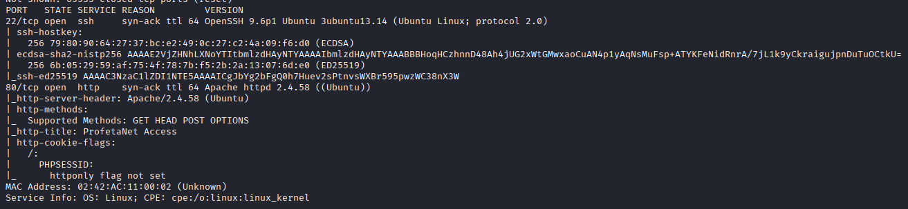
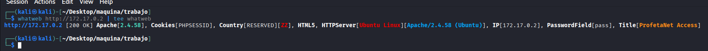
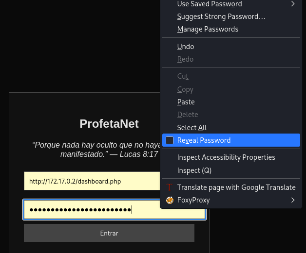
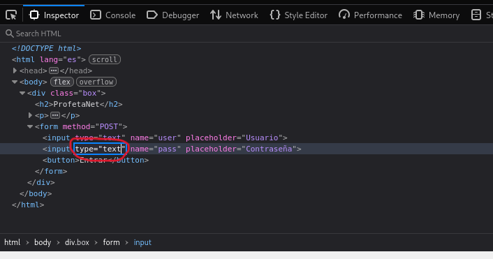
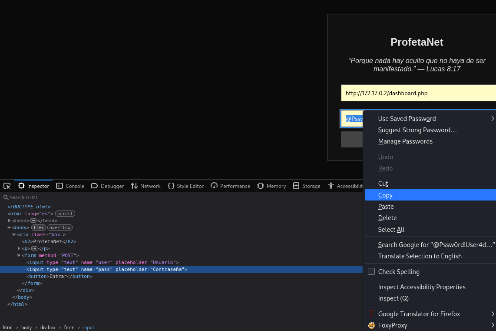

## MONTAMOS MÁQUINA VULNERABLE

1-Vamos a la página `https://dockerlabs.es/` y buscamos la máquina ´Profetas´ nivel medio y su autor `mikisbd`

2- descargamos el zip

3-descomprimimos el zip con:

```bash
 unzip profetas.zip
```

4- montamos la máquina vulnerable en docker con los archivos descomprimidos en el zip:

```bash
sudo bash auto_deploy.sh profetas.tar
```

5- una vez montada nos dice que la IP del la máquina vulnerable es `172.17.0.2`




## FASE DE ENUMERACIÓN

Vamos a enumerar a la máquina, comenzamos viendo que puertos tiene abiertos y que servicios corren por ellos, así como sus versiones por si son vulnerables:

```bash
 sudo nmap -sS -sCV --open -p- --min-rate 5000 172.17.0.2 -vvv -oN nmap
```
Encontramos dos puertos abiertos:

-22 por el que corre SSh en versión no vulnerable
-80 http




Dado que no tenemos usuarios ni credenciales para SSH vamos a centrarnos en la página web que corre por el puerto 80.


Antes de ir a la página vamos a ver que tecnologias utiliza la página con:
```bash
whatweb http://172.17.0.2 | tee whatweb
```




Vemos un apache...una cookie, vamos a ver la página.


Vemos una página con un login en el cual vemos la dirección  `http://172.17.0.2/dashboard.php` y si en el password damos botón derecho y revelar contraseña vemos un password `@Pssw0rd!User4dm1n2025!#` para poder copiar
el password, click derecho,reveal password




Ahora para copiarlo, cambiamos `type=password` por `type=text`








No se si servirá de algo pero hay que apuntarlo, la página `http://172.17.0.2/dashboard.php` nos redirecciona a `http://172.17.0.2/index.php`
Y el cóidigo fuente no nos revela ada interesante, con esto, vamos a fuzzear un poco.


